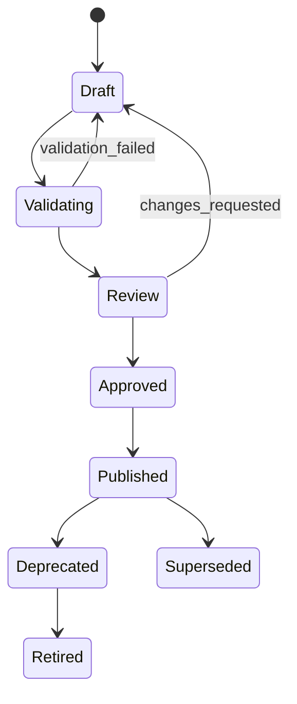

# 配置资产元模型

## 1. 目标

配置资产元模型统一描述 Workflow、Form、Evidence、Rule、SLA、Dispatch、Pricing 和 Integration 等业务资产，确保它们可验证、可依赖、可审批、可发布、可锁定、可回滚和可审计。

## 2. 核心概念

### ConfigurationAsset

逻辑资产，例如“比亚迪勘安流程”。它跨版本保持稳定身份。

### ConfigurationVersion

不可变版本，例如 `BYD-SURVEY-INSTALL@3.2.0`。已发布版本禁止原地修改。

### ConfigurationBundle

一次业务上线所需的完整版本集合。工单创建时只锁定 Bundle ID，不动态寻找“最新版本”。

### Publication

版本从草稿到发布的审批与投放记录。

### Dependency

资产版本之间的显式依赖，例如流程版本依赖表单、资料、SLA 和负责人策略版本。

## 3. 通用标识

```text
assetId        稳定逻辑标识
assetType      WORKFLOW / FORM / EVIDENCE / RULE / SLA / DISPATCH / PRICING / INTEGRATION
assetKey       租户内唯一可读键
versionId      不可变版本标识
semanticVersion 语义版本
tenantId       租户
projectScope   适用项目范围
brandScope     可选品牌范围
businessTypeScope 业务类型范围
effectiveFrom / effectiveTo 生效窗口
```

## 4. 生命周期



已发布版本不可回到 Draft；修正必须创建新版本。

## 5. 通用资产信封

```json
{
  "assetId": "CFG-ASSET-001",
  "assetType": "WORKFLOW",
  "assetKey": "byd.survey-install",
  "versionId": "CFG-VER-001",
  "semanticVersion": "1.0.0",
  "status": "DRAFT",
  "tenantId": "TENANT-1",
  "scopes": {
    "projectIds": ["PROJECT-BYD-2026"],
    "brandCodes": ["BYD"],
    "businessTypes": ["SURVEY_INSTALL"]
  },
  "validity": {
    "effectiveFrom": "2026-08-01T00:00:00+08:00",
    "effectiveTo": null
  },
  "schemaVersion": "1",
  "definition": {},
  "dependencies": [],
  "metadata": {
    "owner": "product-architecture",
    "createdBy": "U-1",
    "changeReason": "initial pilot"
  }
}
```

## 6. 依赖规则

- 依赖必须指向精确版本，不允许 `latest`；
- 发布 Bundle 前必须完成依赖闭包解析；
- 不允许循环依赖；
- 同一 Bundle 内只能出现一个逻辑资产的一个生效版本；
- 依赖缺失、失效或租户不匹配时禁止发布；
- 历史工单继续引用原 Bundle，不受新版本影响。

## 7. Bundle

```json
{
  "bundleId": "CFG-BUNDLE-BYD-SI-2026-08",
  "bundleVersion": 1,
  "projectId": "PROJECT-BYD-2026",
  "businessType": "SURVEY_INSTALL",
  "assets": [
    {"assetType": "WORKFLOW", "versionId": "WF-VER-10"},
    {"assetType": "FORM", "versionId": "FORM-VER-22"},
    {"assetType": "EVIDENCE", "versionId": "EVD-VER-30"},
    {"assetType": "SLA", "versionId": "SLA-VER-8"},
    {"assetType": "DISPATCH", "versionId": "DSP-VER-4"},
    {"assetType": "PRICING", "versionId": "PRICE-VER-2"}
  ],
  "status": "PUBLISHED"
}
```

## 8. 发布校验

发布必须完成：

- JSON Schema 校验；
- 引用完整性校验；
- 表达式静态检查；
- 未知字段和枚举检查；
- 路由可达性和死路检查；
- 表单条件和资料条件循环检查；
- SLA 日历存在性检查；
- 派单策略硬过滤顺序检查；
- 价格规则覆盖、冲突和舍入口径检查；
- 真实样本回放；
- 与上一版本差异报告。

## 9. 工单锁定原则

工单创建时写入：

```text
configurationBundleId
configurationBundleVersion
configurationResolvedAt
```

执行期所有任务、表单、资料、SLA、派单和计价均从锁定 Bundle 解析。禁止因“当前最新配置”而改变历史实例。

## 10. 迁移

运行中工单迁移配置必须：

- 显式发起；
- 展示旧、新 Bundle 差异；
- 校验当前流程位置可迁移；
- 审批通过；
- 记录迁移前后版本；
- 生成补偿任务；
- 支持失败回退；
- 写入审计事件。

默认策略是不迁移。

## 11. 最小持久化对象

- `configuration_asset`
- `configuration_version`
- `configuration_dependency`
- `configuration_bundle`
- `configuration_bundle_item`
- `configuration_publication`
- `configuration_validation_result`
- `configuration_migration`

具体物理表结构在试点物理数据模型中确定。
