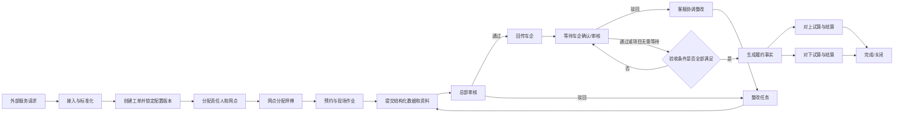

# 业务领域与边界

## 1. 核心业务叙事

车企或其合作渠道发起一项现场服务请求。ServiceOS 将外部请求标准化为服务履约单，确定适用的项目与业务产品版本，分配内部责任人和服务网点，由网点安排师傅完成预约、勘测、安装或维修，采集结构化数据和证据。当项目配置要求的总部审核、车企确认或其他验收条件全部满足后，平台形成可计价的履约事实，并分别完成对上和对下结算。

## 2. 领域分区

| 领域 | 类型 | 负责问题 | 主要对象 |
|---|---|---|---|
| 履约编排 | 核心域 | 一项服务如何被拆成阶段和任务并可靠执行 | WorkOrder、Stage、Task、Action |
| 现场作业 | 核心域 | 师傅如何预约、到场、勘测、施工和整改 | Appointment、Visit、Survey、Installation |
| 资料与审核 | 核心域 | 需要哪些证据、如何采集和逐版审核 | EvidenceRequirement、EvidenceItem、EvidenceRevision、ReviewCase |
| 派单与服务网络 | 核心域 | 哪个网点/师傅有资格且适合承接 | ServiceNetwork、DispatchPolicy、Assignment |
| 履约计价与结算 | 核心域 | 从履约事实计算应收与应付 | FulfillmentFact、ChargeItem、SettlementStatement |
| 项目与业务产品 | 支撑域 | 哪个合同/品牌/业务使用哪些配置版本 | Client、Brand、Project、ServiceProduct |
| 资产与物料协同 | 支撑域 | 设备和物料在履约过程中的去向 | Asset、Material、InventoryMovement |
| 客服与异常 | 支撑域 | 协调投诉、驳回、空跑、无法施工等例外 | Case、Exception、Complaint、FollowUp |
| 外部集成 | 支撑域 | 车企报文如何可靠映射和回传 | Connector、Mapping、InboundRecord |
| 身份与授权 | 通用域 | 谁能对哪些数据执行哪些动作 | User、Organization、Role、DataScope |

## 3. 关键边界

### 3.1 Client、Brand、Project 与 ServiceProduct

- `Client`：签约或对接的商业主体，如车企集团；
- `Brand`：业务与数据管理维度，如王朝、海洋、仰望；
- `Project`：具有合同周期、组织、区域、目标和配置组合的运营项目；
- `ServiceProduct`：可售卖或可履约的服务定义，如纯勘测、勘安、维修、拆装。

车企不是“只是一项配置”，它仍是合同、数据隔离和集成的业务主体；但车企差异必须通过项目和版本化方案表达，不能渗透为核心代码分叉。

### 3.2 ServiceRequest 与 WorkOrder

- `ServiceRequest` 表示外部或内部提出的服务诉求；
- `WorkOrder` 表示平台接受并承诺履约后的执行容器。

一个请求可能因拆分、重开或多地点产生多个工单；一个工单也可关联原请求和后续返工/维修请求。MVP 可在应用层合并展示，但领域概念保持分离。

### 3.3 WorkOrder 与 Task

工单负责：业务身份、适用配置版本、参与方、整体生命周期和汇总投影。

任务负责：明确的工作目标、执行人、输入、完成条件、SLA 和动作权限。勘测、安装、审核、回传、整改和结算都表现为不同任务，而不是不断增加工单状态。

### 3.4 文件与履约资料

文件只是存储对象；资料是有业务语义的履约证据。`EvidenceItem` 表示逻辑资料，`EvidenceRevision` 保存某次不可变文件版本、采集上下文、上传人、来源和 OCR/AI 校验。审核结果由 `ReviewDecision` 精确引用资料版本，不写回文件生命周期。

### 3.5 表单数据与履约事实

动态表单保存用户提交的原始业务数据。只有经过校验或审核、按事实提取规则标准化后的数据，才能成为计价使用的 `FulfillmentFact`。

## 4. 端到端主链路

## 5. 当前已知例外

- 自动派单失败：生成项目经理人工处理任务，目标 24 小时内处理；
- 无可派网点：不自动跨区，进入人工兜底；
- 资料驳回：可驳回单项，允许多次补传并保留全部版本；
- 车企驳回：先进入客服协调，不直接退给师傅；整改完成后按项目回传策略重新提交；
- 改派：立即撤销原网点后续数据权限，必须记录原因；
- 强制关闭与恢复：必须是授权动作并留下完整审计链。

## 6. 待验证边界

以下内容不能由架构师代替业务决定，进入详细设计前必须补证据：

- 服务请求与工单是否需要在 MVP 中物理分表；
- 勘测和安装何时属于同一工单，何时拆为关联工单；
- 车企审核结果通过接口返回、人工录入还是两者并存；
- 结算触发点是总部审核、车企确认还是合同周期；
- 设备资产与仓储系统的系统边界及主数据所有权。
