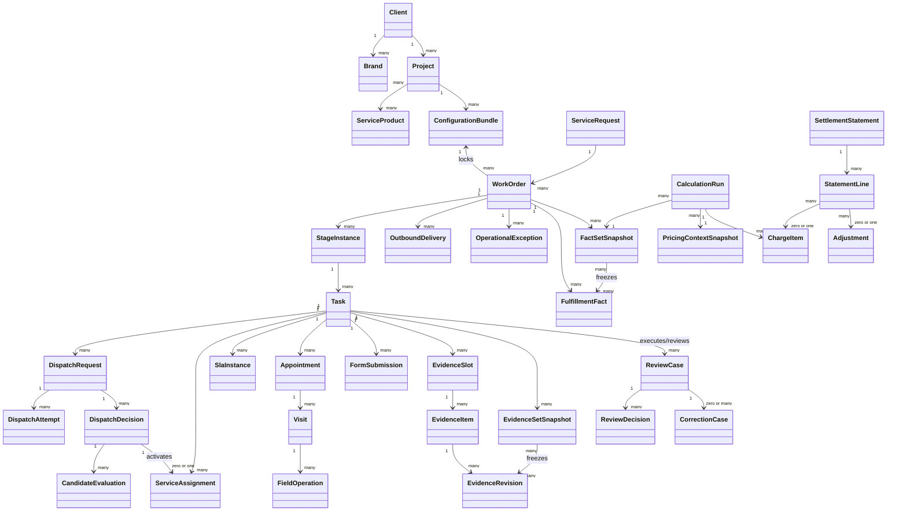

# 核心领域模型

## 1. 模型总览



## 2. 聚合边界

### 2.1 WorkOrder 聚合

负责：

- 工单唯一身份、来源和外部编号；
- 客户、地址、车辆、设备等业务引用；
- 当前生命周期和当前阶段投影；
- 锁定的配置包版本；
- 取消、关闭、恢复等工单级命令约束。

不负责：资料明细、审核历史、预约历史、费用计算明细。它们有独立聚合和生命周期。

建议稳定生命周期：

```text
DRAFT -> ACTIVE -> FULFILLED -> CLOSED
           |       \-> CANCELLED
           \-> SUSPENDED -> ACTIVE
```

“待派单、待预约、审核中”不是工单生命周期，而是阶段/任务投影。

取消、关闭后的授权恢复，以及履约后的整改重开，必须创建显式事件和新的阶段/任务实例，不复用或覆盖历史任务。

### 2.2 Task 聚合

任务类型包括但不限于：初审、派网点、派师傅、预约、勘测、安装、资料审核、整改、回传、事实确认和结算。

任务必须包含：

- 任务类型与所属阶段；
- 责任人策略解析后的实际候选人/执行人；
- 输入引用、完成条件和允许动作；
- SLA 实例引用；
- 状态变更历史；
- 自动执行失败后的人工接管信息。

`Task` 是统一的工作队列和流程执行外壳，独占责任人、候选人、SLA 和待办状态。审核任务执行时引用一个 `ReviewCase`；审核对象、审核结论、驳回原因和版本历史只保存在 `ReviewCase` 中，不在两处重复维护。

建议状态：

```text
PENDING -> READY -> CLAIMED/RUNNING -> COMPLETED
                    |       |       -> CANCELLED
                    |       -> BLOCKED/FAILED
                    |                  -> READY（恢复或重试）
                    -> MANUAL_INTERVENTION（重试耗尽）
```

完整迁移规则以[工单、任务与流程执行内核](06-work-order-task-execution-kernel.md)为权威定义，本文件不另设第二套枚举。

### 2.3 EvidenceItem 与 EvidenceRevision 聚合

一项运行时资料槽位可以产生多个逻辑资料项，每个资料项可以有多版资料。任何补传都新增 `EvidenceRevision`，不覆盖历史文件。

核心不变量：

- 每版资料必须关联要求版本和采集人；
- 现场拍摄、GPS、水印等约束的校验结果必须留存；
- OCR/AI 结果与人工审核结果分开；
- 审核通过后普通角色不可原地替换文件；
- 驳回只能针对明确版本，补传后产生新待审版本。

### 2.4 ReviewCase 聚合

审核对象可以是单项资料、不可变资料集合快照、表单提交或费用试算。总部审核与车企审核是不同的 ReviewCase，并由各自的流程任务驱动；车企回执映射为外部来源的 ReviewDecision，不引入第二种 Case 模型。

审核结果至少包括：`APPROVED`、`REJECTED`、`NEEDS_CORRECTION`、`FORCED_APPROVED`。

强制通过必须记录授权依据和原因，不允许伪装成普通通过。

`ReviewCase` 不保存任务责任人和 SLA；这些属于关联的 `Task`。审核案例可以包含多次 `ReviewDecision`，以保留驳回、补传、复审和强制通过的完整历史。

### 2.5 DispatchRequest 与 DispatchDecision 聚合

派单不是简单修改 `network_id`，而是一轮可解释的决策：

1. 校验指定网点和人工覆盖；
2. 执行停派、黑名单、区域、业务能力、资质和产能硬过滤；
3. 对候选网点按履约、评分、签约比例偏差等评分；
4. 生成候选快照和选择理由；
5. 创建 ServiceAssignment；
6. 失败时创建人工处理任务。

一次请求因容量竞争、重算或人工介入可以产生多次不可变 DispatchDecision；只有成功激活的决定产生 ServiceAssignment。

### 2.6 FulfillmentFact 与 SettlementStatement 聚合

`FulfillmentFact` 是已标准化且可追溯的履约事实，例如实际线缆米数、二次上门次数、偏远区域、安装立柱数量。事实何时可用于计价，由项目的验收条件决定；在需要车企审核的项目中，车企驳回必须冻结或撤销相关事实的“可计价”资格。

`ChargeItem` 是某一计价方案版本对事实计算后的结果。对上与对下分别生成，不共享金额，只共享事实。

试算通过 FactSetSnapshot 冻结事实版本，并使用独立 PricingContextSnapshot 与 CalculationRun。SettlementStatement 不直接包含可变“当前费用”，而由 StatementLine 精确引用 ChargeItem 或 Adjustment。

## 3. 配置包

创建工单时生成 `ConfigurationBundle` 快照引用，至少包含：

- 项目版本；
- 流程版本；
- 表单版本；
- 资料模板版本；
- 规则版本；
- SLA 版本；
- 派单策略版本；
- 对上价格版本；
- 对下价格版本；
- 通知与集成映射版本。

配置包只保存引用和必要摘要，不复制全部配置内容；被引用的发布版本不可删除。

## 4. 命令与事件示例

| 命令 | 成功后的领域事件 |
|---|---|
| `CreateWorkOrder` | `WorkOrderCreated` |
| `AssignServiceNetwork` | `ServiceNetworkAssigned` |
| `ScheduleAppointment` | `AppointmentScheduled` |
| `SubmitEvidence` | `EvidenceSubmitted` |
| `RejectEvidence` | `EvidenceRejected` |
| `CompleteInstallation` | `InstallationCompleted` |
| `ExtractFulfillmentFacts` | `FulfillmentFactsExtracted` |
| `CalculateReceivable` | `ReceivableCalculated` |

事件采用过去式，只表达已经发生的事实。消费者必须幂等；事件载荷只放稳定标识、必要快照和追踪信息。

## 5. 明确不做的过度设计

- 不在首期预设 200～300 个领域对象；
- 不以 300～500 张数据库表作为平台成熟指标；
- 不默认采用事件溯源作为主存储；
- 不把所有业务规则都做成通用 DSL；
- 不在没有团队和流量证据时拆成大量微服务。
