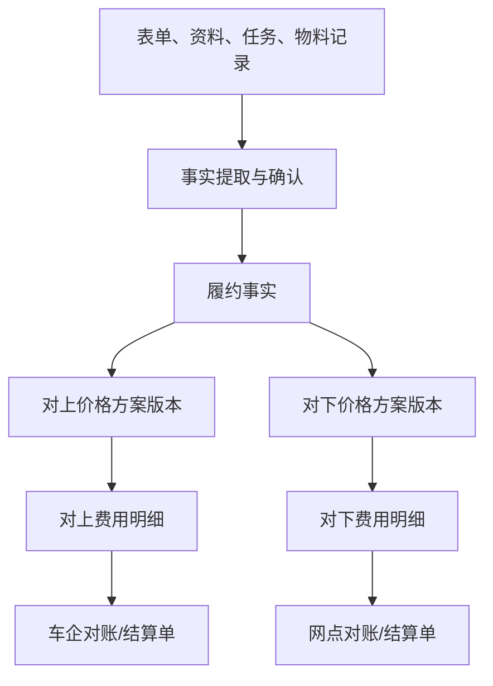

# 履约事实、计价与结算设计

## 1. 目标

本设计解决三个不同问题：

1. 现场实际发生了什么；
2. 按某份合同和价格版本应计算多少金额；
3. 双方对哪些金额完成了确认、调整和结算。

三者必须分别建模。动态表单是原始输入，不是结算事实；试算结果是可重算的计算结果，不是双方确认的结算单。

## 2. 核心对象

| 对象 | 职责 | 示例 |
|---|---|---|
| `FulfillmentFact` | 标准化、可追溯的履约事实 | 实际线缆 42 米、安装立柱 1 个 |
| `PricingPlanVersion` | 一组已发布且不可变的计价规则 | 比亚迪家充山东 2026 V2 |
| `PricingContext` | 本次试算适用的项目、区域、日期和对象 | 对上、山东、安装完成日 |
| `ChargeItem` | 一条规则计算出的费用或扣减 | 超长线缆费 12 米 × 单价 |
| `CalculationRun` | 一次完整试算的输入、版本和结果 | 第 3 次对上试算 |
| `SettlementStatement` | 对账周期内提交双方确认的费用集合 | 2026-07 比亚迪山东对账单 |
| `Adjustment` | 对已计算或已确认金额的显式修正 | 核减、补差、奖励、处罚 |
| `Dispute` | 对费用项的争议和处理过程 | 线缆长度口径争议 |

## 3. 事实模型

履约事实采用“受控事实目录 + 类型化值”的混合模型。事实编码由平台维护，项目可以选择和配置提取规则，但不能随意用自然语言创建结算事实。

建议首批事实分类：

- 服务结果：勘测完成、安装完成、维修完成、取消原因；
- 数量事实：线缆米数、打孔数、立柱数、上门次数；
- 区域事实：省市区、偏远等级、跨区标识；
- 时间事实：预约、到场、完工、等待时长、超时分钟；
- 物料事实：实际消耗、来源、品牌、规格、数量；
- 责任事实：用户原因、网点责任、车企原因、不可抗力；
- 质量事实：一次审核通过、返工、投诉、资料不合格；
- 资产事实：桩型、功率、SN、换新/拆旧结果。

每条事实至少保存：

```text
factCode
value + valueType + unit
sourceObjectType + sourceObjectId + sourceVersion
evidenceIds
confirmedBy + confirmedAt
effectiveAt
status
```

事实状态建议为：`OBSERVED`、`CONFIRMED`、`INVALIDATED`。只有满足项目验收条件的事实才能标记为可计价。

## 4. 对上与对下独立



两侧共享事实，不共享价格、金额、审批和调整。任何一侧的特批不得直接修改另一侧结果。

## 5. 价格方案结构

一个价格方案版本至少包含：

- 结算方向：`RECEIVABLE` 对上或 `PAYABLE` 对下；
- 适用客户、项目、业务产品、品牌、区域和合同周期；
- 生效起止时间和取价日期口径；
- 币种、含税方式、税率与舍入规则；
- 费用项目录；
- 规则优先级、互斥组、叠加组和封顶规则；
- 所需事实和证据；
- 调整权限与审批策略；
- 发布、停用和替代关系。

## 6. 费用项模型

| 类型 | 表达方式 | 示例 |
|---|---|---|
| 固定金额 | 满足条件即产生固定金额 | 标准安装服务费 |
| 单价 × 数量 | 从事实读取数量 | 超出免费额度的线缆费 |
| 阶梯价格 | 按数量区间分别计价 | 0～30 米免费，31～50 米单价 A |
| 条件附加 | 条件满足时增加金额 | 偏远区域补贴 |
| 组合套餐 | 一组项目按套餐价 | 勘测 + 安装一口价 |
| 封顶/保底 | 对合计金额施加上下限 | 单工单最高收费 |
| 奖励/处罚 | 基于质量或时效事实 | 超时扣款、一次通过奖励 |
| 人工调整 | 经审批后生成独立调整项 | 商务特批、争议核减 |

费用项必须保存规则命中解释，不能只保存最终金额。

## 7. 计算流水线

```text
解析价格方案版本
→ 校验必需事实与证据
→ 生成 PricingContext
→ 执行规则匹配
→ 计算基础费用项
→ 应用互斥、叠加、免费额度与阶梯
→ 应用封顶/保底
→ 应用税与舍入
→ 生成 CalculationRun 和 ChargeItem
→ 执行差异检查
→ 提交审核或对账
```

同一输入事实和同一价格版本必须得到相同结果。试算服务不得读取“当前价格”，必须显式接收价格版本。

## 8. 取价日期

合同可能按下列日期之一决定价格版本：工单创建日、接单日、勘测日、安装完成日、总部审核日、车企确认日或结算周期日。

取价日期属于价格方案配置，不应写死为工单创建日。若事实日期被更正，系统必须提示是否需要重新试算，而不是静默改变已确认金额。

## 9. 试算、结算与调整生命周期

### 9.1 CalculationRun

```text
DRAFT -> CALCULATED -> VALIDATED -> SUPERSEDED
                  \-> FAILED
```

重新试算新增一条运行记录，并将旧记录标记为被替代；不得覆盖旧结果。

### 9.2 SettlementStatement

```text
DRAFT -> SUBMITTED -> CONFIRMED -> LOCKED
                    -> DISPUTED -> SUBMITTED
LOCKED -> ADJUSTED
```

`LOCKED` 后不得修改原费用项。补差、核减、红冲必须创建关联调整单，并保留原结算单。

## 10. 审核与冻结

- 当项目验收规则把总部或车企审核设为计价前置条件时，相关审核驳回会使受影响事实失去可计价资格；不属于计价前置条件的审核不得无条件冻结费用；
- 已试算未确认：自动将试算标记为过期，整改后重新计算；
- 已确认未锁定：按权限撤回并重新提交；
- 已锁定：通过调整单处理，不修改历史；
- 车企审核是否是计价前置条件，由项目配置决定。

## 11. 精度与舍入

- 数量保存业务精度，不使用浮点数；
- 金额使用定点小数并记录币种；
- 明确单项舍入、分组舍入还是总额舍入；
- 规则配置必须声明舍入模式和精度；
- 所有中间值用于解释和重算，不只保留展示后的两位小数。

## 12. 权限和审计

以下操作必须独立授权并审计：

- 发布或停用价格版本；
- 修改尚未发布的规则；
- 手工确认履约事实；
- 发起重新试算；
- 创建核减、补差、奖励、处罚或红冲；
- 撤回已提交对账单；
- 强制确认争议费用；
- 导出包含金额和个人信息的对账数据。

审计信息必须包含操作前后内容、原因、申请人、审批人和关联证据。

## 13. 配置校验

价格版本发布前至少执行：

- 时间范围重叠检查；
- 同优先级规则冲突检查；
- 条件遗漏和永不命中检查；
- 必需事实是否存在于事实目录；
- 免费额度、阶梯边界和封顶值连续性检查；
- 对上/对下方向检查；
- 样例工单批量回放及新旧版本差异报告。

## 14. MVP 边界

MVP 实现：事实目录、事实提取、双向价格版本、基础费用项、可解释试算、重新试算和结果导出。

正式对账、账期、发票、收付款、红冲、跨期调账和复杂争议进入二期。若业务要求 MVP 直接承担正式结算，必须先完成价格矩阵、审批、财务接口和历史对账回放，不得仅凭本设计开工。
