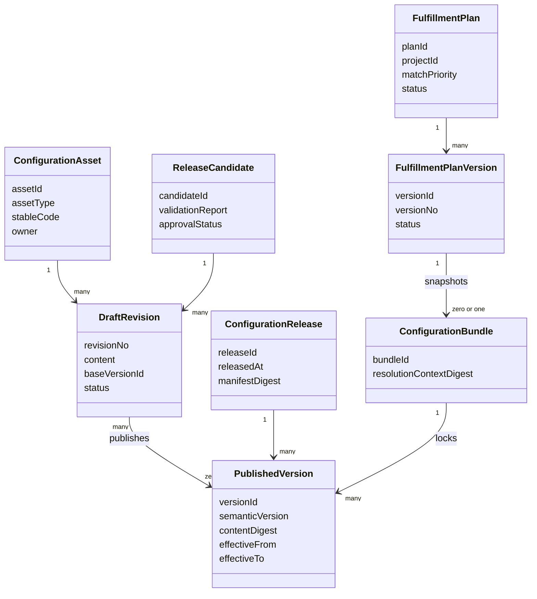

# 配置资产与版本中心设计

## 1. 目标

配置中心负责把业务差异表达为可治理的资产，并保证：

- 新项目可以继承已有模板后局部调整；
- 发布版本不可变，历史工单可还原；
- 一组相互依赖的配置能够作为整体校验、发布和锁定；
- 配置冲突、缺失和不兼容在进入生产前被发现；
- 在途工单不会因为“项目当前配置”变化而漂移。

配置中心不负责执行业务流程、计算价格或决定派单。它负责提供经过发布治理的配置定义，领域能力负责解释和执行这些定义。

## 2. 配置资产分类

| 资产类型 | 资产内容 | 主要消费者 |
|---|---|---|
| `ProjectProfile` | 客户、品牌、区域、业务产品和合同周期 | 工单接入、权限、报表 |
| `ProcessDefinition` | 阶段、任务、连线、条件和补偿 | 履约执行内核 |
| `FormDefinition` | 节点字段、布局、显隐、校验 | 后台与移动端 |
| `EvidenceTemplate` | 资料要求、采集和审核规则 | 资料与审核域 |
| `RuleSet` | 决策表、表达式和受控扩展 | 派单、责任人、验收等 |
| `SlaPolicy` | 时钟、日历、暂停、预警和升级 | SLA 能力 |
| `DispatchPolicy` | 硬过滤、候选评分和人工兜底 | 派单域 |
| `PricingPlan` | 对上/对下价格规则 | 计价与结算域 |
| `NotificationPlan` | 触发、对象、渠道和模板 | 通知能力 |
| `IntegrationMapping` | 外部字段、枚举、状态和回执映射 | 集成域 |
| `PermissionProfile` | 动作与字段权限模板 | 授权能力 |

Client、Brand、Project、ServiceProduct 的稳定身份、生命周期和有效绑定由 project 模块拥有。`ProjectProfile` 只引用这些 ID，并保存需要随 ConfigurationRelease 版本化的运行时选择维度、默认策略和外部映射；不能复制一套可独立修改的项目/品牌主数据。

## 3. 核心模型



### 3.1 稳定身份与版本身份

`stableCode` 标识业务资产，例如 `BYD.HOME_INSTALL.PROCESS`；`versionId` 标识一次不可变发布。运行时引用必须使用 `versionId`，不能只使用稳定编码或“最新版”。

### 3.2 草稿修订

草稿可以反复修改，但每次保存应增加修订号并记录作者、差异和原因。草稿内容不允许被生产工单引用。

### 3.3 发布版本

发布版本包含：

- 完整、解析后的规范化内容；
- 内容摘要和依赖版本清单；
- 语义版本、发布时间和替代关系；
- 申请人、审批人和验证报告；
- 兼容性声明和运行时解释器最低版本。

发布版本的业务内容永远不可变。生效区间、灰度范围、停止新绑定和退休属于发布适用性与治理事件，不写回发布版本内容。

## 4. 生命周期

```text
DRAFT -> VALIDATING -> REVIEW_PENDING -> APPROVED -> PUBLISHED -> RETIRED
   ^          |               |
   |          v               v
   +------ INVALID         REJECTED
```

- `PUBLISHED` 后内容不可变；
- `RETIRED` 是根据追加的治理事件计算出的状态，只阻止新绑定，不影响历史读取和在途执行；
- 发现错误时发布替代版本，不修改旧版本；
- 删除仅允许未发布且未被审计记录引用的草稿。

## 5. 继承与覆盖

项目可以从标准模板或同类项目版本创建草稿，并对允许的扩展点进行覆盖。运行时不执行多层动态继承；发布前必须把继承链解析为一个扁平、完整的不可变版本。

```text
标准安装模板 V3
  + 比亚迪共同覆盖
  + 仰望资料增量
  + 山东区域价格/派单覆盖
  = 已解析发布版本
```

约束：

- 继承只发生在草稿编辑和发布解析阶段；
- 每种资产声明可覆盖路径和禁止覆盖路径；
- 发布版本保留来源链和每个最终字段的来源；
- 模板新版本不会自动修改派生项目草稿或已发布版本；
- 升级通过三方差异：旧基线、项目覆盖、新基线，生成冲突报告。

## 6. 配置发布单元

单个资产独立发布容易产生不兼容组合，例如流程引用了尚未发布的表单。配置资产层使用 `ConfigurationRelease` 作为资产版本的原子发布单元。产品层的原子发布单位是单个履约方案版本（FulfillmentPlanVersion，见 DEC-007 与 [AD-014](AD-014-fulfillment-plan-matching-and-version-binding.md)）：发布方案版本时把解析后的资产版本冻结为该版本快照并对应一个 `ConfigurationRelease`/`ConfigurationBundle`，不同履约方案独立发布、互不影响。

一个发布单元可以包含多个资产版本，并生成 manifest：

```yaml
releaseId: REL-2026-0001
projectVersion: PRJ-12-V4
processVersion: PROC-93-V6
formVersions:
  survey: FORM-18-V3
  installation: FORM-19-V5
evidenceVersion: EVD-31-V7
slaVersion: SLA-11-V2
dispatchVersion: DSP-08-V4
receivablePricingVersion: PRICE-UP-44-V2
payablePricingVersion: PRICE-DOWN-19-V3
integrationMappingVersion: MAP-17-V6
```

示例只表达 manifest 结构，不是确定的存储格式。

## 7. 发布校验

### 7.1 通用校验

- 编码唯一、引用存在且均为同一候选发布或已发布版本；
- 生效时间、客户、项目、品牌、区域和业务产品范围一致；
- JSON Schema/领域 Schema 校验通过；
- 无循环依赖、孤立节点、重复编码和非法覆盖；
- 解释器版本与配置版本兼容；
- 所有 `TBD`、占位表达式和测试值已清除。
- 同一租户、项目、业务产品和归一化解析维度下，业务时间范围不得与其他有效发布重叠；
- 发布事务必须锁定解析范围键并再次执行重叠检查，防止两个并发候选同时通过校验。

### 7.2 跨资产校验

- 流程任务引用的表单、资料模板、SLA 和责任人策略存在；
- 表单条件引用的标准字段存在且类型兼容；
- 资料条件引用的字段在该节点已可获得；
- 派单规则使用的指标和网点能力存在；
- 价格规则引用的履约事实存在；
- 外部回传映射引用的字段、资料和状态均可生成；
- 权限模板允许至少一个角色完成每个必经人工任务。

### 7.3 回放校验

候选发布必须运行：

- 配置单元测试；
- 典型正常和异常样本桌面/自动回放；
- 与当前生产版本的差异报告；
- 价格新旧版本金额差异；
- 流程可达性和终止性检查；
- 权限死锁检查。

## 8. 履约方案匹配与工单锁定

工单正式受理时，先由履约方案匹配确定唯一方案与其生效版本，再锁定对应配置：

```text
输入：项目、品牌、业务类型、设备类型、行政区域、故障等级、优先级、保内外、来源、客户等级、业务日期
→ 候选：项目下 ENABLED 且有 ACTIVE 版本的履约方案
→ 结构化硬匹配排除不满足的方案
→ 按 matchPriority 降序、同级按规则具体度确定唯一方案
→ 锁定该方案 ACTIVE 版本对应的 ConfigurationRelease/Bundle
→ 保存 fulfillmentPlanId、fulfillmentPlanVersionId、匹配解释与版本引用
→ 完成受理并创建流程实例
```

零命中或同优先级同具体度多命中不得随机选择、不得默认项目第一条方案，工单进入“待确认履约方案 / 履约配置异常”，由具备权限的角色处理。匹配算法与冲突检查见 [AD-014](AD-014-fulfillment-plan-matching-and-version-binding.md)。

## 9. 生效时间和业务时间

配置选择使用明确的业务日期，例如外部工单创建日或合同约定日期。业务日期口径属于项目配置并写入解析上下文。

发布时间和生效时间分开：允许提前发布未来生效版本。生效范围由独立、追加式的 `ReleaseApplicability` 和激活/停用事件表达。发布后如果需调整生效时间，应创建新的适用性记录并关闭旧记录，避免静默改变已经解析的结果。

## 10. 在途工单迁移

默认不迁移。确需迁移时创建 `ConfigurationMigrationPlan`：

1. 指定来源和目标配置包；
2. 筛选候选工单并排除不可迁移状态；
3. 比较流程节点、字段、资料、SLA、价格和集成差异；
4. 定义数据转换、任务补建/取消和回滚策略；
5. 运行影子演练并生成逐工单报告；
6. 业务、产品、技术审批；
7. 分批执行并完整审计。

价格已锁定、结算已确认或外部车企已接受的结果不得通过普通配置迁移修改。

## 11. 灰度与回滚

灰度是解析规则的一部分，不是运行时随机切换。可以按明确白名单、区域、外部工单号或创建比例将“新创建工单”绑定不同发布版本。每张工单一旦创建即固定绑定。

回滚意味着停止新工单绑定问题版本并重新启用已验证版本；已经绑定的工单默认继续原版本，除非执行受控迁移。

## 12. 权限与职责分离

- 配置编辑者不能审批自己的高风险发布；
- 价格、权限、脚本和外部映射属于高风险资产；
- 平台管理员维护平台，不默认拥有业务发布审批权；
- 生产发布、强制停用、迁移和回滚都要求理由和审计；
- 受控脚本需静态检查、资源限制、允许列表和安全审批。

## 13. 查询与审计

平台必须支持按工单反查全部配置版本，按版本查受影响工单，以及对任意两个版本进行语义差异比较。

审计链至少回答：谁基于哪个草稿发起发布、校验结果、谁审批、何时生效、哪些工单绑定、何时退休或被替代。

## 14. MVP 范围

MVP 实现：资产注册、草稿修订、发布版本、依赖清单、静态校验、审批、原子发布、配置解析、工单锁定、版本查询和基础差异。

多级灰度、复杂三方合并、自动在途迁移、脚本市场和跨租户模板共享延后。
