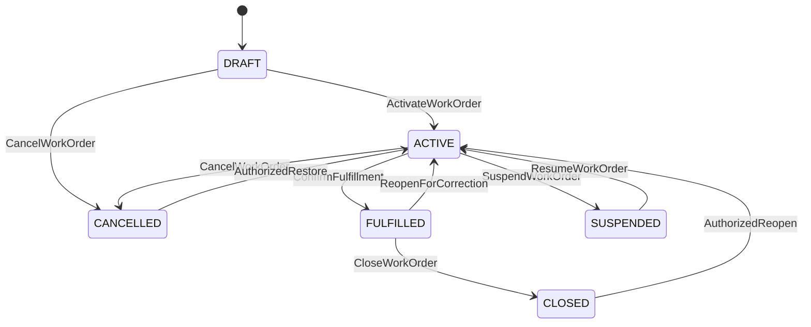
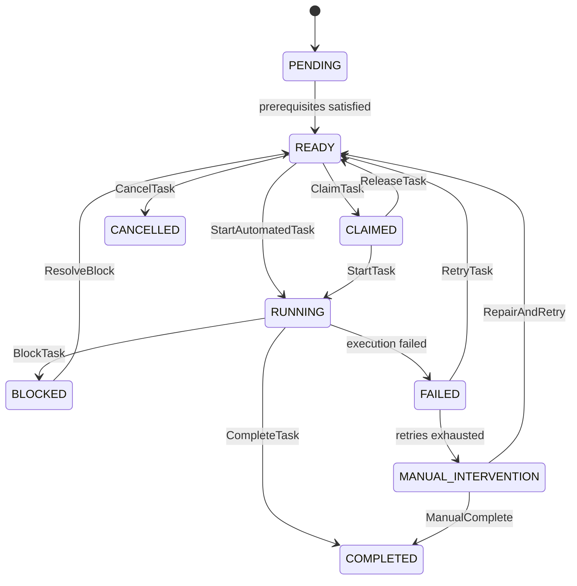
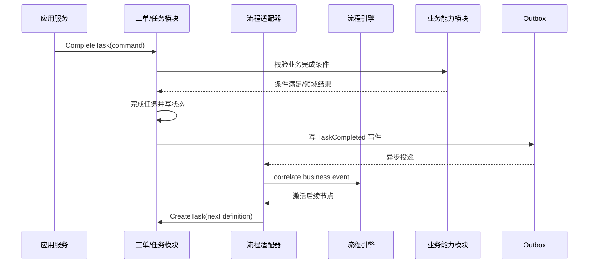

# 工单、任务与流程执行内核设计

## 1. 目标

执行内核负责让一张可能持续数天或数周的工单，在等待用户、等待资料、外部回传失败、系统重启和人工整改的情况下仍能可靠推进。

内核协调工单、阶段和任务，但不吞并预约、资料、审核、派单和结算的业务事实。各领域对象仍由各自模块维护。

## 2. 四层执行模型

| 层级 | 作用 | 稳定性 |
|---|---|---|
| `WorkOrder` | 一次履约的业务容器和生命周期 | 高度稳定 |
| `StageInstance` | 面向业务汇总的阶段实例 | 随服务产品配置 |
| `Task` | 责任人、SLA 和完成条件的执行单元 | 随流程配置 |
| `DomainEvent` | 已经发生的业务事实 | 追加记录 |

流程引擎中的 token、job、execution 等技术对象不对业务 API 暴露。

## 3. WorkOrder 聚合

### 3.1 关键字段

```text
workOrderId
externalOrderRefs[]
serviceRequestId
clientId / projectId / brandId / serviceProductId
configurationBundleId
customerRef / vehicleRef / assetRefs[]
lifecycleStatus
currentStageProjection
priority / riskLevel
ownerAssignments[]
createdAt / activatedAt / fulfilledAt / closedAt
version
```

`currentStageProjection` 是查询投影，不是驱动流程的唯一事实。

### 3.2 生命周期



约束：

- `FULFILLED` 表示项目验收条件满足，不等同财务已付款；
- `CLOSED` 表示本次履约不再接受普通业务动作；
- 关闭、重开、取消和恢复是工单级高风险命令；
- 强制操作产生独立事件并要求原因和授权依据。

## 4. StageInstance

阶段用于业务视图和指标，例如受理、派单、勘测、安装、审核、回传、结算。阶段可以串行或并行，不能假设工单只有一个“当前阶段”。

状态建议：

```text
NOT_STARTED -> ACTIVE -> COMPLETED
                    \-> SKIPPED
                    \-> CANCELLED
```

阶段完成由其出口条件决定，例如所有必需任务完成、指定审核通过或收到外部事件。

## 5. Task 聚合

### 5.1 任务类别

- `HUMAN`：客服审核、网点派师傅、人工异常处理；
- `AUTOMATED`：自动分配、事实提取、自动试算；
- `EXTERNAL`：等待车企确认、等待 SFTP 文件；
- `TIMER`：超时唤醒、预约提醒；
- `COORDINATION`：整改协调、投诉或争议跟踪。

### 5.2 状态机



### 5.3 不变量

- 同一任务只有一个当前责任归属事实源；
- 领取和完成操作使用乐观锁，不能重复完成；
- 完成必须校验动作权限、输入版本和完成条件；
- 自动任务失败不能直接标记完成；
- 人工完成自动任务必须保存修复内容、原因和证据；
- 取消任务不等于回滚该任务已经产生的领域事实；需要显式补偿。

## 6. 任务定义与任务实例

`TaskDefinition` 属于已发布流程配置，描述任务类型、创建条件、责任人策略、输入、动作、完成条件、SLA 和失败策略。

`Task` 是运行时实例，保存解析后的实际责任人、输入引用、配置版本和执行历史。运行时不再次读取可变草稿。

## 7. 动作模型

页面按钮必须映射为领域命令，而不是直接修改状态。动作可用性由以下条件共同决定：

```text
角色能力
AND 数据范围
AND 工单/任务生命周期
AND 配置定义的允许动作
AND 业务前置条件
```

动作查询 API 返回允许动作及所需输入 Schema；服务端在执行命令时重新校验，不能信任前端按钮隐藏。

## 8. 责任人解析

责任人策略输入包括工单、项目、品牌、区域、网点和当前参与关系，输出候选人或确定执行人，并记录解析解释。

首期策略：

- 系统执行；
- 指定用户或角色；
- 品牌/项目/客服负责人；
- 当前网点负责人或已分配师傅；
- 根据区域和组织规则；
- 人工选择。

零候选人、多候选人冲突或人员失效必须创建分配异常，不能静默落给管理员。

## 9. 流程引擎边界

流程引擎负责：节点推进、并行/网关、等待事件、定时器、引擎内部技术作业重试和流程执行历史。

业务模块负责：工单和任务状态、预约事实、资料版本、审核结论、派单决策、履约事实和金额。

业务自动任务的尝试次数、退避时间、业务幂等键和下次执行时间由任务模块唯一拥有并调度。流程引擎不得同时重试同一个外部副作用；它只在收到 `TaskCompleted` 等业务事件后继续推进。



流程引擎不得直接更新业务表。流程变量只保存稳定标识、小型路由数据和必要相关键。

## 10. 事务与一致性

单个聚合命令在本地事务中完成，并把领域事件写入 Outbox。跨模块通过幂等事件消费达到最终一致。

需要立即反馈的业务校验通过同步模块接口完成；长耗时、外部调用和可重试动作通过任务与消息执行。

不使用分布式数据库事务覆盖整个履约链路。

## 11. 幂等与并发

每个外部或用户命令包含：

```text
commandId
idempotencyKey
actor
expectedAggregateVersion
correlationId
causationId
occurredAt
```

- 相同幂等键和相同请求摘要返回第一次结果；
- 相同幂等键但摘要不同返回冲突；
- 聚合版本不匹配返回并发冲突并要求刷新；
- 事件消费者按 `eventId + consumerName` 去重；
- 外部回调同时校验外部流水号和业务状态合法性。

## 12. 自动任务执行

自动任务定义必须包含：

- 超时；
- 最大尝试次数与退避策略；
- 可重试和不可重试错误分类；
- 幂等键生成规则；
- 成功判定；
- 人工接管角色和 SLA；
- 修复后重试或人工完成方式。

重试不得制造重复派单、重复回传、重复扣款或重复通知。

## 13. 等待、暂停与 SLA

业务等待不等同任务阻塞：

- 等待用户/物业/电力报装可以由等待任务或暂停原因表达；
- SLA 是否暂停由 `SlaPolicy` 判断；
- 暂停动作保存原因、操作者、开始和恢复时间；
- 流程引擎计时器与 SLA 时钟分离，避免技术定时器成为业务事实源。

## 14. 取消、补偿和重开

取消工单时执行配置化取消计划：取消尚未开始的任务、终止不再需要的等待、释放资源预占、通知参与方，并为已发生事实创建必要补偿任务。

重开不删除旧任务，而是从授权恢复点创建新阶段/任务实例，并关联原处理链。资料、审核和回传历史继续保留。

## 15. 查询投影

为工单列表、待办、时间线和运营统计建立独立投影：

- 工单概要投影；
- 当前待办和候选人投影；
- 阶段进度投影；
- SLA 风险投影；
- 工单时间线；
- 外部同步状态投影。

投影可以重建；写模型不为列表筛选堆叠大量重复状态字段。

## 16. 可观测性

每次命令、事件、流程实例、任务、外部调用和自动重试共享 `correlationId`。运维界面必须能从工单追踪到：

- 当前活动阶段和任务；
- 流程引擎执行位置；
- 最近失败和重试；
- 待处理人工异常；
- 配置包和定义版本；
- 领域事件与外部调用记录。

## 17. MVP 验收场景

1. 相同外部工单重复推送只创建一张工单；
2. 初审可按配置跳过，并创建正确的下一任务；
3. 自动派单失败重试后转项目经理人工处理；
4. 勘测审核驳回后创建整改，补传后重新审核；
5. 安装与勘测分别创建预约和审核任务，不互相覆盖；
6. 回传超时重试不产生重复车企状态；
7. 服务重启后等待、计时器和任务仍可继续；
8. 并发完成同一任务只有一个成功；
9. 配置发布后在途工单仍使用原定义；
10. 取消、强制关闭、恢复和重开均有权限、原因和完整时间线。
