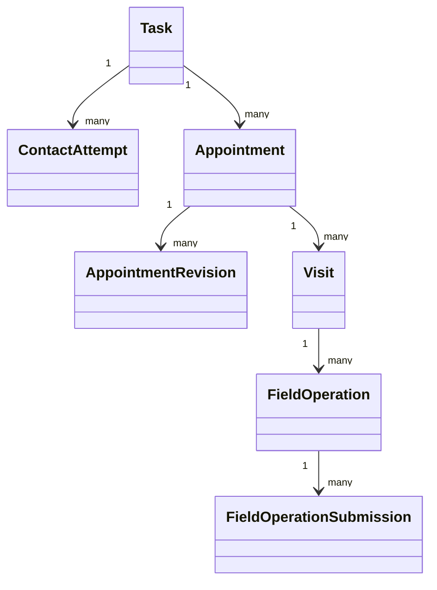
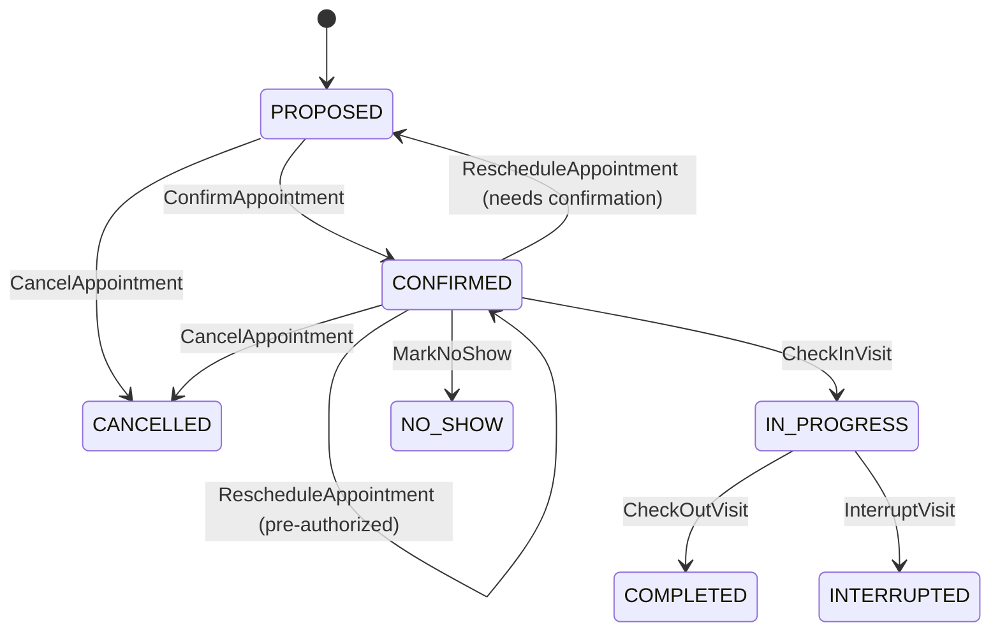

# 预约与现场作业设计

## 1. 目标

预约能力服务于勘测、安装、维修、整改和二次上门，不属于某一个业务页面。它需要区分：联系用户、约定时间、实际到场、现场作业和离场结果。

本设计确保勘测预约与安装预约不会互相覆盖，多次改约和多次上门均保留完整历史，并能在弱网场景下可靠提交现场记录。

## 2. 核心对象

| 对象 | 职责 |
|---|---|
| `ContactAttempt` | 一次联系用户的事实记录 |
| `Appointment` | 对某项现场服务的时间与地点承诺 |
| `AppointmentRevision` | 预约内容的一次不可变修订 |
| `Visit` | 实际到场和离场的一次现场访问 |
| `FieldOperation` | 勘测、安装、维修或整改的现场工作记录 |
| `FieldOperationSubmission` | 一次提交的结构化现场结果版本 |
| `OfflineCommand` | 移动端离线产生、待服务器确认的命令 |

## 3. 关系



一项任务可以有多次预约；一次预约可能因用户未到、地址异常等产生零次或多次 Visit。一个 Visit 可以执行多个明确的现场操作，但每个操作必须绑定任务和业务类型。

## 4. 联系记录

预约之前或过程中，每次联系都记录为 `ContactAttempt`：

```text
channel
contactedParty
startedAt / endedAt
resultCode
note
nextContactAt
actor
recordingRef（如合规允许）
```

建议结果编码：`CONNECTED`、`NO_ANSWER`、`BUSY`、`WRONG_NUMBER`、`USER_REQUESTED_LATER`、`INVALID_CONTACT`。

联系记录只追加，不以“最后联系结果”覆盖历史。手机号等敏感数据通过用户引用获取，不复制到每条记录。

## 5. Appointment

### 5.1 预约类型

- `SURVEY`：勘测预约；
- `INSTALLATION`：安装预约；
- `REPAIR`：维修预约；
- `CORRECTION`：整改/返工预约；
- `SECOND_VISIT`：因特定原因产生的再次上门；
- 后续类型通过受控目录扩展。

### 5.2 状态机



改约是事件而不是持久生命周期状态。每次改约新增 `AppointmentRevision`，不修改原约定时间；若新约定需要用户再次确认，Appointment 回到 `PROPOSED`，否则保持 `CONFIRMED`。

### 5.3 预约内容

每个修订至少包含：

- 预约类型和关联任务；
- 服务地址引用与坐标快照；
- 期望时间窗口和预计服务时长；
- 网点、师傅和用户参与方；
- 发起方、确认方、确认时间和确认渠道；
- 改约/取消原因；
- 项目日历和时区；
- 配置版本。

## 6. 并发和资源校验

创建或确认预约时校验：

- 任务处于允许预约状态；
- 网点和师傅仍为当前有效分配；
- 时间窗口符合项目日历和用户约束；
- 师傅不存在不可接受的时间冲突；
- 地址版本仍是当前或已明确接受旧地址；
- 预约修订版本未被其他人改约。

MVP 可以只进行冲突提示并允许授权覆盖，不要求路线优化。覆盖必须填写原因并审计。

## 7. Visit

Visit 表达实际发生的上门，不等同预约。关键字段：

```text
visitId / appointmentId / taskId
visitSequence
technicianId / networkId
checkInCapturedAt / checkInReceivedAt
checkOutCapturedAt / checkOutReceivedAt
checkInLocation / checkOutLocation
locationAccuracy
geofenceResult
deviceId
resultCode
exceptionCode
```

一次预约可能没有 Visit；二次上门必须创建新的 Visit，必要时创建新 Appointment。不能用一个“实际上门时间”字段反复覆盖。

`NO_SHOW` 只属于 Appointment：它表示约定时间内没有发生有效到场，因此不创建 Visit。只有实际执行 Check-in 后才存在 Visit 及其结果。

## 8. 到场与离场

### 8.1 Check-in

到场命令校验：当前师傅、任务、预约、设备、时间和位置。GPS 只作为证据之一，不能单独决定业务真伪。

位置校验结果：`WITHIN_GEOFENCE`、`OUTSIDE_GEOFENCE`、`LOCATION_UNAVAILABLE`、`LOW_ACCURACY`。异常结果可按项目要求阻止、警告或转人工审批。

### 8.2 Check-out

离场前校验现场操作结果、必填表单、必传资料和异常说明。允许保存草稿，但只有满足提交条件后才能完成作业任务。

## 9. FieldOperation

现场操作类型包括勘测、安装、维修、拆装和整改。它保存业务结果引用，不在自身重复保存所有动态字段和资料。

状态建议：

```text
PLANNED -> IN_PROGRESS -> SUBMITTED -> ACCEPTED
                         -> CORRECTION_REQUIRED -> IN_PROGRESS
                         -> ABORTED
```

`ACCEPTED` 表示平台内部完成条件满足；是否还需车企确认由后续任务和项目验收规则决定。

## 10. 无法施工、空跑和中断

这些不是简单备注，而是受控结果：

- `USER_UNREACHABLE`；
- `USER_NO_SHOW`；
- `PROPERTY_BLOCKED`；
- `POWER_APPLICATION_PENDING`；
- `MATERIAL_MISSING`；
- `SITE_UNSAFE`；
- `ADDRESS_INVALID`；
- `WEATHER_OR_FORCE_MAJEURE`。

每个结果配置必填原因、证据、责任归属、是否需要再次预约、是否暂停 SLA 和是否可能产生费用。提交异常结果后由流程创建协调或整改任务，不能由移动端直接跳到完成。

## 11. 多角色预约

客服、网点和师傅都可能预约，但必须使用同一 Appointment API。权限由角色能力、数据范围和任务动作共同判断。

后发修改使用版本控制；任何人不能无提示覆盖其他人的最新预约。系统保留实际操作者和确认方，不能把网点代约伪装为师傅预约。

## 12. 通知

预约确认、改约、取消、上门提醒和师傅出发等事件交给通知能力。Appointment 只产生领域事件，不直接拼短信或微信内容。

通知失败不回滚已确认预约，但进入通知失败处理；项目可以配置关键通知失败是否要求人工跟进。

## 13. 离线与弱网

移动端下载工作包：

```text
workOrder/task identifiers
configurationBundleId
form/evidence definitions and digests
prefill snapshot and versions
allowed offline actions
offline validity window
```

离线命令必须包含 `deviceCommandId`、设备 ID、采集时间、基础聚合版本和配置摘要。服务器收到后：

1. 校验离线有效期和身份；
2. 按 deviceCommandId 幂等；
3. 校验任务仍归属该师傅；
4. 检测聚合版本和预填数据冲突；
5. 接受、拒绝或要求人工合并；
6. 返回每条命令的权威结果。

不允许“最后上传覆盖服务器”。到场时间同时保存 `capturedAt` 和 `receivedAt`，并标记是否离线采集。

## 14. 定位与隐私

- 仅在现场作业所需时间采集位置；
- 明确展示采集目的并遵循授权；
- 不持续追踪与工单无关的师傅位置；
- 精确坐标按敏感数据控制访问和保留期限；
- 水印展示地址时避免暴露超出车企要求的个人信息；
- 原始 EXIF、设备信息和定位校验结果按证据策略保存。

## 15. 事件

| 事件 | 关键用途 |
|---|---|
| `ContactAttemptRecorded` | 首次联系 SLA、客服时间线 |
| `AppointmentProposed` | 用户确认和通知 |
| `AppointmentConfirmed` | 激活上门等待和提醒 |
| `AppointmentRescheduled` | 更新提醒、保留旧修订 |
| `AppointmentCancelled` | 流程补偿和通知 |
| `VisitCheckedIn` | 到场事实、SLA 停止/阶段推进 |
| `VisitCheckedOut` | 现场操作提交检查 |
| `FieldOperationSubmitted` | 启动资料验证和审核 |
| `FieldOperationInterrupted` | 创建协调任务 |

## 16. MVP 边界

MVP 包含联系记录、预约/改约/取消、到场/离场、勘测与安装现场操作、异常结果、基础时间冲突提示、GPS 证据和离线队列。

用户自助选时、实时路线优化、持续位置跟踪、复杂产能日历和自动行程重排延后。
