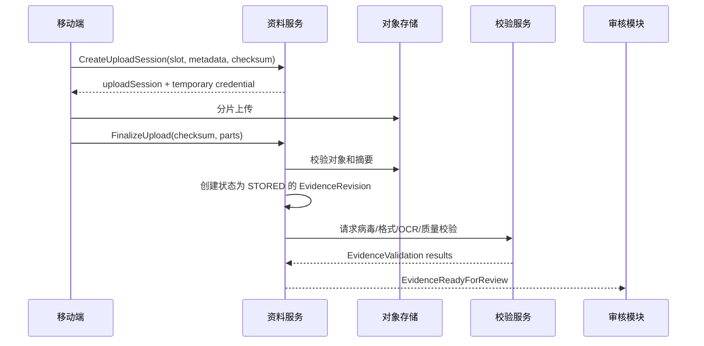

# 资料、审核与整改闭环设计

> M44 已实现 ReviewCase/ReviewDecision 最小运行时（见 `architecture/57-review-case-decision-runtime.md`）。
> M45 已实现 CorrectionCase 最小运行时（见 `architecture/58-correction-case-runtime.md`）。
> M47 已实现整改 Task 自动创建（见 `architecture/60-correction-task-runtime.md`）。
> 强制通过、重开、车企回执仍未实现；本章其余内容仍为指导设计。

## 1. 目标

资料不是工单附件列表，而是对明确业务要求提交的履约证据。系统必须支持固定与条件资料、现场采集约束、OCR/AI 预检、单项审核、多次驳回补传、总部与车企两级审核，以及完整版本追溯。

## 2. 核心对象

| 对象 | 职责 |
|---|---|
| `EvidenceRequirement` | 已发布资料模板中一项要求 |
| `EvidenceSlot` | 某任务实例根据条件解析出的资料槽位 |
| `EvidenceItem` | 满足一个槽位的逻辑资料身份 |
| `EvidenceRevision` | 一次不可变文件/数据版本 |
| `EvidenceSetSnapshot` | 某一时点用于提交、审核或报告的不可变资料版本集合 |
| `CaptureMetadata` | 拍摄时间、位置、设备、水印和来源 |
| `EvidenceValidation` | 格式、病毒、重复、OCR、质量等机器校验 |
| `ReviewCase` | 对明确审核范围的一次审核案例 |
| `ReviewDecision` | 审核员对资料版本或提交组的一次决定 |
| `CorrectionCase` | 汇总需整改项及其闭环状态 |
| `ExternalReviewReceipt` | 车企对 ReviewCase 返回的一次不可变回执记录 |

## 3. 资料要求

每项 `EvidenceRequirement` 至少配置：

- 稳定编码、名称、业务说明、适用任务；
- 固定或条件出现规则；
- 最小/最大数量，是否允许同槽多项；
- 照片、视频、文件、签名或结构化报告类型；
- 现场拍摄、相册、GPS、时间、水印和设备约束；
- MIME、大小、时长、分辨率和清晰度要求；
- OCR 字段、一致性校验和 AI 预检策略；
- 审核规则和驳回原因库；
- 车企回传映射和 PDF/资料包输出要求；
- 敏感级别、保留期限和访问策略。

虽然当前部分项目没有数量限制，底层仍支持最小/最大数量。

## 4. 条件解析

任务进入资料采集阶段时，根据锁定配置和当时已确认字段生成 `EvidenceSlot`。之后条件字段变化时：

- 尚未提交的槽位可重新解析；
- 已提交槽位不直接删除，标记条件变化并要求规则决定保留、作废或复审；
- 任务完成时重新使用权威字段版本校验必需槽位；
- 解析过程保存输入字段版本、规则版本和命中解释。

## 5. 文件上传流程



对象存储回调不能单独创建业务资料，必须通过有效 upload session、任务权限和 checksum 完成 finalize。

## 6. EvidenceItem 与 Revision

`EvidenceItem` 是逻辑资料，例如“充电桩铭牌照片第 1 项”。补传创建新 `EvidenceRevision`，不覆盖原对象。

Revision 生命周期只表达文件处理：

```text
STORED -> VALIDATING -> VALIDATED
                    \-> VALIDATION_FAILED
                    \-> QUARANTINED
VALIDATED -> INVALIDATED（授权作废）
```

上传中状态属于 `UploadSession`；Finalize 成功前不存在 EvidenceRevision。

审核通过/驳回不写成 Revision 生命周期状态；审核事实属于 `ReviewDecision`。查询层可以投影“当前有效版本审核状态”。

## 7. CaptureMetadata

保存：

```text
captureSource: CAMERA/GALLERY/FILE/GENERATED/EXTERNAL
capturedAt / receivedAt
latitude / longitude / accuracy
addressSnapshot
deviceId / appVersion
watermarkPolicyVersion / watermarkDigest
originalExifDigest
offlineFlag
uploadedBy / uploadedRole
onBehalfOf / delegationRef
```

网点异常代补资料时必须显式标记实际上传人、角色和代办原因，不能伪装为师傅上传。

## 8. 机器校验

校验结果独立保存：

- 文件格式、大小、分辨率、时长；
- 恶意文件和内容安全；
- 图片模糊、过暗、反光、遮挡；
- 与历史资料的重复/近重复；
- GPS 和安装地址距离；
- OCR 的 SN、VIN、编号和金额；
- OCR/图像值与工单标准字段一致性；
- 模型、规则版本、置信度和原始输出摘要。

机器校验可阻止提交、给出警告或进入人工审核。MVP 不允许低置信度 AI 自动做不可逆审核决定。

## 9. 审核范围

`ReviewCase` 的 scope 明确指向：

- 单个 EvidenceRevision；
- 一个 EvidenceSlot 当前版本；
- 一个任务的资料集合；
- FormSubmission；
- FieldOperationSubmission。

当前业务通常一张工单由一名客服审核，但模型允许按资料类型或阶段配置不同审核策略。责任人和 SLA 仍属于关联 Task，ReviewCase 不重复保存任务责任事实。

当审核范围是一组资料时，先创建 `EvidenceSetSnapshot`，冻结成员的 slot、item、revision、校验版本和集合摘要。后续补传不会静默改变旧集合；复审创建新 snapshot 或精确增加新的审核 target。

## 10. ReviewDecision

决定类型：

- `APPROVED`；
- `REJECTED`；
- `NEEDS_CORRECTION`；
- `FORCED_APPROVED`；
- `VOIDED`，仅用于撤销错误决定并要求授权。

每个决定记录审核对象精确版本、原因编码、补充说明、审核人、策略版本、时间和证据。标准原因库按项目和资料类型版本化。

审核员不能直接修改师傅提交字段或替换资料。若业务授权允许代补，必须创建新资料版本并使用独立能力和审计。

## 11. 单项审核与整组结果

单项资料可独立通过或驳回。任务级审核结果由配置化聚合规则计算，例如：

```text
所有必需槽位至少一个当前有效版本 APPROVED
AND 表单提交 APPROVED
AND 无未解决的阻断性机器校验
```

聚合结果是可重建投影，不另行手工维护“工单审核状态”。

客户端只提交各 target 的决定、原因和说明；整组决定由服务端按审核策略计算并返回，客户端不能声明一个与单项结果矛盾的 `overallDecision`。

## 12. CorrectionCase

驳回产生或更新整改案例：

```text
correctionCaseId
sourceReviewCaseId
rejectedTargets[]
reasonCodes[]
requiredActions[]
correctionTaskIds[]
status
resubmissionRefs[]
```

整改责任人、候选人、截止时间和 SLA 只保存在关联整改 Task。CorrectionCase 通过 Task ID 关联并投影进度，不保存第二套责任事实。

状态：

```text
OPEN -> IN_PROGRESS -> RESUBMITTED -> VERIFIED -> CLOSED
                 \-> WAIVED（高风险授权）
```

`IN_PROGRESS` 是根据关联整改 Task 的执行状态形成的案例投影，不表示 CorrectionCase 自己拥有责任人。

同一项可以多次驳回；每轮保留独立决定和补传版本。整改 Task 完成后重新创建/激活审核任务，而不是把旧审核决定改为通过。

## 13. 车企审核

总部审核通过并回传后，创建 `origin=CLIENT` 的 ReviewCase。车企每次响应记录为关联的 `ExternalReviewReceipt`：

- 外部审核单号和回执原文引用；
- 回传批次和映射版本；
- 通过/驳回结果；
- 外部原因到内部原因的映射；
- 接收时间和幂等键；
- 受影响字段、资料或报告版本。

外部回执由适配器校验和映射后追加一条 ReviewDecision；它不是第二种审核案例模型。

车企驳回先创建客服协调任务，由客服确认整改对象并分派给网点/师傅。不得让外部回调直接把当前师傅任务改成任意状态。

## 14. 重新审核和强制通过

审核通过后重新驳回必须创建新审核案例，并引用触发原因（车企驳回、抽检、发现造假等）。旧决定保留。

强制通过使用专用能力：

- 必填原因和授权依据；
- 可配置二级审批；
- 记录未满足的原条件；
- 影响结算或外部回传时向相关角色告警；
- 不能删除机器校验或原驳回事实。

## 15. 报告与车企资料包

报告生成是自动任务，输入必须锁定：表单提交版本、资料版本、模板版本和映射版本。生成的 PDF/ZIP 本身作为 `GENERATED` EvidenceRevision 保存摘要。

同一输入和模板应生成业务等价结果。报告重生成不覆盖旧报告；车企回传记录精确引用已发送版本。

## 16. 离线上传

- 移动端先生成本地资料 ID、checksum 和 capture metadata；
- 恢复网络后创建 upload session 并分片上传；
- 相同 deviceCommandId/checksum 重试不重复创建 revision；
- 任务已改派、槽位已失效或配置不匹配时进入冲突处理；
- 未完成上传不能完成任务；
- 本地文件确认服务器持久化并校验后再按保留策略清理。

## 17. 安全

- 上传凭证只允许指定路径、类型、大小和短时有效；
- 文件下载需要实时数据范围和资料权限；
- 敏感图片 URL 不进入普通事件；
- 原图、缩略图、水印图和报告派生关系可追溯；
- 删除或隐私处理使用受控保留策略，不破坏必要审计；
- 重复图检测使用受控特征摘要，访问模型输出需要授权。

## 18. MVP 验收

1. 固定与条件资料槽位正确生成；
2. 现场拍摄、相册、GPS、水印规则按项目执行；
3. OCR SN 与工单 SN 不一致能阻止或转人工；
4. 单项驳回不影响已通过的其他资料；
5. 补传产生新 revision，旧文件和审核历史保留；
6. 同一资料多次驳回可完整追溯；
7. 车企驳回先进入客服协调；
8. 普通审核员不能改字段、代上传或强制通过；
9. 离线上传重试不产生重复资料；
10. 报告和回传精确引用版本。
