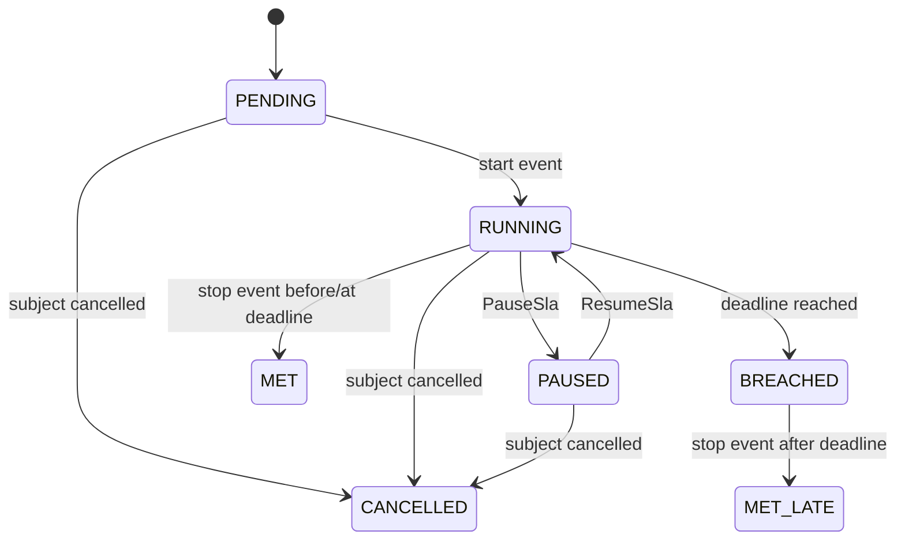

# SLA 时钟、预警与升级设计

> M61 已实现 Task `TASK_CREATED → TASK_COMPLETED` 的 ELAPSED 自然时长子集：Workflow 显式
> `slaRef`、SLA Version/摘要冻结、RUNNING/BREACHED/MET/MET_LATE、单一 TARGET_DUE milestone、
> Inbox/Outbox 和 PostgreSQL 对账。M62 已实现 `sla.read` + Project Scope 的工作台、工单时间线和
> segment/milestone 详情查询。本文其余 BUSINESS 日历、暂停、预警、升级、通知、重算和多 subject
> 仍为 Proposed，不得从 M61 外推为完整 SLA 平台。

## 1. 目标

SLA 能力用于项目、业务和节点时效，不只是工单上的预计完成时间。它必须支持不同车企、业务类型、风险等级、工作日历、暂停原因、预警阈值和多级升级，并保留可重算的时钟历史。

## 2. 核心对象

| 对象 | 职责 |
|---|---|
| `SlaPolicyVersion` | 已发布的目标、日历、暂停、预警和升级规则 |
| `BusinessCalendarVersion` | 工作时段、周末、节假日和特殊工作日 |
| `SlaInstance` | 某工单/任务实际运行的 SLA 时钟 |
| `SlaClockSegment` | RUNNING/PAUSED 的不可变时间片段 |
| `SlaPauseRecord` | 暂停原因、证据、操作者和恢复信息 |
| `SlaMilestone` | 预警、到期和升级阈值 |
| `SlaEscalation` | 某个 SLA 里程碑触发的一次升级记录 |

## 3. 策略选择

SLA 策略按以下上下文解析并锁定版本：

```text
client/project
serviceProduct
taskCode
riskLevel/priority
region
businessDate
```

具体小时数和日历尚需按首个试点项目填写 M1-04，架构不预设数值。自动派单失败人工处理的 24 小时是当前唯一已确认的明确值。

## 4. SlaInstance

关键字段：

```text
slaInstanceId
subjectType / subjectId
policyVersionId / calendarVersionId
startEventId / startedAt
targetDuration
deadlineAt
status
elapsedBusinessDuration
pausedBusinessDuration
currentSegmentId
version
```

建议状态：



`BREACHED` 是已经发生的事实，之后完成标记为 `MET_LATE`，不能把历史超时擦除。

## 5. 开始与停止

策略明确业务事件：

- 开始：WorkOrderCreated、TaskReady、DispatchFailed、EvidenceSubmitted 等；
- 停止：OwnerAssigned、AppointmentConfirmed、ReviewDecided 等；
- 取消：相关工单或任务被合法取消；
- 重启：整改新轮次通常创建新 SLA，不复用旧实例。

事件重复消费按 `slaInstance + milestone/event` 幂等。迟到事件按其业务发生时间计算，但记录接收时间和迟到原因。

## 6. 业务日历

日历版本包含：

- 时区；
- 每周工作时段；
- 法定节假日；
- 调休工作日；
- 项目特殊停工日；
- 日期边界和跨日班次规则。

SLA 实例锁定日历版本。日历后续修订不改变历史 deadline；确需修正使用受控重算并保存新旧结果和原因。

## 7. 时长与截止时间

支持自然时长和工作时长：

- `ELAPSED`：连续自然时间；
- `BUSINESS`：只累计业务日历工作时间。

截止时间由纯函数计算：开始时间、目标时长、日历版本和已确认暂停片段。同样输入必须得到相同结果。

## 8. 暂停与恢复

当前业务中暂停不需要审批或证明，但不同项目可能变化，因此策略配置：

- 允许暂停的原因；
- 哪些角色可暂停；
- 是否必须资料/说明/审批；
- 最大单次/累计暂停时长；
- 是否自动恢复；
- 是否通知车企或品牌负责人。

首批暂停原因候选：用户延期、物业阻塞、电力报装、物料缺货和不可抗力。必须以真实项目确认后启用。

暂停命令创建 `SlaPauseRecord` 和结束当前 RUNNING segment；恢复关闭 pause 并创建新 RUNNING segment。不能只改一个 `paused=true` 字段。

## 9. 预警与升级

Milestone 可以按剩余时长、已消耗比例或超时后时长配置：

```text
50% consumed -> 提醒当前责任人
80% consumed -> 提醒责任人和项目经理
100% -> 标记 BREACHED
+2h -> 升级品牌负责人
```

示例不代表当前项目真实阈值。当前已确认超时主要升级品牌负责人。

Milestone 触发只追加记录。通知失败不撤销 SLA 事实，进入通知重试/异常处理。

## 10. SlaEscalation

预警或超时里程碑触发升级记录，保存：

```text
sourceSlaInstanceId
severity
triggeredMilestoneId
recipientResolutionId
notificationIntentIds[]
operationalExceptionId（可选）
triggeredAt
```

SlaEscalation 只记录“何时按哪条策略升级给谁”。若需要持续人工协调，创建 `OperationalException` 和 handling Task；责任人、处理状态和处理 SLA 不在 SlaEscalation 中重复维护。

## 11. 调度与权威时间

数据库中的 SlaInstance/segments/milestones 是事实源；定时调度器只是唤醒机制。调度器重启或重复触发不得产生重复 breach/notification。

建议使用：

- 按 `nextMilestoneAt` 查询或延时任务；
- milestone 唯一键保证幂等；
- 周期性 reconciliation 扫描漏触发实例；
- 使用服务器权威时间，客户端时间只作为业务采集信息；
- 监控调度延迟和积压。

## 12. 重算

以下情况可能要求重算：

- 业务时间或暂停记录被授权更正；
- 项目日历存在错误；
- 历史数据迁移；
- 车企确认免责区间。

重算创建 `SlaRecalculation`，保存旧结果、新结果、输入版本、原因和审批。不得覆盖原 milestone 触发记录；报表明确当前认可值和历史计算值。

## 13. 考核输出

SLA 输出标准事实：是否按时、超时分钟、暂停分钟、免责分钟、策略版本、责任阶段。网点考核读取这些事实，不直接从工单状态和当前时间临时计算。

责任归属和处罚金额属于考核/结算规则，不由 SLA 时钟直接决定。

## 14. 权限与审计

暂停、恢复、手工更正开始/停止事件、重算和免责均记录：操作者、能力、数据范围、原因、证据、审批和前后 deadline。

普通用户不能手工把 `BREACHED` 改回未超时；只能通过受控重算生成认可结果。

## 15. 事件

| 事件 | 用途 |
|---|---|
| `SlaStarted` | 查询投影和调度 |
| `SlaPaused` | 更新时间片和通知 |
| `SlaResumed` | 重算下一 milestone |
| `SlaWarningReached` | 通知当前责任人 |
| `SlaBreached` | 考核、升级和异常中心 |
| `SlaMet` | 关闭时钟、指标 |
| `SlaMetLate` | 保留超时后完成事实 |
| `SlaRecalculated` | 报表和审计差异 |

## 16. MVP 验收

1. 不同项目、任务和风险等级锁定正确策略；
2. 自然时长与工作日历截止时间计算正确；
3. 暂停/恢复形成连续且无重叠的 segment；
4. 服务重启和重复调度不重复触发 milestone；
5. 超时后完成保留 breach 历史；
6. 自动派单失败创建 24 小时人工处理 SLA；
7. 预警和升级按当前 Task 责任关系解析收件人；
8. 品牌负责人收到配置要求的超时升级；
9. 重算保留新旧值和审批；
10. 网点考核能读取稳定 SLA 事实。
