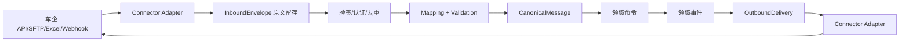
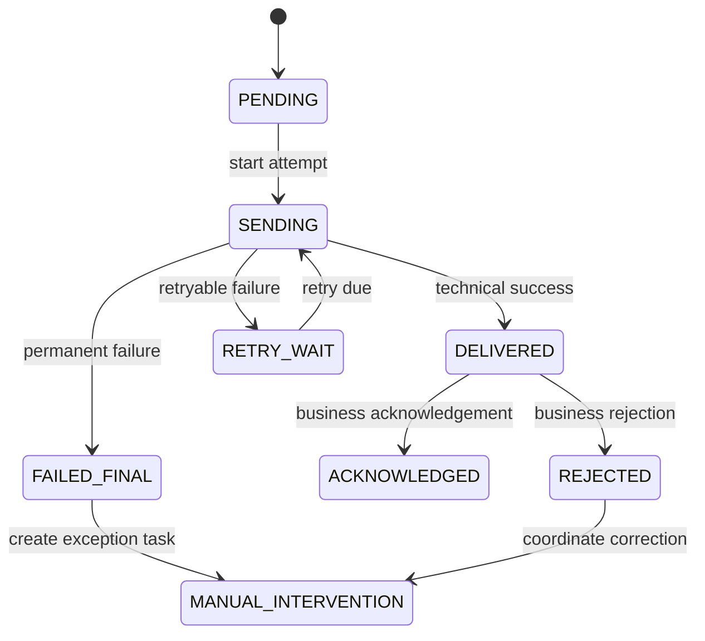

# 车企集成、回传与可靠交付设计

## 1. 目标

集成能力将车企 API、主动拉取、Excel、SFTP、Webhook 等外部差异隔离在适配层，并保证重复请求不重复创建工单、回传超时不重复产生外部副作用、失败可以自动重试或转人工修复。

## 2. 核心对象

| 对象 | 职责 |
|---|---|
| `ConnectorDefinitionVersion` | 渠道、认证、端点和能力配置 |
| `IntegrationMappingVersion` | 字段、枚举、状态、资料和错误映射 |
| `InboundEnvelope` | 一次收到的原始外部消息 |
| `CanonicalMessage` | 标准化后的业务消息 |
| `OutboundDelivery` | 一次待向外部系统交付的业务意图 |
| `DeliveryAttempt` | 一次网络/文件交付尝试 |
| `ExternalAcknowledgement` | 外部技术或业务确认 |
| `IntegrationException` | 无法自动闭环的集成异常 |
| `ReplayRequest` | 受审计的重放/补发请求 |

## 3. 接入分层



适配器不直接写工单、任务、资料或结算表。

## 4. InboundEnvelope

保存：

```text
inboundEnvelopeId
connectorVersionId
externalMessageId / externalOrderNo
receivedAt
transportMetadata
payloadObjectRef / payloadDigest
signatureValidation
deduplicationKey
processingStatus
mappingVersionId
canonicalMessageId
correlationId
```

原始正文进入受控对象存储或加密存储，关系库不重复保存大报文和敏感附件。

## 5. 入站幂等

按连接器定义稳定业务键，例如：

```text
tenant + connector + externalMessageId
或 tenant + source + externalOrderNo + messageType + externalVersion
```

- 同键同摘要：返回或关联第一次处理结果；
- 同键不同摘要：记录冲突，不静默覆盖；
- 无外部消息号：使用规范化业务键与内容摘要，并提高人工冲突处理能力；
- Excel/SFTP 批次同时保留文件摘要、行号和业务键。

## 6. 标准消息

CanonicalMessage 使用平台稳定语义，例如创建工单、更新客户信息、车企审核回执、取消请求。映射保存：

- 外部字段路径与标准字段；
- 类型转换、枚举映射和默认值；
- 来源优先级与是否允许覆盖已确认数据；
- 错误策略；
- 映射版本和样例测试。

外部状态不能直接写工单状态，必须映射为合法领域命令。

## 7. OutboundDelivery

一次业务意图只创建一个 OutboundDelivery，例如“回传安装完成资料 V3”。它保存：

```text
deliveryId
connectorVersionId / mappingVersionId
businessMessageType
businessKey
sourceObjectRefs[]
payloadSnapshotRef / payloadDigest
externalIdempotencyKey
status
failurePolicyVersionId
createdAt
```

sourceObjectRefs 必须精确到表单、EvidenceSetSnapshot、生成报告、审核和状态版本，后续资料变化不能静默改变已创建 delivery 的内容。

## 8. 交付状态



技术 2xx/文件上传成功不一定等于车企业务接受；`DELIVERED` 与 `ACKNOWLEDGED` 分离。

## 9. DeliveryAttempt

每次尝试保存：

- attemptNo、开始/结束时间；
- 请求摘要、外部流水号和幂等键；
- 端点/文件路径引用；
- 响应状态、错误分类和响应正文引用；
- 连接、读取和总超时；
- 下次重试时间；
- 实际 connector credential version（不保存密钥）。

不能只保留“最后一次错误”。

## 10. 错误分类与重试

| 分类 | 示例 | 默认处理 |
|---|---|---|
| `TRANSIENT_NETWORK` | 连接超时、DNS 临时错误 | 指数退避重试 |
| `REMOTE_THROTTLED` | 429 | 尊重 Retry-After |
| `REMOTE_5XX` | 服务器错误 | 有界重试 |
| `AUTHENTICATION` | 凭据过期 | 暂停 connector、告警人工 |
| `VALIDATION` | 外部必填缺失 | 不自动重试，人工修复 |
| `BUSINESS_REJECTED` | 资料不合格 | 进入客服协调/整改 |
| `DUPLICATE_ACCEPTED` | 外部已存在 | 查询并核对，视为幂等成功或冲突 |
| `UNKNOWN` | 未分类错误 | 少量重试后人工 |

重试次数、退避和人工接管由失败策略版本定义。任务模块是业务重试唯一调度者；连接器库内部只能重试明确无副作用的低层连接动作。

## 11. 外部幂等

如果车企支持幂等键，使用稳定 `externalIdempotencyKey`。如果不支持：

- 发送前保存 OutboundDelivery；
- 超时后优先查询外部状态；
- 使用外部工单号、消息类型和版本作为业务去重键；
- 不盲目重发收费、完成或取消等高风险消息；
- 无法判定时转人工，不把“不知道”当失败重试。

## 12. 回执

ExternalAcknowledgement 保存技术回执和业务回执：

```text
ackId / deliveryId
externalAckId
ackType: TECHNICAL/BUSINESS
result
reasonCodes
payloadRef / digest
receivedAt
mappingVersionId
affectedObjectRefs[]
```

重复回执幂等；相互矛盾的回执进入异常，不覆盖旧结果。

## 13. 人工修复与重放

人工处理不能直接把 delivery 状态改为成功。允许动作：

- 修复配置后重试原 payload；
- 基于新对象版本创建新的 delivery；
- 查询外部状态并登记确认；
- 标记外部已人工处理并附证据；
- 放弃交付并说明业务影响。

ReplayRequest 保存申请人、范围、原因、审批、原 delivery、是否复用幂等键和执行结果。批量重放需限流和预演。

## 14. SFTP、Excel 和文件渠道

- 文件生成先写临时路径，校验摘要后原子重命名；
- 批次 manifest 保存行数、业务键和文件摘要；
- 入站按文件 + 行双层幂等；
- 部分行失败形成逐行结果，不整批静默丢弃；
- 文件名不是唯一业务键；
- 人工上传 Excel 也记录操作者和原文件版本。

## 15. 连接器健康

监控：成功率、P95 延迟、重试量、积压、最老待发送时间、认证错误、业务拒绝率和回执延迟。

熔断只保护依赖，不把业务消息丢弃。熔断期间 delivery 保持待重试并按 SLA 触发人工预警。

## 16. 安全

- 凭据由密钥系统管理、轮换和最小权限；
- 入站验签、重放窗口和来源限制；
- 敏感报文加密、脱敏查看和访问审计；
- 日志不输出令牌、完整手机号或附件 URL；
- 下载/回传资料使用短时授权或受控服务凭据；
- 每个 connector 有独立服务主体和速率限制。

## 17. MVP 验收

1. 重复车企推送不重复创建工单；
2. 同业务键不同内容进入冲突；
3. 回传 payload 锁定精确对象版本；
4. 超时重试不产生重复车企业务结果；
5. 技术送达与业务确认分离；
6. 车企拒绝先进入客服协调；
7. 永久失败创建人工异常 Task；
8. 修复重试和创建新 delivery 均完整审计；
9. SFTP/Excel 支持批次与行级幂等；
10. 服务重启后积压 delivery 可继续且不重复。
