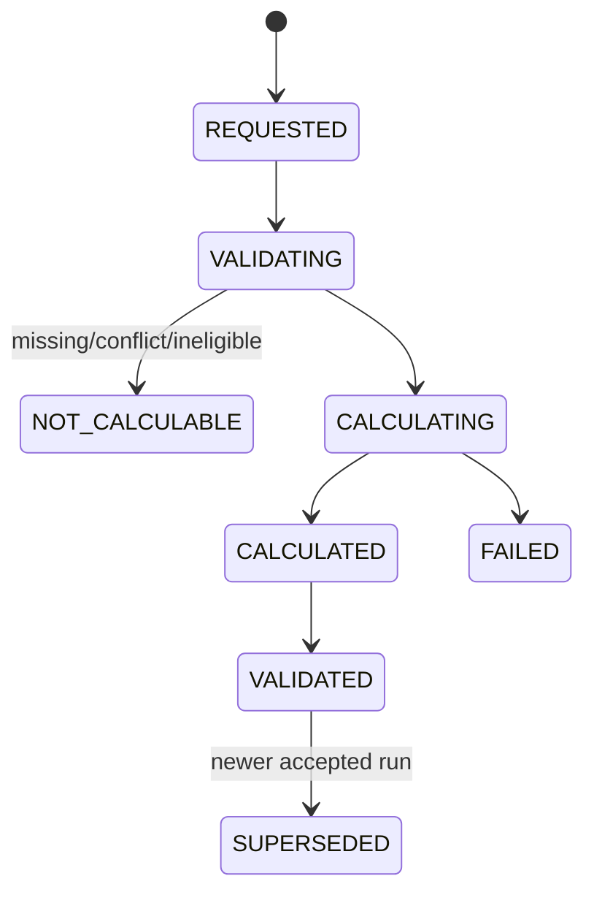

# 履约事实提取与双向试算运行时

## 1. 目标

本设计把已确认的任务、表单、资料、预约、上门、物料和 SLA 数据转换为标准履约事实，再使用明确的事实集合与价格版本分别计算对上应收和对下应付。

运行时必须满足：确定性、可解释、可重算、版本不可变、缺失不默认为零、两种结算方向互不污染。

## 2. 核心对象

| 对象 | 职责 |
|---|---|
| `FactDefinitionVersion` | 事实编码、类型、单位、枚举和业务定义 |
| `FactExtractionPolicyVersion` | 来源到标准事实的提取、聚合与确认规则 |
| `FactExtractionRun` | 一次提取执行及完整输入/输出/错误 |
| `FulfillmentFact` | 某个事实编码的一次不可变断言版本 |
| `FactCorrection` | 对既有事实的更正、失效或替代依据 |
| `FactSetSnapshot` | 某次试算使用的不可变事实版本集合 |
| `PricingPlanVersion` | 某方向已发布且不可变的计价规则 |
| `PricingContextSnapshot` | 项目、区域、合同、日期、税和方向上下文 |
| `CalculationRun` | 一次确定性试算运行 |
| `ChargeItem` | 规则生成的一条不可变费用明细 |
| `CalculationComparison` | 新旧系统、版本或重算结果的差异 |

## 3. 事实目录

事实编码由受控目录管理，例如：

```text
service.installation.completed
installation.cableLength
installation.pillarCount
visit.count.installation
service.remoteLevel
sla.installation.breachedMinutes
responsibility.secondVisit
material.cable.actualQuantity
```

每个版本定义：

- 值类型、单位、精度和允许枚举；
- 单值、多值或按明细维度；
- 业务定义和不包含的情况；
- 是否可用于对上、对下、考核或报表；
- 敏感等级；
- 允许来源类型；
- 更正和失效政策；
- 替代事实编码。

项目不能通过自然语言临时创建价格规则专用字段；新增事实先进入目录、评审语义与复用边界。

## 4. 提取策略

提取策略声明：

```text
factCode
sourceSelectors[]
eligibilityCondition
transformation
aggregation
confirmationPolicy
conflictPolicy
evidenceRequirement
effectiveTimeRule
```

来源必须精确到版本，例如 FormSubmission V3、EvidenceSetSnapshot S2、Visit V1、ReviewDecision D4、SlaInstance 当前认可重算版本。

## 5. 提取流程


每一步保存规则节点、输入摘要、中间值、输出或错误，不能只保存最终事实值。

## 6. FulfillmentFact

关键字段：

```text
factId / factCode / factDefinitionVersionId
workOrderId
dimensionKey（可选）
value / valueType / unit
effectiveAt
sourceRefs[]
evidenceSetSnapshotIds[]
extractionRunId / policyVersionId
status
supersedesFactId
confirmedBy / confirmedAt
invalidationReason
contentDigest
```

状态：

```text
OBSERVED -> CONFIRMED
OBSERVED -> INVALIDATED
CONFIRMED -> SUPERSEDED
CONFIRMED -> INVALIDATED（受控更正）
```

事实记录只追加。更正创建新事实和 FactCorrection；旧事实状态变化通过追加事件/治理记录形成投影，不更新原值和来源。

## 7. 冲突处理

同一事实可能来自多个来源，例如表单线缆长度、OCR 收费单和物料消耗。策略必须明确：

- 权威来源优先；
- 数值必须一致；
- 允许误差范围；
- 取最大/最小/求和；
- 转人工确认。

未配置冲突策略时，不选择“最后写入值”，提取运行返回 `FACT_SOURCE_CONFLICT`。

## 8. 缺失与零值

- `MISSING` 表示没有合格事实；
- 数值 `0` 是经过来源确认的真实值；
- `NOT_APPLICABLE` 表示规则明确不适用；
- `UNKNOWN` 表示业务暂时无法确定。

价格规则必须声明允许哪些状态。必需事实 MISSING/UNKNOWN 时 CalculationRun 返回 `NOT_CALCULABLE`，不能把它们当零。

## 9. FactSetSnapshot

试算之前创建不可变集合：

```text
factSetSnapshotId
workOrderId
purpose
memberFactIds[]
eligibilityPolicyVersionId
createdAt
contentDigest
```

服务端校验：事实属于同一工单/允许的关联工单，状态可计价、无重复键、维度完整、必需事实齐全、证据和验收条件满足。

后续事实更正不会改变旧 snapshot；新试算必须使用新 snapshot。

## 10. PricingContextSnapshot

保存：

- 方向：RECEIVABLE/PAYABLE；
- 客户或网点结算对象；
- 项目、品牌、业务产品、区域；
- 合同和价格方案版本；
- 取价日期及其来源事实；
- 币种、税、舍入策略；
- 特批和调整上下文；
- 内容摘要。

运行时不能临时读取“项目当前合同”或“当前区域”。

## 11. CalculationRun



运行锁定：

```text
factSetSnapshotId
pricingContextSnapshotId
pricingPlanVersionId
calculationEngineVersion
functionLibraryVersion
requestId/idempotencyKey
```

同一业务幂等键与相同输入摘要返回同一运行；相同键不同输入拒绝。

## 12. 规则执行

计价规则使用受控表达式、决策表和注册函数：

- 禁止任意网络、文件或数据库访问；
- 禁止随机数和无快照当前时间；
- 限制 CPU、内存、递归和执行时长；
- 所有函数版本化；
- Decimal/定点数运算，不使用二进制浮点金额；
- 条件、互斥、叠加、阶梯、封顶、税和舍入顺序明确；
- 发布前执行规则冲突、覆盖和历史样本回放。

## 13. ChargeItem

每条明细保存：

```text
chargeItemId / calculationRunId
chargeCode / direction
conditionTrace
factInputs[]
quantity / unit
unitPrice
preAdjustmentAmount
adjustments[]
tax
roundingTrace
finalAmount / currency
ruleVersionId / ruleNodeId
explanation
```

ChargeItem 不允许人工原地改金额。商务特批、核减或补差生成独立 Adjustment/ChargeItem，并关联审批。

## 14. 对上与对下

同一 FactSetSnapshot 可以分别用于两个方向，但必须创建独立 PricingContextSnapshot、PricingPlanVersion、CalculationRun 和 ChargeItems。

```text
事实更正
├─ 标记相关对上 run 过期并评估重算
└─ 标记相关对下 run 过期并评估重算
```

任一方向的人工调整、审核、争议和锁定不自动影响另一方向。

## 15. 过期与影响分析

当事实失效、价格版本撤销、验收被重开或合同上下文更正时，创建 `CalculationImpact`：

- 受影响 runs/charge items/statements；
- 是否已提交、确认或锁定；
- 可自动重算或必须调整；
- 两个方向分别处理；
- 通知和人工 Task。

未锁定 run 可标记 `STALE` 并重算；已锁定结算只通过调整单处理。

## 16. 影子试算与比较

试点前对历史和新产生工单运行：

- 旧系统结果 vs ServiceOS；
- 当前价格版本 vs 候选新版本；
- 同一事实更正前后；
- 对上与对下毛利合理性检查。

CalculationComparison 保存金额差、明细差、事实差、规则差、舍入差和分类结果。影子试算绝不产生正式结算、通知或车企回传。

## 17. 权限与审计

- 事实人工确认/更正、价格发布、重算、调整和结果导出分别授权；
- 价格编辑与审批职责分离；
- 规则执行日志不泄露其他网点价格；
- 每次运行可从结果反查事实、证据、策略、规则、函数和引擎版本；
- 高风险批量重算需要预演、审批和限流。

## 18. MVP 验收

1. 表单、资料、Visit 和 SLA 可提取标准事实；
2. 来源冲突不会最后写入覆盖；
3. MISSING 与零值严格区分；
4. FactSetSnapshot 成员冻结且资格完整；
5. 同输入同版本的试算结果和 trace 一致；
6. 对上/对下使用独立价格和运行；
7. 事实更正创建影响分析和新 run；
8. 已锁定结果不被重算覆盖；
9. 历史样本差异可分类解释；
10. 影子试算没有任何外部或财务副作用。
