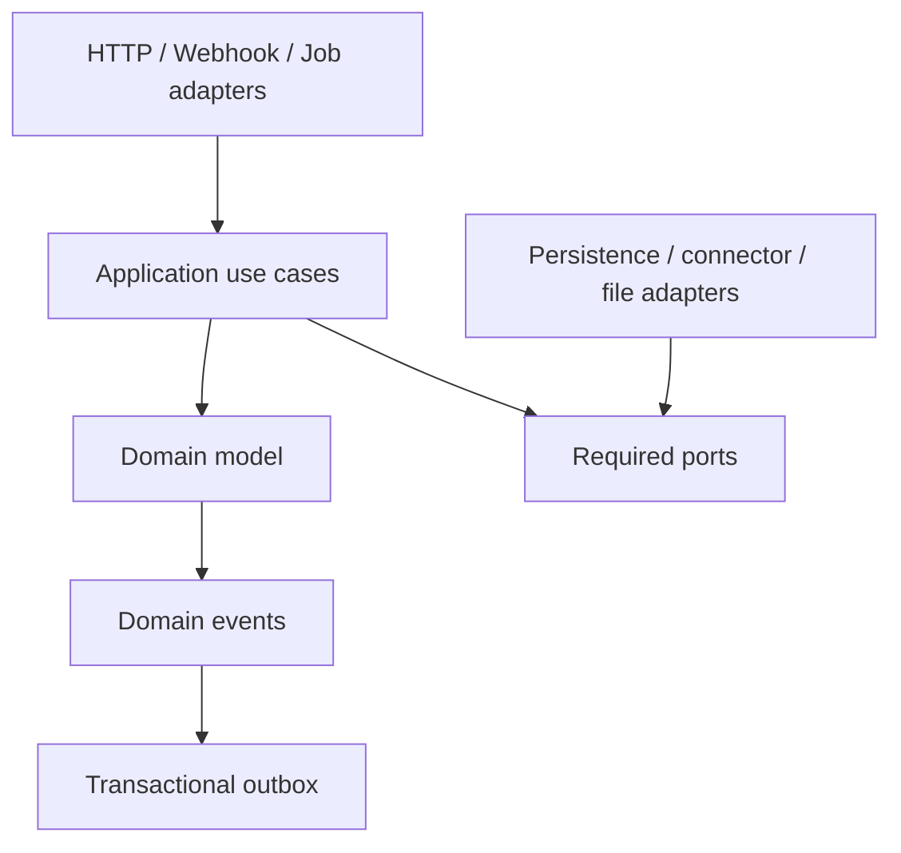

# 研发工程、模块与应用服务实施蓝图

## 1. 目标

本蓝图把 M0～M5 的领域边界转换为可创建代码仓库、模块、包、数据库迁移和测试的工程约束。它不重新定义业务规则，也不把逻辑模块误拆成首期微服务。

首期实现必须做到：

- 一个可独立构建、部署和回滚的模块化单体后端；
- 后台、网点端和师傅端保持独立 Portal 与发布节奏；
- 模块公开 API、领域事件、数据所有权和依赖方向可自动验证；
- 以一条“外部收单 → 任务 → 现场提交 → 审核 → 回传 → 事实试算”纵向链路证明骨架；
- 未来拆分服务不要求重写领域模型。

## 2. 参考技术基线

| 层次 | 首期参考选择 | 约束 |
|---|---|---|
| 运行时 | Java 21 LTS | 禁止依赖非 LTS 专属语法；升级由构建矩阵验证 |
| 应用框架 | Spring Boot 当前受支持稳定线 | 使用 BOM 锁定完整依赖，不混用单独 Spring 版本 |
| 模块约束 | Spring Modulith + ArchUnit | CI 验证无循环、只访问公开接口和允许依赖 |
| 构建 | Maven Wrapper，多模块工程 | Wrapper 与插件版本入库；本地/CI 使用同一命令 |
| 数据库 | PostgreSQL 受支持主版本的当前小版本 | Decimal、JSONB、事务、行锁和 SKIP LOCKED 作为已验证能力 |
| 迁移 | Flyway | 每个逻辑模块拥有自己的迁移目录；禁止启动时自动改实体表 |
| 缓存 | Redis 可选 | 只用于缓存、限流和短期协调；不得成为业务事实源 |
| 文件 | S3 兼容对象存储 | 数据库保存元数据、摘要和版本，不把大文件存入业务表 |
| 事件可靠性 | PostgreSQL Transactional Outbox/Inbox | Broker 是传输优化，不是唯一事实源 |
| 前端 | Vue + TypeScript + Vite | Vite 构建之外单独执行类型检查和契约生成校验 |
| 移动端 | 独立师傅端应用 | 必须实现工作包、本地草稿、上传队列和冲突处理 |
| 身份 | 标准 OIDC/OAuth 2.1 提供方 | ServiceOS 不保存用户密码算法实现 |
| 可观测性 | OpenTelemetry + Metrics/Logs/Traces | correlation/causation/workOrder/task 为标准上下文 |

具体补丁版本在代码仓库的依赖清单和 Renovate/Dependabot 策略中锁定，不写死在架构正文。参考选择依据包括 Spring Modulith 的模块结构验证、模块测试和运行时观测能力，以及 PostgreSQL 的五年主版本支持政策。

## 3. 仓库拓扑

建议在 `/Users/louis/code/serviceos` 逐步形成：

```text
serviceos/
├── serviceos-architecture/       # 当前架构事实源
├── serviceos-backend/            # Java 模块化单体与后台 workers
│   ├── pom.xml
│   ├── serviceos-bootstrap/
│   ├── serviceos-shared-kernel/
│   ├── serviceos-modules/
│   ├── serviceos-adapters/
│   └── serviceos-test-support/
├── serviceos-contracts/          # OpenAPI、AsyncAPI、JSON Schema 与生成物
├── serviceos-admin-web/          # 总部运营/客服/审核/财务后台
├── serviceos-network-web/        # 网点负责人 Portal
├── serviceos-technician-app/     # 师傅移动端
├── serviceos-deploy/             # 容器、环境、迁移和运维清单
└── .github/ 或 .gitlab/          # CI/CD
```

仓库可以暂时采用一个 Git 根，也可以后续拆仓；无论物理仓库如何，Portal 不能合并成一个按角色隐藏菜单的万能前端。

## 4. 后端分层



每个业务模块内部使用相同结构：

```text
com.company.serviceos.<module>
├── api/                    # 其他模块唯一允许编译依赖的 Java API
│   ├── command/
│   ├── query/
│   ├── event/
│   └── model/
├── application/            # 用例编排、事务边界、端口调用
├── domain/                 # 聚合、实体、值对象、领域服务
├── infrastructure/         # repository、SQL、connector 实现
├── web/                    # 本模块 controller 与 DTO mapper
└── package-info.java       # 模块声明与 allowedDependencies
```

### 4.1 分层规则

- `domain` 不依赖 Spring MVC、JPA 实体、消息 SDK 或外部 DTO；
- `application` 拥有事务和权限/幂等/权威门禁编排；
- `web` 只做协议校验、身份上下文解析、DTO 转换和用例调用；
- `infrastructure` 实现模块内部端口，不能把数据库模型泄露给其他模块；
- 其他模块只能访问 `<module>.api` 或消费已发布事件；
- 查询投影可跨模块组合，但不得借查询投影回写领域表；
- `shared-kernel` 只包含稳定的 ID、Money、TimeRange、Version、ProblemCode、ActorRef 等基础值对象。

## 5. 逻辑模块目录

### 5.1 平台基础模块

| 模块编码 | 职责 | 主要公开能力 |
|---|---|---|
| `identity` | OIDC 主体映射、会话与服务身份 | CurrentPrincipal、SubjectRef |
| `authorization` | capability、数据范围、字段权限和策略判定 | Authorize、ScopePredicate |
| `audit` | 增强审计、敏感导出和配置发布审计 | AppendAudit、AuditQuery |
| `organization` | 公司、区域、网点组织关系 | OrganizationQuery |
| `authority` | 工单/计价唯一权威版本和 SideEffectFence 运行时判定 | CheckCommandAuthority、CheckSideEffectFence |
| `configuration` | 业务资产草稿、校验、发布、Bundle 锁定 | ResolveBundle、PublishAsset |
| `files` | 上传会话、对象摘要、扫描、访问授权 | BeginUpload、FinalizeFile、FileRef |
| `reliability` | 幂等、Outbox/Inbox、AsyncOperation、通用 scheduled execution | BeginIdempotency、PublishEvent、ClaimExecution |
| `automation` | 自动 Task 的定时 claim、业务重试和执行器注册 | ScheduleTaskExecution、ExecuteTask |
| `operations` | OperationalException、人工接管和 runbook 引用 | OpenException、ResolveException |

### 5.2 履约内核模块

| 模块编码 | 职责 | 不拥有 |
|---|---|---|
| `workorder` | 工单身份、生命周期、Stage、参与关系摘要 | Task 执行状态、审核结果 |
| `task` | Task、动作资格、Assignment、Attempt、Guard | 现场表单值和资料文件 |
| `workflow` | 流程引擎适配、等待点和 token 对齐 | 业务事实和负责人真相 |
| `appointment` | 联系尝试、预约、改约和确认 | Visit 现场结果 |
| `fieldwork` | Visit、到场、勘测/安装执行 | 资料审核决定 |
| `forms` | 字段定义、表单版本、提交与验证 | 文件二进制、审核结论 |
| `evidence` | 资料要求实例、版本、证据集合 | 审核任务状态 |
| `review` | ReviewTask、逐项决定、整改轮次 | TaskAssignment |

### 5.3 自动化与商业模块

| 模块编码 | 职责 | 关键边界 |
|---|---|---|
| `network` | 网点、师傅、能力、资质和覆盖范围 | 不决定具体派单结果 |
| `dispatch` | 候选过滤、评分、容量预占和 ServiceAssignment | TaskAssignment 由 task 拥有 |
| `sla` | SLA 实例、时钟、暂停、milestone 和升级 | 处理责任通过 Task |
| `integration` | Envelope、CanonicalMessage、Delivery、Ack | 不直接修改其他模块表 |
| `notification` | 模板、意图、收件人解析、渠道投递 | 业务重试由 Task 调度 |
| `facts` | 事实目录、提取、确认、更正、snapshot | 不拥有来源表单/资料 |
| `pricing` | 价格版本、上下文解析、CalculationRun/ChargeItem | 不拥有正式对账确认 |
| `settlement` | 二期 feature-gated 对账结算边界 | 不拥有总账/支付/法定发票 |
| `migration` | Snapshot、映射、批次、血缘和验证 | 不拥有旧系统源数据 |
| `rollout` | cohort、gate、切换决策和 rollback 治理 | 通过 authority.api 变更权威，不拥有运行时判定 |

## 6. 允许依赖方向

依赖表示“编译期调用其公开 API”；事件消费不反转依赖。

| 模块 | 允许直接依赖 |
|---|---|
| identity | shared-kernel |
| organization | shared-kernel、identity.api |
| authorization | shared-kernel、identity、organization |
| audit | shared-kernel |
| authority | shared-kernel、audit.api |
| configuration | shared-kernel、audit、authorization |
| files | shared-kernel、authorization、audit |
| reliability | shared-kernel |
| automation | shared-kernel、task.api、audit.api |
| operations | shared-kernel、task.api、authorization.api、audit.api |
| workorder | shared-kernel、configuration、authorization、authority、audit |
| task | shared-kernel、workorder.api、authorization、authority、audit |
| workflow | task.api、workorder.api、authority.api |
| appointment | task.api、workorder.api、authorization、authority |
| fieldwork | task.api、appointment.api、files.api、authorization、authority |
| forms | task.api、configuration.api、files.api、authorization、authority |
| evidence | task.api、configuration.api、files.api、authorization、authority |
| review | task.api、evidence.api、forms.api、authorization、authority |
| network | organization.api、files.api、authorization、audit |
| dispatch | task.api、workorder.api、network.api、configuration.api、authorization、authority |
| sla | task.api、workorder.api、configuration.api、authority.api |
| integration | workorder.api、task.api、configuration.api、files.api、operations.api、authority.api |
| notification | identity.api、organization.api、configuration.api、automation.api、authority.api |
| facts | workorder.api、forms.api、evidence.api、review.api、fieldwork.api、sla.api、authority.api |
| pricing | workorder.api、facts.api、configuration.api、authority.api |
| settlement | pricing.api、facts.api、authority.api、authorization、audit |
| migration | 各模块受控 import API、files.api、authority.api、audit |
| rollout | workorder.api、authority.api、authorization、audit、operations.api |

发现循环时先检查是否应改为事件、查询端口或把稳定概念上移，禁止通过把双方类搬进 `shared` 掩盖循环。

表中未带 `.api` 的模块名也只表示其公开接口；任何情况下都不允许依赖目标模块 internal 包。除表中业务依赖外，每个需要提交命令/事件的模块均可依赖根模块 `reliability.api`；reliability 不依赖任何业务模块，因此不会形成反向循环。

`authority` 不依赖 workorder，只保存稳定 WorkOrderId/业务路由键并执行版本门禁；`rollout` 读取工单投影、生成治理决定，再通过 authority 公开命令发布新权威版本。该方向避免 `workorder ↔ rollout` 循环。

## 7. 应用服务模板

每个命令用例按固定顺序执行：

```text
1. 解析 Actor/Tenant/Correlation/Idempotency/Authority 上下文
2. 协议级与命令 Schema 校验
3. capability + data scope + field policy 授权
4. 幂等记录获取或冲突判断
5. authorityVersion / feature gate / aggregate version 校验
6. 加载聚合和必要 guard/reservation
7. 调用领域行为产生结果与领域事件
8. 同一事务保存聚合、审计摘要、Outbox 和幂等结果
9. 提交后返回资源/operation；异步副作用由 worker 执行
```

应用服务不得：

- 根据品牌写 `if/else`；
- 在 controller 中直接调用 repository；
- 修改其他模块数据库表；
- 在数据库事务中调用车企、短信、OCR 或对象存储外部接口；
- 捕获异常后只记日志并返回成功；
- 用当前配置替换工单锁定的 ConfigurationBundle。

## 8. 数据所有权实现

首期使用一个 PostgreSQL 集群、一个业务数据库。每个模块：

- 拥有独立 Flyway migration 目录；
- 表名使用稳定模块前缀，例如 `tsk_task`、`evd_evidence_item`；
- 本模块内部使用真实外键和唯一约束；
- 跨模块保存 ID/版本引用，写入前通过公开 API 验证，不建立可被任意 repository 导航的 ORM 关系；
- repository 只能位于拥有模块；
- 报表读取使用只读投影/物化视图，不反向成为事实源；
- JSONB 只承载动态字段值、规则 trace 和快照，不承载聚合所有核心列。

所有金额使用 Decimal/NUMERIC 与明确币种；所有时间保存 UTC instant，业务日历和本地日期另存语义字段。

## 9. Portal 边界

| Portal | 用户 | 主要能力 | 明令禁止 |
|---|---|---|---|
| Admin Web | 总部、客服、审核、项目、运营、财务 | 工作台、配置、工单、异常、审核、试算 | 通过前端隐藏代替后端授权 |
| Network Web | 网点负责人 | 网点工单、师傅分配、补资料、网点数据 | 查看其他网点或对上价格 |
| Technician App | 师傅 | 工作包、预约、到场、表单、拍摄、上传、整改 | 依赖持续在线才能保存现场数据 |
| External Collaboration | 车企/用户的受控链接或门户 | 确认、签字、有限资料/状态 | 暴露内部工单全量模型 |

前端可以共享设计 token、基础组件和生成的契约类型，但不得共享包含角色假设的整页业务实现。

## 10. 模块验证与测试

CI 必须包含：

1. `ApplicationModules.verify()` 或等价模块验证；
2. ArchUnit 禁止依赖 internal/infrastructure/web 包；
3. 每模块独立启动测试；
4. 公开命令/查询 API 契约测试；
5. 发布事件 Schema 兼容测试；
6. repository 集成测试使用真实 PostgreSQL；
7. Flyway 从空库升级、从上一发行版升级和重复启动测试；
8. 禁止跨模块表写入的静态和运行时检查；
9. 生成模块依赖图并与允许依赖清单比较。

模块边界失败属于构建失败，不能以 `ignore` 长期豁免。临时豁免必须有 ADR、负责人和失效日期。

## 11. 拆分触发条件

只有出现以下证据之一才把模块拆为独立服务：

- 独立扩缩容且单体资源隔离无法满足；
- 故障必须隔离，且现有 bulkhead/worker profile 不足；
- 独立发布频率造成持续交付阻塞；
- 数据主权或合规要求独立存储；
- 明确团队长期拥有完整构建、运行和 on-call；
- 拆分收益覆盖网络、契约、数据一致性和运维成本。

拆分时保留相同公开 API/事件语义，并将本地 Outbox 消费切为远程传输；不得通过共享数据库维持“伪微服务”。

## 12. 骨架完成定义

研发骨架只有在以下证据齐全时完成：

- Wrapper 一条命令完成编译、测试、模块验证和契约校验；
- 本地依赖可由容器编排启动，空库可自动迁移；
- 一个示例命令完成授权、幂等、事务、审计和 Outbox；
- 一个示例异步消费者完成 Inbox 去重和失败恢复；
- Admin Web 登录后调用真实后端并展示 trace/correlation；
- 构建产物可在测试环境部署、迁移、健康检查和回滚；
- 禁止跨模块访问的负向测试确实失败。

## 13. 参考资料

- [Spring Modulith：模块结构验证](https://docs.spring.io/spring-modulith/reference/verification.html)
- [Spring Modulith：模块测试](https://docs.spring.io/spring-modulith/reference/testing.html)
- [Spring Modulith：生产可观测能力](https://docs.spring.io/spring-modulith/reference/production-ready.html)
- [Spring Boot：系统要求](https://docs.spring.io/spring-boot/system-requirements.html)
- [PostgreSQL：版本支持政策](https://www.postgresql.org/support/versioning/)
- [Vue：TypeScript 与 Vite](https://vuejs.org/guide/typescript/overview.html)
