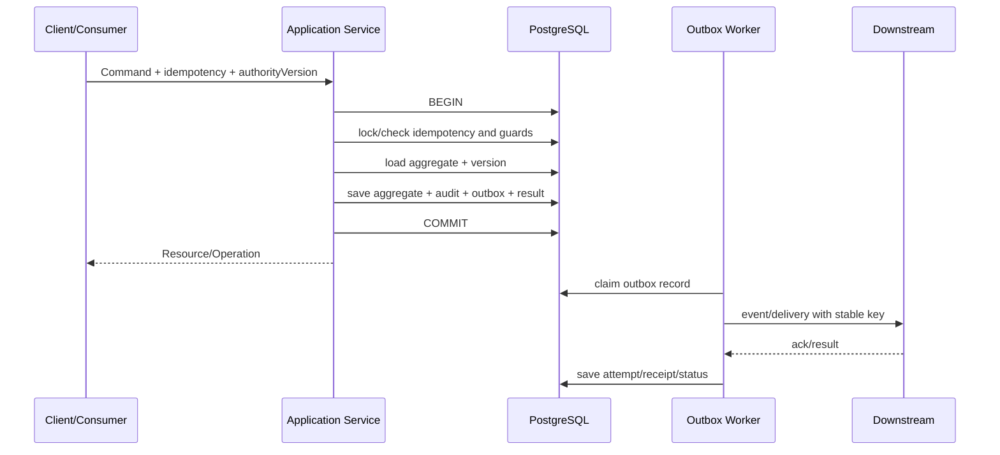

# 事务、消息、幂等、并发与后台执行实施蓝图

## 1. 目标

本蓝图规定 ServiceOS 如何把领域命令可靠地落为数据库状态、事件、异步任务和外部副作用。目标不是“永不失败”，而是每次失败都可检测、可重试、不会重复产生业务结果，并可转人工闭环。

## 2. 核心原则

1. 一个领域命令只拥有一个本地数据库事务；
2. 事务内不调用不受控外部系统；
3. 聚合状态、审计摘要、幂等结果和 Outbox 同事务提交；
4. 消息按至少一次处理设计，消费者必须幂等；
5. 业务重试由 Task 唯一调度，技术 attempt 只记录一次尝试；
6. 乐观锁是默认并发控制，容量/资格/唯一激活等热点使用明确悲观锁；
7. 每个副作用都先形成 intent，再形成 attempt 和 receipt；
8. Broker、Redis、搜索索引和流程引擎都不是业务事实源。

实现所有权：`reliability` 模块拥有 IdempotencyRecord、Outbox/Inbox、AsyncOperation 和通用 ScheduledExecution；`automation` 模块只负责自动 Task 的 claim、业务重试与执行器注册。领域模块通过 reliability.api 在自己的事务中写可靠性记录，reliability 不依赖任何业务模块。

## 3. 命令事务模板



### 3.1 事务内允许

- 本模块聚合读取和写入；
- 本模块唯一约束、guard、reservation 和版本校验；
- 调用纯函数领域规则；
- 写 IdempotencyRecord、AuditRecord、OutboxRecord；
- 调用其他模块的无副作用公开查询/校验端口；一个命令事务默认只写一个拥有模块的聚合。

跨模块同时写入必须使用事件/saga。只有不这样做就无法保持已批准业务不变量、且双方位于同一数据库时，才可通过单独 ADR 允许同步强一致命令；ADR 必须列出锁顺序、失败原子性、未来拆分代价和模块依赖，不能把“调用方便”作为理由。

以下是已批准的跨切面事务参与者，不视为第二个业务聚合：

- `reliability.api` 追加 Idempotency/Outbox/AsyncOperation；
- `audit.api` 追加 AuditRecord；
- `authority.api` 锁定并追加命令/副作用门禁决定。

它们只能追加调用上下文和判定记录，不能反向调用业务模块、推进业务状态或在事务中执行外部副作用。其他例外仍必须单独 ADR。

### 3.2 事务内禁止

- HTTP/RPC、短信、车企 API、OCR、地图或对象存储请求；
- 等待人工、计时器或流程引擎回调；
- 大文件读取、批量导出和长时间规则回放；
- 获取无上限数量的聚合；
- 捕获数据库冲突后静默覆盖或无限重试。

## 4. 幂等模型

### 4.1 IdempotencyRecord

关键字段：

```text
tenantId
operationType
idempotencyKey
requestDigest
actorRef
status（IN_PROGRESS/SUCCEEDED/FAILED_RETRYABLE/FAILED_FINAL）
resourceRef / operationRef
responseCode / responseDigest
startedAt / completedAt / expiresAt
```

唯一键为 `tenant + operationType + idempotencyKey`。

- 同 key、同 digest：返回既有结果或同一 operation；
- 同 key、不同 digest：返回 `IDEMPOTENCY_KEY_REUSED`；
- IN_PROGRESS 超时：由恢复任务验证原事务结果，不能直接再执行业务；
- 业务资源创建与 SUCCEEDED 结果同事务提交；
- 保留期至少覆盖客户端、连接器和人工重试最大窗口。

### 4.2 业务唯一键

幂等记录不能替代领域唯一约束。外部工单使用 `sourceSystem + externalOrderNo + businessType`；StatementLine、ServiceAssignment、Fact 版本和 Delivery 均保留各自业务唯一键。

## 5. 乐观与悲观并发

### 5.1 乐观锁默认

WorkOrder、Task、Appointment、ReviewTask、Statement 等聚合保存 `aggregateVersion`。命令携带 `If-Match` 或已读取版本；冲突返回 409 和当前可见版本，不自动把旧命令套到新状态。

### 5.2 悲观锁使用清单

只在以下经过验证的资源竞争中使用行锁/排他约束：

| 场景 | 共同锁点 | 必须保护的结果 |
|---|---|---|
| 网点/师傅容量 | CapacityBucket/Reservation | 不超配、不重复预占 |
| 同层级责任激活 | Assignment business key | 同时最多一个 ACTIVE |
| 事实更正与结算资格 | FactEligibilityGuard | pending 更正期间无新权威 run/line |
| StatementLine 收集 | lineBusinessKey | 同一费用只进入一个有效 line |
| Outbox/Task claim | 待执行记录 | 一个 attempt 只有一个 worker 执行 |
| cohort authority 切换 | AuthorityAssignment | 单一 ACTIVE/DRAINING 权威版本 |

多行锁必须按稳定业务键排序；事务设置短超时；死锁属于可分类的技术失败，由外层有限次数重试，不能无限循环。

## 6. Transactional Outbox

### 6.1 OutboxRecord

```text
outboxId
module
eventType / schemaVersion
aggregateType / aggregateId / aggregateVersion
eventId / occurredAt
tenantId / projectId / workOrderId / taskId
correlationId / causationId
payloadRef / payloadDigest
partitionKey
status（PENDING/CLAIMED/PUBLISHED/FAILED/DEAD）
availableAt / claimOwner / claimUntil
attemptCount / lastErrorCode
createdAt / publishedAt
```

领域事件 payload 在事务中冻结。大 payload 使用受控 blob 引用；事件不得携带明文敏感资料、完整价格规则或文件内容。

### 6.2 Claim 算法

Worker 使用短事务和 `FOR UPDATE SKIP LOCKED` 或等价机制：

1. 选择 `PENDING/可重新认领 CLAIMED` 且 `availableAt <= now`；
2. 设置 claimOwner/claimUntil 并提交；
3. 事务外发布；
4. 新事务保存 publish attempt 和 PUBLISHED；
5. 发布结果未知时保持可恢复状态，依赖 eventId 去重，不创建新 eventId。

发布成功但状态保存失败会再次发布，因此所有消费者必须按 eventId 幂等。

## 7. Inbox 与消费者

### 7.1 InboxRecord

唯一键为 `consumerName + eventId`，保存 schemaVersion、payloadDigest、状态、处理结果、attempt 和时间。

消费者事务顺序：

```text
BEGIN
插入/锁定 InboxRecord
若已 SUCCEEDED -> 返回 ack
校验 schema 与数据范围
执行本模块幂等领域命令
保存 Inbox SUCCEEDED + 本模块 Outbox
COMMIT
ack broker
```

同 eventId 但 payloadDigest 不同属于安全/契约异常，进入 OperationalException，不能以“最后消息”为准。

### 7.2 顺序

- 需要聚合顺序的事件使用 aggregateId/workOrderId 作为 partitionKey；
- 消费者仍检查 aggregateVersion，不能只相信队列顺序；
- 旧版本事件可以幂等忽略，但必须留下处理结论；
- 跨聚合不承诺全局顺序。

## 8. Task、ExecutionAttempt 与技术投递

必须保持三个层次：

```text
Task                       业务上要完成什么、谁负责、何时到期
TaskExecutionAttempt       自动 Task 的一次业务执行尝试
Delivery/NotificationAttempt 真实外部调用的一次技术尝试
```

- Task 拥有 nextRunAt、retry policy 和最终失败转人工；
- Delivery 不自行计算下一次业务重试；
- 一个 TaskExecutionAttempt 可以产生一个 DeliveryAttempt；
- 外部结果 UNKNOWN 时先查询/对账，不直接发送新业务操作；
- 人工重放创建 ReplayRequest 和新 Delivery，保留原链路。

## 9. Scheduler

所有定时工作统一进入 `scheduled_execution` 或 Task：

- SLA milestone；
- Outbox/Inbox 恢复；
- Delivery retry；
- 上传会话过期；
- 配置生效/失效；
- 迁移批次；
- 事实提取和试算；
- 数据保留和清理。

Scheduler 只 claim 到期工作，不直接拥有业务状态。执行器按 `executionId` 幂等，支持租约超时重新认领、限流、优先级和暂停队列。

时钟来自注入的 Clock；测试禁止直接读取系统当前时间。业务日历计算保存 calendarVersion 和输入区间。

## 10. 流程引擎适配

流程引擎负责：节点编排、等待消息、定时器、并行汇合和技术恢复；领域模块负责工单、Task、审核、资料、派单和金额事实。

```text
流程进入节点
→ 调用 CreateTask/RequestAutomation
→ 等待 TaskCompleted/TaskCancelled 等领域事件
→ 推进 token
```

约束：

- 流程变量只保存业务 ID、版本、分支条件摘要和 correlation；
- 流程 token 不能直接成为工单业务状态；
- 引擎重试不能绕过业务幂等；
- 流程定义版本由 ConfigurationBundle 锁定；
- 引擎不可用时，已提交领域事务不回滚；恢复后从 Outbox/Inbox 继续。

## 11. 外部副作用 Fence

所有真实派单激活、通知、车企写回、正式结算和 FinanceHandoff 在最终本地事务中：

1. 锁定当前 AuthorityAssignment；
2. 重新计算 SideEffectFence；
3. 保存 fenceDecisionId/authorityVersion/policyVersion；
4. 创建不可变 intent/delivery；
5. Outbox 发布可执行信号。

执行器发送前再次读取 authorityVersion。版本变化则不发送并返回 `AUTHORITY_CHANGED_BEFORE_SEND`。外部幂等键包含稳定业务键和 authorityVersion，避免权威切换窗口重复执行。

### 11.1 新工单权威引导

CreateWorkOrder 发生前尚无 workOrderId，不能让 workorder 与 authority 在一个跨模块事务中互相创建。入口使用稳定 `creationBusinessKey`（tenant/sourceSystem/externalOrderNo/businessType）执行：

```text
1. authority.ReserveCreationAuthority(creationBusinessKey)
2. 若 authority=LEGACY/SHADOW_ONLY，ServiceOS 不创建权威工单
3. 若 authority=SERVICEOS，返回 assignmentId/version/短期 reservation
4. CreateWorkOrder 保存 assignmentId/version 与 creationBusinessKey
5. WorkOrderCreated 事件幂等绑定 assignment 到 workOrderId
```

ReserveCreationAuthority 按 creationBusinessKey 唯一且可重试。CreateWorkOrder 事务通过 authority.api 重新锁定 assignment 并复核 ACTIVE + RESERVED + version 后才提交。

工单创建失败时 reservation 可由恢复任务释放；过期扫描先锁定 assignment，再通过 workorder 公开查询检查是否已有对象引用该 assignmentId，因此会等待并看见并发 CreateWorkOrder 的已提交结果。工单已创建但绑定事件延迟时，后续命令仍可用保存的 assignmentId/version 校验。绑定不得生成第二个 assignment，也不得改变已锁定 authority。

## 12. 文件上传事务

文件采用三段式：

```text
BeginUpload -> 客户端直传临时对象 -> FinalizeFile
```

FinalizeFile 校验 object key、大小、MIME、checksum、租户和上传会话，创建不可变 FileObject；病毒/内容扫描未通过前状态为 QUARANTINED，业务资料只能引用 AVAILABLE 文件。

业务提交只保存 FileObject 版本引用，不在同一事务移动大对象。临时对象清理由可重试 scheduler 处理。

## 13. 批处理

- 每批有 Batch/Record，单记录独立幂等；
- 读取使用固定 snapshot/watermark；
- 写入分片且限制事务大小；
- partial failure 可重跑失败记录；
- 批量重算、迁移和导出有 dry-run、审批、限流与取消检查点；
- 不允许用一个超长事务包住整个批次。

## 14. 错误分类

| 类型 | 示例 | 处理 |
|---|---|---|
| Validation | 字段格式、枚举非法 | 422，不重试 |
| Authorization | capability/data scope 不满足 | 403，增强审计 |
| Concurrency | aggregateVersion/authorityVersion 冲突 | 409，调用方刷新 |
| BusinessConflict | 已锁定、重复行、资格不满足 | 409/422，按领域动作解决 |
| TransientTechnical | 超时、连接失败、死锁 | 有界退避重试 |
| ExternalUnknown | 请求可能成功但响应丢失 | 查询/回执对账，不盲重发 |
| PermanentExternal | 业务拒绝、签名配置错误 | 转人工 Task/OperationalException |
| Security | digest 变化、签名失败、跨租户 | 拒绝、告警、保留证据 |

Problem Details 返回稳定 errorCode、correlationId、field errors 和可安全公开的 detail；堆栈、SQL、凭据和内部价格不返回客户端。

## 15. 恢复扫描器

至少实现：

- 过期 IdempotencyRecord；
- CLAIMED 超时 Outbox/Task；
- Delivery UNKNOWN；
- 上传已完成但未 finalize；
- Saga 卡在中间阶段；
- authority DRAINING 的未决副作用；
- ACTIVE FactEligibilityGuard 超过阈值；
- 未绑定 handling Task 的 OperationalException。

扫描器只创建恢复 Task/命令，不直接跨模块改状态。

## 16. 实施验收

1. 数据提交成功但发布状态保存失败时，事件可重复发布且只产生一个业务结果；
2. 消费者处理成功但 ack 失败时，Inbox 阻止重复领域写入；
3. 同 key 不同 digest 被拒绝；
4. Aggregate 乐观锁冲突不覆盖新状态；
5. Capacity/FactGuard/StatementLine 并发测试保持不变量；
6. worker 崩溃后租约到期可恢复；
7. UNKNOWN 外部结果不会盲目重发；
8. authority 切换后旧 worker 不能发送副作用；
9. 流程引擎停机不丢已提交 Task/事件；
10. 所有最终失败都有 OperationalException 和处理 Task。
