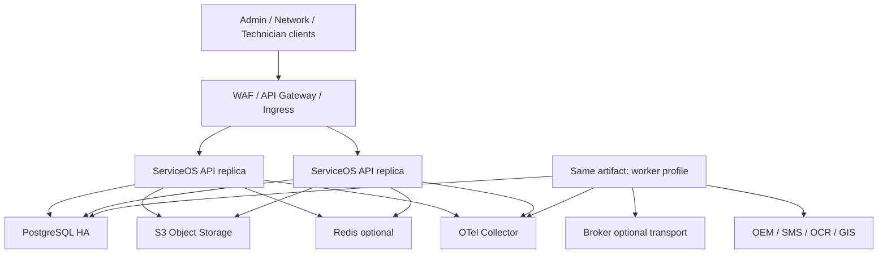

# 安全、非功能、部署与运维实施蓝图

## 1. 目标

本蓝图定义首期生产系统必须具备的安全、容量、可靠性、部署、备份、恢复和交付基线。具体 SLO、RPO、RTO 和合规等级必须由业务影响分析、部署环境和法规要求签署；架构文档不虚构数字。

## 2. 保护对象与主要威胁

| 保护对象 | 主要风险 |
|---|---|
| 用户姓名、手机号、地址、VIN | 越权查询、导出泄露、日志泄露 |
| 现场照片、视频、签字和协议 | 猜测 URL、跨租户访问、恶意文件、篡改 |
| 价格、对上/对下金额 | 客服越权、规则篡改、影子结果入账 |
| 工单与任务动作 | 冒充师傅、重放命令、旧责任人继续操作 |
| 车企接口和回传 | 签名伪造、重复回传、结果未知后重发 |
| 配置与脚本 | 未审批发布、任意代码、历史版本被修改 |
| 迁移暂存数据 | 大范围明文复制、超期保留、缺乏血缘 |
| 审计记录 | 管理员删除、时间线篡改、缺少主体证据 |

## 3. 身份与会话

- 员工、网点和外部协作主体使用独立身份域/客户端策略；
- 使用 OIDC Authorization Code + PKCE；移动端不保存长期密码；
- 管理员、高风险配置、价格、导出和切换要求 MFA；
- access token 短时有效，refresh token 轮换并可撤销；
- 服务间使用 workload identity 或短期凭据，不共享静态万能 token；
- Subject 与业务 Person/Technician/NetworkMembership 分离；人员离职或网点停用立即撤销有效关系；
- token 只携带稳定主体与粗粒度声明，数据范围从授权服务按版本解析；
- 紧急 break-glass 账号需双人审批、短期激活、独立告警和全量审计。

## 4. 授权执行点

每个命令和敏感查询同时校验：

```text
subject
× capability
× tenant/project/brand/region/network scope
× work-order participation
× task action eligibility
× field/evidence/amount classification
× feature gate / authority version
```

### 4.1 查询

- Repository/QueryService 必须接收已编译 ScopePredicate；
- 禁止先查全量再在内存过滤；
- ID 直查同样加数据范围，不因知道 UUID 获得访问权；
- 导出复用同一 predicate，并额外校验 export capability、行数和字段策略；
- 缓存键必须包含 tenant、subject/scopeVersion 和脱敏视图版本。

### 4.2 命令

- controller 的菜单/按钮判断不构成授权；
- 应用服务在事务中复核 capability、当前参与关系和 Task action；
- 改派后旧网点/师傅的访问与操作能力按事件撤销，执行命令时仍实时复核；
- 金额、敏感附件和配置发布使用职责分离策略；
- 批量命令逐记录执行数据范围，不能以批次创建者权限覆盖所有对象。

## 5. 数据分类与保护

| 等级 | 示例 | 基线 |
|---|---|---|
| PUBLIC | 公开服务说明 | 完整性保护 |
| INTERNAL | 普通流程配置、非敏感统计 | 登录访问、审计变更 |
| CONFIDENTIAL | 工单、地址、网点表现 | 数据范围、传输/存储加密、脱敏 |
| RESTRICTED | 手机号、VIN、身份证、签字、价格、财务 | 字段级 capability、增强审计、导出审批、密钥隔离 |

- TLS 覆盖客户端、内部入口、数据库、对象存储和外部连接器；
- 存储使用平台/KMS 加密，RESTRICTED 字段按风险采用应用层信封加密或 tokenization；
- 密钥和凭据只在 Secrets Manager/KMS，禁止进入 Git、镜像、日志或普通配置表；
- 数据库备份、对象副本和迁移暂存使用同等级保护；
- 日志、trace、指标 label 不记录手机号、地址、VIN、token、签字或完整 payload；
- 非生产环境默认使用脱敏/合成数据，生产数据复制需审批和到期销毁。

## 6. 文件安全

- 上传使用短期、限定 object key/MIME/size 的预签名凭据；
- Finalize 校验租户、checksum、实际大小和 MIME sniffing；
- 病毒/恶意内容扫描完成前隔离；
- 下载通过业务授权换取短期 URL，不暴露永久公共桶地址；
- 水印、OCR 派生文件保留原文件关系和算法版本；
- 删除遵循保留政策和 legal hold，不由普通用户物理删除；
- 对象访问日志与业务 AuditRecord 关联；
- 防止压缩炸弹、超大视频、伪造扩展名和路径注入。

## 7. 配置、规则和脚本安全

- Draft/Validate/Approve/Publish 职责可分离；
- 发布内容不可变并计算 digest；
- 表达式只访问白名单上下文和注册函数；
- 脚本运行在隔离进程/沙箱，禁止网络、文件和任意数据库；
- CPU、内存、执行时间、递归和输出大小有硬限制；
- 发布前执行静态扫描、样本回放、权限影响和敏感字段检查；
- 紧急回滚是发布新版本/切换引用，不原地修改历史版本。

## 8. 审计

审计至少覆盖：登录/MFA、权限变更、敏感查看、导出、资料下载、配置/价格发布、事实更正、强制审核、派单策略调整、切换/回退和管理员操作。

AuditRecord 保存：actor、effective actor、tenant、action、object/version、purpose、before/after digest、decision policy/version、correlation、IP/device、result 和时间。

- 审计写入与关键领域变更同事务或同事务 Outbox；
- 业务管理员不能删除审计；
- 审计归档使用不可变/防篡改存储与校验链；
- 审计查询本身被审计；
- 失败/拒绝操作同样记录，避免只看成功路径。

## 9. 容量模型

初始容量基于已确认的 9 万+/月业务量，但不能用月均替代峰值。上线前业务方必须提供：

- 15 分钟和小时级收单峰值；
- 同时在线总部/网点/师傅用户；
- 单工单照片/视频数量、大小和上传集中时段；
- 外部接口限流与回执延迟；
- 自动派单、SLA、回传、事实提取的积压容忍度；
- 历史查询/导出范围；
- 三年增长和新项目并发上线计划。

### 9.1 测试档位

不在未知数据上承诺生产 SLO。先定义相对档位：

| 档位 | 负载 |
|---|---|
| Baseline | 最近 3 个月实测 P95 峰值 |
| Launch | Baseline × 已签署增长系数 |
| Burst | Launch 的短时突发与批量回执叠加 |
| Degraded | 一个外部依赖失败、worker 积压、数据库故障转移 |
| Recovery | 故障窗口积压在目标时间内安全排空 |

测试输出必须给出吞吐、P50/P95/P99、错误率、连接池、锁等待、队列新鲜度、CPU/内存、数据库 IO、对象上传和恢复时间。

## 10. 性能设计

- 命令查询分页和最大 page size；
- 列表使用稳定游标或受控 offset，不允许无界导出；
- 工单详情通过聚合读模型组合，避免 N+1；
- 高频筛选列建立由真实查询计划验证的索引；
- 动态字段搜索只对白名单字段建立投影/索引；
- 大附件直传对象存储；
- 规则回放、导出和迁移进入异步 operation；
- 对热点容量桶、fact guard 和 assignment 锁进行竞争测试；
- 缓存失效不会导致错误业务结果，只允许性能下降。

## 11. 可用性与降级

| 依赖失败 | 系统行为 |
|---|---|
| Redis | 关闭非必要缓存/限流回退本地保护，业务事实仍在数据库 |
| 消息 Broker | Outbox 积压，核心本地命令可提交；超过阈值停止扩大/限流 |
| 对象存储 | 已有工单可查询，文件提交转可恢复状态，不伪装成功 |
| OCR/AI | 转人工校验，不阻断允许人工完成的主链路 |
| 地图 | 使用行政区/已缓存坐标兜底，记录降级派单解释 |
| 车企接口 | Delivery 重试/UNKNOWN 对账/人工 Task |
| 流程引擎 | 已提交领域状态保留，Task/Outbox 恢复后继续 |
| 单个 worker 类别 | 隔离线程池/队列，不拖垮交互 API |

所有降级必须有开关、权限、告警、用户提示、恢复步骤和事后对账，不能以吞异常实现。

## 12. 部署拓扑



首期 API 与 worker 使用同一版本产物、不同运行 profile；可独立扩容但不形成不同代码分支。数据库迁移作为独立、一次性、带审批的 deployment job 执行，应用实例无 DDL 权限。

## 13. 环境

| 环境 | 用途 | 外部副作用 |
|---|---|---|
| local | 开发与模块测试 | 全部 stub/sandbox |
| test | 自动化集成与契约 | sandbox，合成数据 |
| staging | 生产等价部署、迁移、性能和回退演练 | 白名单 sandbox |
| shadow | 生产数据受控复制/计算 | SideEffectFence 强制 DENY |
| production | 真实 cohort | authority/fence 决定 |

环境使用独立数据库、对象桶、凭据、队列 namespace 和身份客户端。禁止用配置参数让测试实例访问生产写凭据。

## 14. 数据库与备份

- PostgreSQL 高可用和故障转移方案由部署平台验证；
- 自动备份、WAL/PITR、备份加密和跨故障域副本；
- 定期执行恢复演练，而不是只验证“备份任务成功”；
- 对象存储版本/复制与数据库 FileObject 版本协调核对；
- Flyway 采用 expand → migrate/backfill → contract，禁止同版本先删旧列；
- 大表变更验证锁时间、回滚和只读窗口；
- 发布前记录数据库/对象/消息水位和恢复点。

RPO/RTO 必须分别定义：核心工单事务、附件、搜索/报表投影、审计和迁移暂存；不能用一个数字覆盖所有数据。

## 15. 可观测性

### 15.1 标准上下文

```text
traceId / spanId
correlationId / causationId
tenantId / projectId
workOrderId / taskId
module / useCase
actorType（不记录敏感主体原值）
authorityVersion / configurationBundleId
```

### 15.2 Golden signals

- API latency/traffic/errors/saturation；
- PostgreSQL 连接、慢查询、锁等待、复制/备份；
- Task/Outbox/Inbox/Delivery backlog age，而不只看数量；
- 上传 finalize、扫描和对象错误；
- 外部依赖成功率、UNKNOWN、限流和回执延迟；
- 业务异常、SLA、派单无候选、事实不可计算和金额差异；
- authority/fence denied 和旧版本尝试。

告警必须映射 runbook、负责人和严重度；高基数业务 ID 进入日志/trace，不进入无界 metrics label。

## 16. CI/CD 与供应链

Pipeline 顺序：

```text
format/lint
→ unit/module/architecture tests
→ contract/schema compatibility
→ PostgreSQL integration + migration tests
→ security/SCA/secret scan
→ build immutable image + SBOM + signature
→ deploy staging
→ smoke/acceptance/failure tests
→ approval
→ canary/cohort release
→ observation gate
```

- 产物一次构建、多环境提升，不在生产重建；
- 依赖和基础镜像固定 digest；
- 生成 SBOM、漏洞清单和修复 SLA；
- 禁止高危漏洞、泄露 secret、失败迁移或契约破坏进入生产；
- 发布记录关联 Git commit、镜像 digest、配置 Bundle、迁移、feature gate 和审批；
- 回滚应用版本前先验证数据库向后兼容和消息 Schema 兼容。

## 17. 上线前必须签署的非功能参数

1. 关键 API 与后台队列 SLO；
2. 各数据类别 RPO/RTO；
3. 峰值、增长系数和附件容量；
4. 数据保留、删除、legal hold 和归档年限；
5. 等保/隐私/数据驻留/国产化要求；
6. 加密/KMS/Secrets 责任人；
7. 值班、告警、升级和重大事件流程；
8. 外部依赖的限流、维护和故障联系人；
9. 灾备演练频率和签署人；
10. 生产 break-glass 与数据修复审批制度。

未签署参数不意味着可以默认“无限容量/零丢失/即时恢复”；对应生产 Gate 保持阻塞并记录责任人。

## 18. 安全与运行完成定义

- 跨租户、跨网点、旧师傅和敏感金额负向授权测试通过；
- token 重放、签名错误、IDOR、批量导出和恶意文件测试通过；
- 生产日志/trace 扫描无敏感字段和 secret；
- 数据库应用账号无 DDL、跨环境和超级用户权限；
- staging 完成峰值、依赖降级、故障转移和积压恢复测试；
- 从真实备份恢复数据库和对象引用并完成业务核对；
- 同一镜像完成 canary、停止扩大和回滚演练；
- 所有 P0 告警有可执行 runbook 和 on-call；
- 发布、配置、权限、金额和切换的审计链可查询且不可普通删除。
