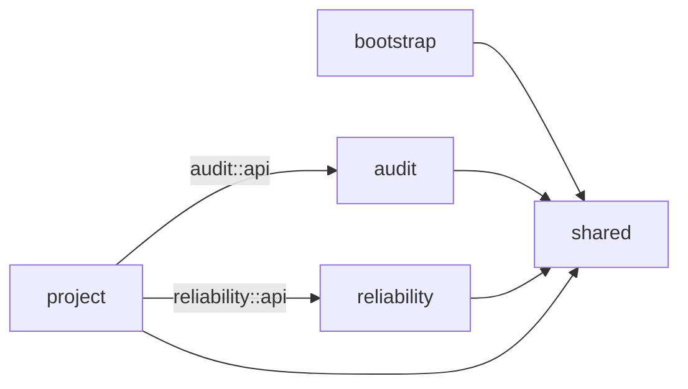
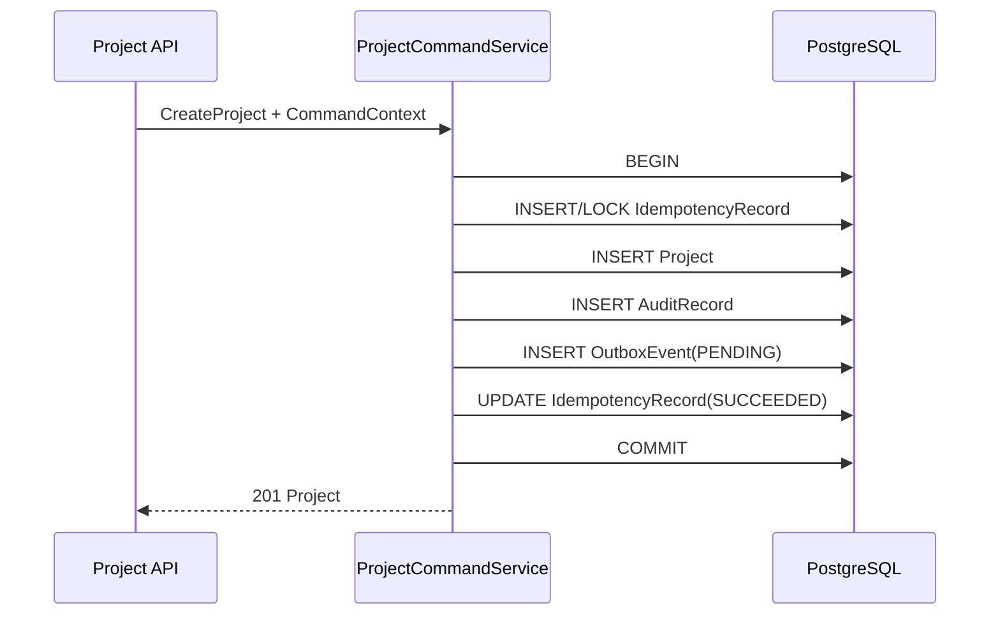

# M8 工程参考实现与首条事务纵向切片

## 1. 目的

M8 把 ARCH-19/20、ADR-013/014 从文字约束转换成第一批可编译、可测试、可部署的代码证据。它验证工程方向，不宣称 E1 或完整履约业务已经完成。

## 2. 已落地范围

| 能力 | 当前证据 | 对应门禁 |
|---|---|---|
| 可复现构建 | 根 `pom.xml`、Maven Wrapper、CI workflow | BOOT-001、ENG-001 |
| 模块边界 | 五个 Modulith 模块及 allowedDependencies | BOOT-002、ENG-002～004 |
| 机器契约 | OpenAPI 3.1、`project.created` JSON Schema 和校验测试 | E1-09、M6-API-001/002 基础 |
| 物理模型 | 三个模块迁移目录、四张 PostgreSQL 表 | BOOT-004、DB-001/003 基础 |
| 命令上下文 | tenant、actor、correlation、idempotency | CORE-001 基础 |
| 幂等 | 唯一业务键、同 key 同 digest 重放、不同 digest 拒绝 | CORE-002、TX-001/002 |
| 审计 | 创建成功摘要与 request digest | CORE-003 成功路径 |
| Outbox | 事件 payload/digest/version 与 PENDING 事实 | CORE-004 生产端基础 |
| 事务原子性 | Project、Audit、Idempotency、Outbox 同事务 | ADR-014 |

## 3. 模块结构



`shared` 只保存稳定调用上下文、错误码和值语义。Spring Web 异常映射和 Clock 装配位于 `bootstrap`，避免把共享内核变成横切杂物箱。

## 4. 首条命令事务



同幂等键、同请求摘要直接读取首次资源；同幂等键、不同摘要返回 `IDEMPOTENCY_KEY_REUSED`。项目编码唯一约束失败时，新幂等记录、审计和 Outbox 全部回滚。

## 5. 契约与数据库映射

- HTTP 契约：`serviceos-contracts/.../openapi/serviceos-core-v1.yaml`；
- 事件契约：`serviceos-contracts/.../events/project-created-v1.schema.json`；
- Outbox 表把事件信封元数据拆为可索引列，`payload` 保存事件业务 payload；
- 发布 worker 组装完整事件信封，保持同一 `eventId` 和 `payloadDigest`；
- 每个逻辑模块拥有独立迁移目录，版本号在一个数据库内全局单调。

## 6. 验证命令与证据口径

```bash
./mvnw clean verify
```

构建必须通过以下非容器测试：

1. Modulith 模块验证；
2. Project 领域不变量；
3. OpenAPI 解析；
4. 事件样本 JSON Schema 校验；
5. 可执行 Boot JAR 打包。

存在 Docker/兼容容器运行时时，还必须运行 `ProjectCommandPostgresIT`，验证 PostgreSQL 迁移、重复迁移、幂等冲突与事务回滚。本地无容器时允许开发机明确跳过，但发布 CI 和 Gate 证据不得以该跳过证明 DB-001、DB-003 或 TX-001/002 已通过。

## 7. 尚未完成，禁止误判

- M6 E1 的 OIDC、授权/数据范围/字段策略；
- Inbox、Outbox worker、claim/lease、崩溃恢复与 Broker；
- 失败/拒绝审计的独立提交策略；
- AsyncOperation、Task scheduler、文件三段式上传；
- OTel、日志脱敏、容器镜像与 staging 部署；
- WorkOrder、Configuration、Authority 与真实收单纵向链路；
- Admin、Network、Technician 三个独立 Portal 工程。

这些条目继续由 [M6 研发交付计划](../roadmap/01-m6-engineering-delivery-plan.md) 和 [M6 工程就绪验收矩阵](../testing/05-m6-engineering-readiness-acceptance.md) 管理，不能因通用骨架存在而标记完成。
