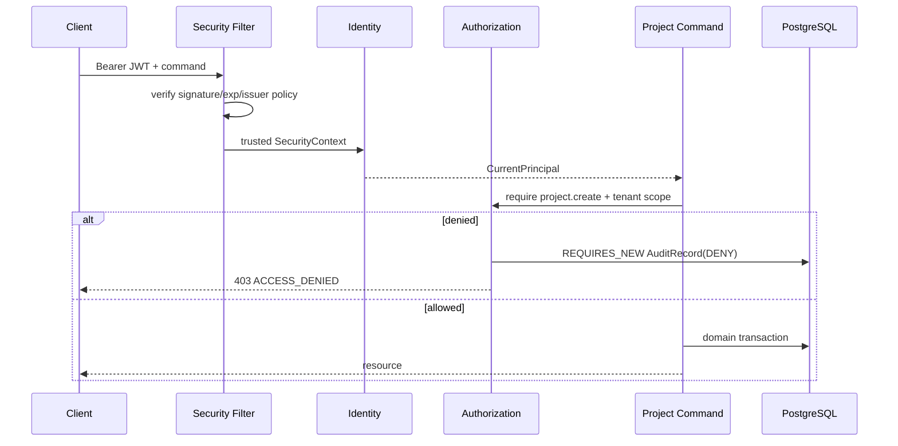
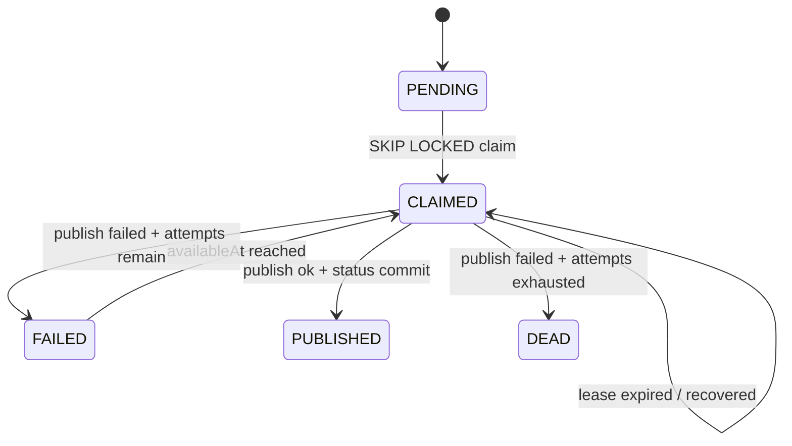

# M9 身份、授权与可靠消息执行参考实现

## 1. 目标

M9 在 M8 首条事务切片上补齐两个 P0 横切边界：

1. 请求主体只能来自受信 OIDC/JWT，后端在命令执行时重新校验 capability 与 tenant scope；
2. Outbox/Inbox 使用 PostgreSQL 作为可恢复事实源，消息允许重复投递但业务结果只能产生一次。

它仍不是 E1 全部完成证明；项目/区域/网点/参与关系、字段权限和授权投影尚未落地。

## 2. 身份与授权链路



关键约束：

- `tenantId`、`actorId` 不再由 `X-Tenant-Id`/`X-Actor-Id` 输入；
- JWT claim 在 `identity` 模块唯一映射，controller 不解释 claim；
- capability 是稳定安全契约，不等同菜单、角色名或 OAuth scope；
- token 的 `capabilities`/`scope` 只保存为 `assertedCapabilities`，不得直接授权；
- authorization 每次命令实时查询 ServiceOS 的 `Role → RoleCapability → RoleGrant`，校验有效期、撤销、租户和 scope；
- 跨租户拒绝优先于 capability 允许；
- 拒绝审计使用独立事务，不能随外层命令回滚。

## 3. 本地 OIDC

`serviceos-deploy` 提供 Keycloak 26.7.0 开发 realm：

- Authorization Code + PKCE S256；
- `tenant_id` 用户属性映射到 token；
- realm role 映射到 `capabilities`，仅作为 Portal 提示和联调声明；
- 本地开发账号与密码不得进入测试/生产；
- ServiceOS 只作为 Resource Server，不保存用户密码算法。

Resource Server 同时配置 issuer、JWK URI 和 `serviceos-api` audience：JWK URI 避免启动依赖 discovery，issuer/audience/exp/nbf 仍必须验证。生产还必须配置 MFA、短期 token、撤销/轮换策略和审批后的 ServiceOS RoleGrant。只有 IdP role、没有 ServiceOS RoleGrant 的主体仍会被拒绝。

## 4. Outbox 执行状态机



执行顺序：

```text
短事务 claim + lease + attemptNo
→ 事务外 OutboxPublisher.publish(eventId, frozen payload)
→ 短事务保存 PUBLISHED/FAILED/DEAD 与 PublishAttempt
```

发布成功但保存 `PUBLISHED` 失败时，不得改记普通失败；记录保持 `CLAIMED`，租约到期后按相同 eventId 重发。下游必须以 Inbox/领域唯一约束去重。

没有真实 `OutboxPublisher` Bean 时 worker 不创建，避免日志/no-op 适配器把事件错误标记为已发布。

## 5. Inbox 消费事务

```text
BEGIN
INSERT/LOCK (tenantId, consumerName, eventId)
同 eventId + 不同 payloadDigest -> EVENT_PAYLOAD_MISMATCH
已 SUCCEEDED -> REPLAY，不再执行领域写入
首次 -> 执行本模块业务命令
UPDATE Inbox SUCCEEDED + 本模块 Outbox
COMMIT
ack broker
```

Inbox 记录不能替代消费者领域唯一约束；两者共同防止重复业务结果。

## 6. 物理模型增量

- `aud_audit_record` 增加 capability、decision、error；
- 允许审计冻结 matchedGrantIds 与 authorizationPolicyVersion，便于解释当时为何允许；
- `auth_capability/auth_role/auth_role_capability/auth_role_grant` 保存服务端权威授权、有效期与撤销；
- `rel_inbox_record` 保存消费者、eventId、schemaVersion、payload/result digest；
- `rel_outbox_publish_attempt` 保存每次 worker、attemptNo、结果和错误分类；
- `rel_outbox_event` 继续拥有唯一状态、租约、availableAt 和 attemptCount；`outboxId` 是记录身份，`eventId` 是跨投递保持不变的消费者去重身份；
- V007 通过新增列并把历史 `eventId=outboxId` 回填完成兼容升级，不修改已提交 V001 checksum。

## 7. 自动化证据

| 证据 | 测试 |
|---|---|
| JWT claim 唯一映射、缺 tenant 拒绝 | `SecurityContextCurrentPrincipalProviderTest` |
| 未认证 HTTP 返回 401 | `ProjectControllerSecurityTest` |
| 伪造 tenant/actor 头无效 | `ProjectControllerSecurityTest` |
| capability/tenant/RoleGrant 判定、撤权与拒绝审计 | `DefaultAuthorizationServiceTest`、PostgreSQL IT |
| Outbox 成功/失败/状态写失败分类 | `OutboxWorkerTest` |
| Inbox 重放/digest 篡改 | PostgreSQL IT |
| claim 排他、租约恢复、DEAD | PostgreSQL IT |

PostgreSQL IT 在无容器运行时的开发机上会明确跳过；CI 先执行 `docker info`，因此不能用跳过伪造 P0 通过。

## 8. 后续缺口

- 正式 OIDC sandbox 的签名/过期/issuer/audience/clock-skew 与服务账号演练；
- Project/Region/Network/Relation ScopePredicate 与 DataScopePolicy/FieldPolicy；
- RoleGrant 管理 API、审批、临时授权和缓存失效；
- 高风险 MFA、审批和 obligations；
- 失败审计完整前后摘要与防篡改链；
- 真实 Broker publisher、consumer adapter 和 schema registry；
- DEAD 自动创建 OperationalException/handling Task；
- Outbox backlog 指标、告警、清理和 runbook。

这些缺口仍受 ARCH-07/20/21 和 M6 P0 门禁约束。
