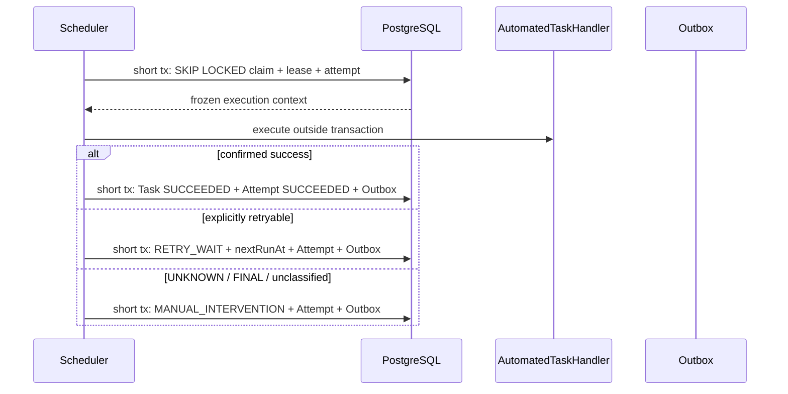

# M10 Task Scheduler 与人工接管执行参考实现

## 1. 目标与边界

M10 实现 M6 E1-07 的最小可运行内核：自动 Task、TaskExecutionAttempt、到期认领、租约恢复、受控重试和最终失败人工接管。

本里程碑不猜测勘测、安装、维修等业务 Task 字段，也不实现普通用户的 claim/start/complete HTTP 动作；这些必须由 M1 真实流程样本驱动。

工程蓝图把跨领域自动化编排定义为独立 `automation` 模块。M10 尚只有一个 Task 执行队列，为避免开放可绕过 Task 不变量的内部写端口，worker 暂与 Task 聚合放在同一模块；引入第二类自动化来源或 E2 workflow adapter 前，必须以受控 Task automation port 提取独立模块，不能让 automation 直接写 `tsk_*` 表。

## 2. 唯一责任源

```text
Task
├── 业务键与冻结 payloadDigest
├── 当前状态与唯一 nextRunAt
├── attemptCount/maxAttempts
├── claimOwner/claimUntil
└── 当前 attemptId

TaskExecutionAttempt
├── attemptNo/workerId
├── startedAt/finishedAt
├── resultCode/errorCode
└── resultRef/nextRetryAt
```

Task 拥有业务重试时钟。外部 Delivery/Notification 只能记录实际调用，不得另建第二套业务退避调度器。

## 3. 执行协议



只有处理器显式分类为 `RETRYABLE` 且给出 `retryAt` 才允许重试。以下结果全部失败关闭并转人工：

- 外部结果 `UNKNOWN`；
- 明确不可重试 `FINAL`；
- 缺少对应 taskType handler；
- 未经分类的运行异常；
- 最大尝试次数已耗尽；
- 最后一次执行认领后进程崩溃且租约已过期。

## 4. 幂等、并发与恢复

- `tenantId + taskType + businessKey` 唯一；
- 相同业务键和摘要返回同一 Task，不同摘要返回 `TASK_SCHEDULE_CONFLICT`；
- PostgreSQL `FOR UPDATE SKIP LOCKED` 确保同一时刻只有一个 worker 认领；
- 结果提交同时校验 `taskId + status + claimOwner + currentAttemptId`，旧 worker 返回 `TASK_LEASE_LOST`；
- 过期认领的上一 Attempt 标记 `LEASE_EXPIRED`，新认领产生新 attemptId；
- 每个 Task 状态结果与领域 Outbox 在同一事务提交；
- handler 必须以 taskId/attemptId 和远端业务键实现副作用幂等；“执行成功但落库失败”允许租约恢复后重复调用。

## 5. 人工接管闭环

`task.execution.manual-intervention-required` 使用发布的 JSON Schema。`operations` 消费者执行：

```text
BEGIN
Inbox begin(eventId + payloadDigest)
→ 幂等创建 OperationalException
→ 幂等创建 operations.resolve-exception HUMAN Task（READY）
→ Inbox complete
COMMIT
```

因此消息重复不会产生第二个异常或第二个人工任务，同 eventId 的载荷摘要变化会被拒绝。

参考实现提供消费应用服务，但不伪造 Broker：正式 OutboxPublisher、Broker topic/ACL 和 consumer adapter 仍需在环境决策后实现。

## 6. 物理模型

- `tsk_task`：自动/人工 Task、业务键、重试时钟、租约、当前 attempt、版本；
- `tsk_task_execution_attempt`：每次执行、结果分类、重试时间和结果引用；
- `ops_operational_exception`：来源 Task、错误、严重度、处理 Task 和解决状态；
- `rel_inbox_record`：operations 消费幂等；
- `rel_outbox_event`：Task 状态变更的可靠事件。

跨模块不建立数据库外键；关联通过稳定 UUID、模块 API 和一致性巡检维护，避免绕过模块所有权。

## 7. 自动化覆盖与未验证

已有自动化覆盖（其中 PostgreSQL IT 必须在具备容器运行时的 CI 执行后才构成数据库通过证据）：

- worker 成功、显式重试、UNKNOWN、缺 handler 和未分类异常；
- 重复 handler 注册启动失败；
- Task 业务键幂等和摘要冲突；
- claim 排他、旧租约拒绝、过期重认领；
- 最大尝试与最后一次崩溃转人工；
- Task/Attempt/Outbox 同事务；
- 最终失败消费生成一个异常和一个 HUMAN Task；
- 人工接管事件 JSON Schema。

仍未证明：

- 正式 Broker 的路由、ACL、积压、顺序和灾难恢复；
- authority/SideEffectFence 在每次外部副作用前的最终判定；
- 通用人工 Task assignment、claim/start/complete/retry API；
- handling Task 的负责人策略、SLA、通知和 runbook UI；
- worker 指标、限流、队列暂停和优雅停机；
- 独立 automation 模块与受控 Task automation port 的提取；
- 本次本机环境中的真实 PostgreSQL P0 运行结果（当前无容器；CI 以硬门禁补足）。

M10 通过不代表 E1、M2 或任何车企业务闭环完成。
