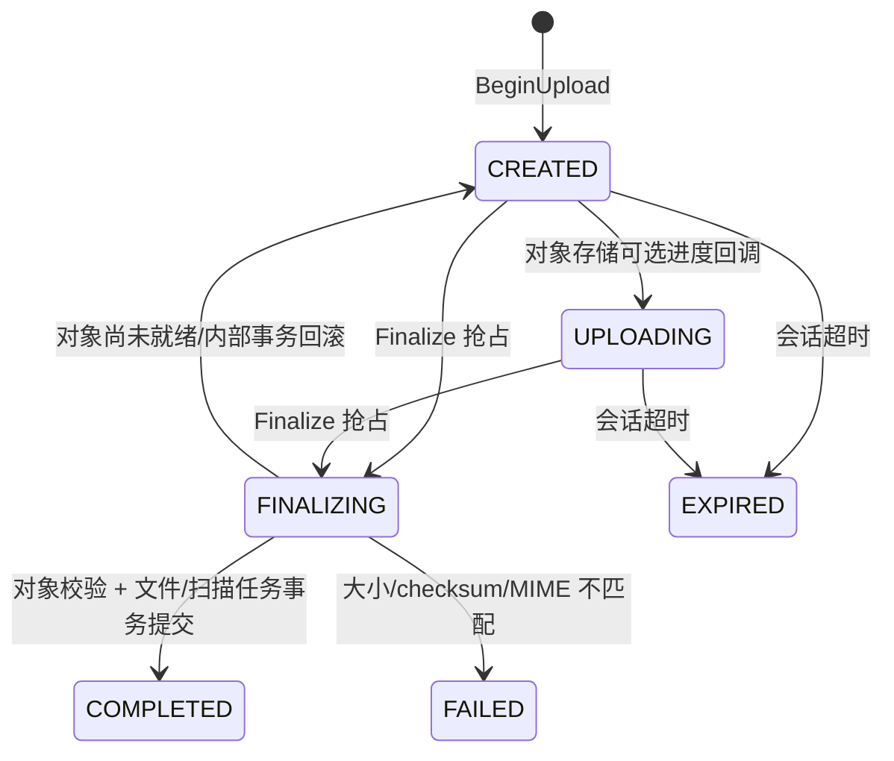
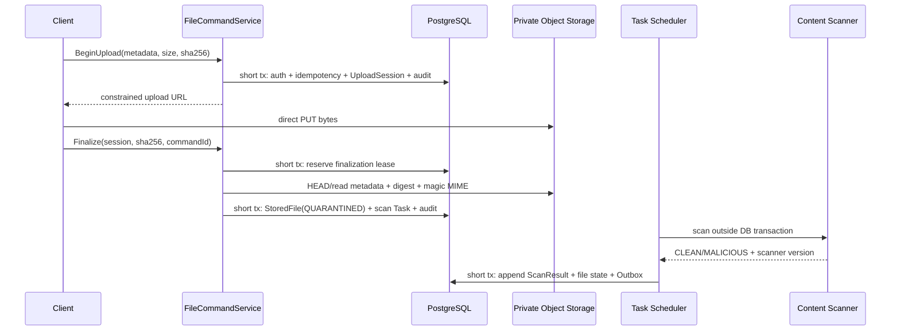

# M11 安全文件生命周期参考实现

## 1. 目标与边界

M11 实现 M6 E1-08 的首个可运行参考闭环：

```text
BeginUpload
→ 短期受限直传
→ Finalize（大小/SHA-256/魔数 MIME）
→ 私有隔离
→ 自动内容扫描
→ AVAILABLE 或 MALWARE 隔离
→ 实时授权的短期下载
```

本里程碑拥有通用 `StoredFile`，不提前拥有 EvidenceSlot、EvidenceItem 或 EvidenceRevision。M3 的 `evidence` 模块必须先校验 Task、资料槽位、拍摄策略和代办关系，再引用 `files.api` 返回的 `fileId`；不得把业务资料规则反向写入通用文件模块。

## 2. 安全不变量

1. 客户端不能提交 object key；key 由服务端生成且不包含文件名、用户、地址或业务 ID。
2. 上传凭证同时绑定 object key、精确字节数、声明 MIME 和有效期。
3. 对象存储回调不能创建 `StoredFile`；只有有效 UploadSession 的 Finalize 命令可以。
4. Finalize 重新读取真实对象，不能信上传请求的 Content-Type、size 或 checksum。
5. Finalize 成功前不存在 `StoredFile`；成功后初始状态为 `QUARANTINED/PENDING_SCAN`。
6. 只有 `AVAILABLE` 文件可获得下载授权；扫描中、恶意和失效文件 fail closed。
7. 下载每次实时执行 RoleGrant 授权，并保存访问目的、主体、关联 ID 和有效期。
8. API 永不返回 object key 或永久公共 URL。
9. 文件状态、扫描结果和 `file.scan-completed` Outbox 在同一本地事务提交。
10. 大对象上传、读取和扫描不占用数据库事务。

## 3. 模块边界

```text
files
├── api
│   ├── BeginUploadCommand
│   ├── FinalizeUploadCommand
│   ├── AuthorizeDownloadCommand
│   └── FileCommandService
├── application
│   ├── DefaultFileCommandService
│   ├── FileScanTaskHandler
│   └── FileScanCompletionRecorder
├── spi
│   ├── ObjectStorageGateway
│   └── FileContentScanner
└── infrastructure
    ├── JdbcFileLifecycleStore
    ├── LocalPrivateObjectStorageGateway
    └── LocalContentScanner
```

允许依赖：`identity::api`、`authorization::api`、`audit::api`、`reliability::api`、`task::api` 和 `task::spi`。其他模块只能使用 `files::api` 或实现 `files::spi`，不能读取 `fil_*` 表或内部 object key。

## 4. 上传与 Finalize 状态机



`finalizationToken + finalizingStartedAt` 是短期租约。活动租约拒绝第二个 Finalize；同一摘要的过期租约可以恢复；不同摘要不能夺取已有 Finalize。会话完成后重放返回同一 `fileId`，不创建第二个文件或扫描任务。

## 5. 事务协议



Finalize 的最后一个事务调用 `TaskSchedulingService`，因此 `StoredFile` 与扫描 Task 要么同时提交，要么同时回滚。若事务回滚，抢占被释放，客户端可用相同命令重试。

## 6. 文件生命周期

```text
QUARANTINED/PENDING_SCAN
├── CLEAN     → AVAILABLE
└── MALICIOUS → QUARANTINED/MALWARE

AVAILABLE → INVALIDATED（后续受控作废命令）
```

`quarantineReason` 不是审核结果。资料审核仍属于 ReviewDecision；文件生命周期只表达存储和内容安全事实。

## 7. 物理模型

| 表 | 所有权与用途 |
|---|---|
| `fil_upload_session` | 会话、预期摘要、过期时间、Finalize 租约和失败码 |
| `fil_stored_file` | 不可变对象引用、真实摘要/MIME、隔离与可用状态 |
| `fil_scan_result` | scanner/version/result/reason 的追加证据，按 attempt 幂等 |
| `fil_download_authorization` | 每次短期授权的主体、目的、关联和有效期 |
| `tsk_task` | `file.content-scan` 的唯一重试时钟与执行状态 |
| `rel_outbox_event` | `file.scan-completed` 的可靠发布事实 |

迁移 `V010__create_secure_file_lifecycle.sql` 同时发布 `file.upload` 和 `file.download` capability。所有文件查询带 `tenant_id`，API 不接受客户端提供的 tenant/actor。

## 8. 本地私有存储沙箱

参考工程默认启用 `local-private`：

- 私有目录不注册为静态资源；
- HMAC-SHA256 能力 token 绑定操作、object key、大小、MIME 和过期时间；
- PUT 使用一次性 consumed marker，防止相同 token 覆盖对象；
- object key 执行规范化和根目录边界检查；
- 下载返回 `Cache-Control: private, no-store` 与 `X-Content-Type-Options: nosniff`。

本地数据面 `/api/v1/file-transfers/{token}` 不使用 Bearer JWT，因为短期 HMAC token 本身是范围受限能力；文件控制面仍要求 OIDC JWT 和数据库 RoleGrant。

该沙箱用于开发和自动化验证，不是生产对象存储。生产必须实现 `ObjectStorageGateway`，使用私有 bucket、短期预签名 URL、服务端加密、密钥轮换、生命周期和跨区域恢复；不得把本地目录适配器带入正式环境。

## 9. 扫描基线

本地 `local-eicar` 扫描器只识别 EICAR 测试特征，用来证明异步隔离协议和恶意路径可执行。它不等于完整反病毒产品。

生产 `FileContentScanner` 必须提供：

- 受管恶意文件/内容安全引擎；
- scanner 与 signature/policy 版本；
- 明确 CLEAN/MALICIOUS，以及可分类的暂时失败；
- 压缩包深度、展开后大小和压缩炸弹限制；
- 超时、限流、熔断和人工接管；
- 结果与原始对象版本的可追溯绑定。

OCR、图片清晰度、GPS、SN/VIN 一致性属于后续 EvidenceValidation，不得与病毒扫描合并成一个不可解释状态。

## 10. 已有自动化证据

- 服务端 key 不泄漏业务字段；
- HMAC token 篡改、错误 MIME、路径逃逸和重复 PUT 被拒绝；
- SHA-256、大小和魔数 MIME 重新校验；
- Begin 幂等与 Finalize 幂等；
- 扫描前下载 fail closed；
- CLEAN 文件变为 AVAILABLE 并可短期下载；
- EICAR 文件保持 MALWARE 隔离且无下载授权；
- 扫描状态与 Outbox 同事务；
- OIDC 控制面不信任伪造 tenant/actor 头；
- OpenAPI 和 `file.scan-completed` JSON Schema 可解析。

PostgreSQL 集成测试在本机没有容器运行时时明确跳过；CI 必须通过 `docker info` 门禁后运行 `clean verify`，否则不能声称数据库 P0 已通过。

## 11. 仍未证明

- 正式 S3/云对象存储适配器及真实预签名约束；
- 正式反病毒/内容安全服务、压缩炸弹与媒体深度解析；
- multipart 分片、断点续传、CompletePart 和临时对象清理 scheduler；
- EvidenceSlot/Task/拍摄策略/代上传授权关系；
- OCR、重复图、定位、EXIF、水印和图片质量验证；
- 原图水印下载、导出审批、法务保留与销毁证明；
- 存储复制、备份、灾难恢复和大规模容量/SLO；
- 本机真实 PostgreSQL P0 运行结果。

M11 证明的是通用安全文件内核的参考闭环，不代表 M3 资料审核、E1 全部能力或任何车企业务已经完成。
