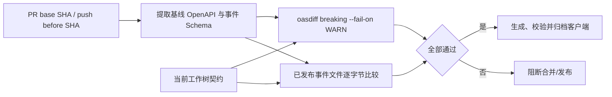

# M12 契约兼容 CI 与客户端生成参考实现

## 1. 目标与边界

M12 实现 M6 E1-09 的工程参考闭环：

```text
Git 基线契约
→ OpenAPI 语义兼容检查
→ 已发布事件版本不可变检查
→ 当前契约与样本校验
→ 固定生成器生成 TypeScript Fetch 客户端
→ 两次生成树摘要一致
→ 客户端与来源清单作为 CI artifact 保留
```

M12 不等于所有 Portal 已接入生成客户端，也不证明 OpenAPI 描述覆盖全部后端。Portal 的编译、lint、包发布和运行时契约测试仍须在对应 Portal 工程落地。

## 2. 为什么比较 Git 基线而不是仓库内 baseline 文件

把 `baseline.yaml` 与修改后的契约放在同一变更中，提交者可以同时修改两者并绕过门禁。M12 直接读取不可变 Git revision：

- Pull Request 使用目标分支的 base SHA；
- push 使用事件的 before SHA；
- 本地默认使用 `HEAD^`，也可显式传入 ref；
- CI 必须使用 `fetch-depth: 0`，缺少基线对象时 fail closed；
- 仓库首个提交没有父 revision 时只允许 bootstrap，当前契约仍由 Maven 校验。



## 3. OpenAPI 兼容策略

`check-contract-compatibility.sh` 使用固定的 oasdiff 1.17.0 对基线与当前 OpenAPI 3.1 执行语义比较：

```bash
oasdiff breaking --fail-on WARN base.yaml current.yaml
```

门禁同时拒绝 ERR 和 WARN，避免把潜在客户端破坏静默带入主干。典型阻断包括删除路径或响应字段、把请求字段改为必填、收窄类型/枚举、改变参数位置及移除安全要求。

允许的演进通常包括新增可选请求字段、新增响应字段、新增路径和显式发布新主版本。即使工具判定兼容，业务语义改变仍须经过 API 评审；兼容工具不是产品语义审批器。

## 4. 事件 Schema 版本策略

事件消费者可能离线、延迟或独立部署，因此已发布的 `*-vN.schema.json` 是不可变资产：

1. 基线存在的 Schema 不得删除；
2. 基线存在的 Schema 不得原地修改，包括描述性修改；
3. 语义或结构变化必须新增 `*-vN+1.schema.json`；
4. 文件名版本、`$id`、title 后缀、`schemaVersion.const` 必须一致；
5. `eventType + schemaVersion` 必须唯一；
6. 每个 Schema 必须有同名 `.valid.json` 样本并通过 JSON Schema 2020-12；
7. 顶层必须 `additionalProperties: false`，避免无治理字段扩散。

Git 门禁负责跨 revision 不可变性，`EventSchemaGovernanceTest` 负责新增版本自洽与样本有效性。两者缺一不可。

## 5. 固定工具链与供应链边界

| 工具 | 固定版本 | 用途 | 供应链控制 |
|---|---:|---|---|
| oasdiff | 1.17.0 | OpenAPI 破坏性变化 | 直接下载官方 release archive，按 OS/架构校验仓库内固定 SHA-256 |
| OpenAPI Generator Maven Plugin | 7.22.0 | `typescript-fetch` 客户端 | Maven 精确版本，不使用 SNAPSHOT/latest |
| Swagger Parser | 2.1.45 | 当前 OpenAPI 解析 | Maven 精确版本 |
| networknt JSON Schema Validator | 1.5.9 | 事件样本校验 | Maven 精确版本 |

安装脚本不执行远程 `install.sh`，也不依赖可变 tag。升级工具时必须同时更新版本、发布摘要、正负向门禁证据和本文件。

## 6. TypeScript 客户端生成契约

Maven `generate-sources` 阶段固定生成：

```text
serviceos-contracts/target/generated-clients/typescript-fetch/
```

关键配置：

- generator：`typescript-fetch`；
- package：`@serviceos/core-client@0.2.0`；
- 单一请求参数对象，避免参数顺序漂移；
- 生成接口类型；
- 隐藏生成时间戳；
- 不生成测试和 Markdown 文档；
- 生成物只进入 `target/`，不提交到 Git。

`GeneratedClientContractTest` 证明 Maven 生命周期确实产出客户端、生成器版本正确，并包含当前四个 operationId。OpenAPI Generator 对 OpenAPI 3.1 的支持仍标记为 beta，因此 parser gate 与 generator smoke test 都必须保留；不能仅凭生成成功推断所有 3.1 语义都被目标语言完整表达。

## 7. 可重复生成与来源清单

`generate-client-artifact.sh` 对所有生成文件排序并逐文件计算 SHA-256，随后生成：

```text
target/client-artifacts/typescript-fetch/
├── files.sha256
└── manifest.json
```

manifest 至少包含：

- generator 与精确版本；
- package 名称与版本；
- OpenAPI 仓库路径与内容摘要；
- 完整生成树摘要。

`verify-client-generation-reproducibility.sh` 比较 Maven 构建已有产物与一次清理后重生成的树摘要；不一致即失败。清单不包含时间和工作站绝对路径，避免非业务输入造成漂移。

## 8. CI 执行顺序

```text
checkout full history
→ resolve base SHA
→ checksum-pin install oasdiff
→ production contract compatibility gate
→ synthetic positive/negative gate probes
→ require Docker
→ validate deploy descriptors
→ clean verify
→ client reproducibility gate
→ upload generated client + provenance manifest (14 days)
```

兼容检查置于 Docker 和完整构建之前，使明显破坏尽早失败。完整 `clean verify` 仍要求容器运行时，以免契约通过掩盖 PostgreSQL P0 未执行。

## 9. 本地命令

```bash
OASDIFF_BIN="$(serviceos-contracts/scripts/install-oasdiff.sh serviceos-contracts/target/contract-tools)" \
  serviceos-contracts/scripts/check-contract-compatibility.sh origin/master

OASDIFF_BIN="$(serviceos-contracts/scripts/install-oasdiff.sh serviceos-contracts/target/contract-tools)" \
  serviceos-contracts/scripts/test-contract-gates.sh

./mvnw --batch-mode --no-transfer-progress -pl serviceos-contracts -am clean verify

serviceos-contracts/scripts/verify-client-generation-reproducibility.sh
```

## 10. 已证明与未证明

已自动证明：

- 请求字段从可选变必填会阻断；
- 已发布事件 Schema 原地修改会阻断；
- 新事件版本文件可被兼容门禁接受，并须再通过自洽/样本测试；
- 当前 3 个事件版本自洽且样本有效；
- TypeScript Fetch 客户端由固定版本生成；
- 两次生成树摘要一致；
- CI artifact 携带契约与生成树来源摘要。
- 根仓库构建在真实 PostgreSQL 容器上执行全部 22 个集成测试，Flyway V001～V010 完整迁移。

仍未证明：

- Admin/Network/Technician Portal 已编译或使用生成客户端；
- npm registry 发布、签名、SBOM 和制品晋级；
- 多语言客户端、服务端 stub 或连接器 SDK；
- OpenAPI 与所有 Controller 的双向覆盖；
- 事件消费者对新旧版本的真实回放兼容；
- GitHub 托管 runner 的一次真实绿色运行（需提交后由远端 CI 证明）。

M12 完成 E1-09 的本仓库参考实现，不代表 E1-10、E1-11 或 M6 Foundation P0 已全部完成。
