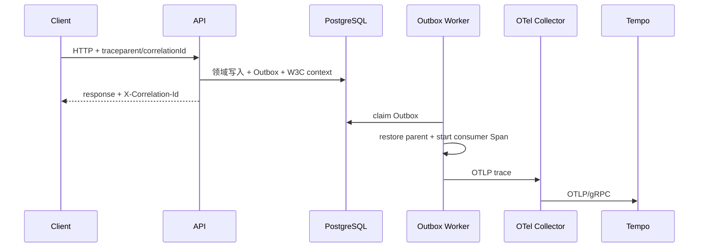

# M13 可观测性、健康探针与日志脱敏参考实现

## 1. 目标与边界

M13 完成 M6 E1-10 的工程参考闭环：

```text
HTTP 请求 correlationId
→ API/数据库事务 Span
→ Outbox 持久化 W3C Trace Context
→ Worker 恢复父上下文并创建 publish Span
→ OTLP Collector
→ Tempo/Grafana 查询
```

同时交付独立存活/就绪探针、受保护的 Prometheus 指标、自定义 Outbox 看板、ECS JSON 日志和敏感输出扫描门禁。M13 不等于生产 SLO、集中日志平台、告警通知链路或正式容量基线已经完成。

## 2. 请求关联与信任边界

`CorrelationContextFilter` 在认证和业务处理前处理 `X-Correlation-Id`：

1. 仅接受 1～128 位安全字符 `[A-Za-z0-9._:/-]`；
2. 缺失或非法输入生成 UUID，不回显攻击者原文；
3. 将最终值写入 request attribute、response header、MDC、OTel baggage 和当前 Span；
4. Controller 与 Problem Details 只读取可信 request attribute。

correlationId 用于跨日志定位，不是授权凭证，也不能代替 traceId。测试显式证明伪装成 correlationId 的 Bearer token 不会进入响应。

## 3. 异步 Trace 连续性

HTTP Span 不能依赖线程本地上下文跨越 Outbox 事务边界。`JdbcOutboxAppender` 在写入消息时捕获 `traceparent`/`tracestate`，Flyway V011 把它们持久化到 Outbox。Worker 发布时由 `OpenTelemetryOutboxTelemetry` 恢复父上下文，并创建 `CONSUMER` 类型的 `outbox publish` Span。



只持久化标准 Trace Context，不持久化 baggage、token 或业务 payload。历史消息与无采样请求允许 trace 字段为空。测试使用内存 Span exporter 证明 API/Worker Span 使用同一 traceId 且父子关系正确。

## 4. 指标与基数策略

Prometheus 暴露 Spring HTTP、JVM、连接池指标以及：

| 指标 | 含义 | 允许标签 |
|---|---|---|
| `serviceos.outbox.backlog` | PENDING/FAILED/CLAIMED 消息数 | `module` |
| `serviceos.outbox.oldest.age` | 最老可发布消息年龄（秒） | `module` |
| `serviceos.outbox.publish` | 发布耗时 | `module`, `result` |
| `serviceos.outbox.publish.total` | 发布结果计数 | `module`, `result` |

指标禁止使用 tenantId、workOrderId、eventId、correlationId、异常正文等无界标签。数据库不可用时 Gauge 返回 `NaN`，不得伪装成零积压。事件标识只进入 Trace。

`/actuator/prometheus` 默认要求认证；仅在本地或已由私网/入口层隔离的采集网络中，显式设置 `SERVICEOS_ALLOW_ANONYMOUS_METRICS=true`。

## 5. 健康与优雅停机

| 入口 | 判定范围 | 失败后的平台动作 |
|---|---|---|
| `/livez` | 仅进程存活状态 | 才允许编排器重启实例 |
| `/readyz` | 应用就绪状态 + PostgreSQL | 摘流量，保留实例供诊断 |

存活探针不得包含数据库、车企接口、对象存储等依赖，避免依赖故障引发重启风暴。应用使用 graceful shutdown，并允许通过 `SERVICEOS_SHUTDOWN_TIMEOUT` 配置停机阶段上限。

## 6. 结构化日志与脱敏

控制台默认输出 ECS JSON。JSON customizer 对所有字符串字段（message、MDC、异常栈等）执行末端脱敏，覆盖：

- Bearer/JWT、token、password、secret、signature；
- 中国大陆手机号、VIN；
- 常见地址键值；
- price/amount/对上金额/对下金额/结算金额。

脱敏器是防御纵深，不构成“可以记录业务正文”的许可。业务代码仍应只记录稳定标识、结果码和有限诊断字段；不得记录请求/响应原文、文件内容、合同价格或用户资料。

CI 将 Maven 输出保存后执行 `verify-sensitive-output.sh`。门禁发现疑似凭证、手机号、VIN、地址或金额即失败；`test-sensitive-output-gate.sh` 同时证明安全样本通过、泄露样本被拒绝。

## 7. 本地可观测性栈

Compose 固定以下镜像版本：

| 组件 | 版本 | 用途 |
|---|---:|---|
| OpenTelemetry Collector Contrib | 0.153.0 | 接收 OTLP HTTP/gRPC，批处理后转发 Trace |
| Grafana Tempo | 2.10.5 | 本地 Trace 存储与查询 |
| Prometheus | 3.10.0 | 指标抓取与查询 |
| Grafana | 13.0.2 | 预置数据源与 Foundation 看板 |

所有宿主机端口只绑定 `127.0.0.1`。Grafana 禁止匿名访问与启动时插件预安装；本地密码仅用于开发机。生产必须使用正式身份、secret 管理、TLS、持久存储、保留策略和网络隔离。

## 8. 看板基线

`ServiceOS Foundation Observability` 看板覆盖：

- HTTP 请求速率、5xx 比例和 p95；
- Outbox backlog、最老消息年龄和发布结果；
- Hikari 连接池；
- JVM heap。

看板只证明数据源和关键查询可用，不替代经过业务确认的 SLO/告警阈值。生产告警必须在容量压测和试点流量后签署。

## 9. 验证命令

```bash
./mvnw --batch-mode --no-transfer-progress -pl serviceos-backend \
  -Dit.test=ObservabilityPostgresIT verify

./mvnw --batch-mode --no-transfer-progress -pl serviceos-backend \
  -Dtest=OpenTelemetryOutboxTelemetryTest test

docker compose -f serviceos-deploy/compose.yaml config --quiet
serviceos-deploy/observability/test-sensitive-output-gate.sh
```

完整验收见 [M13 验收矩阵](../testing/11-m13-observability-acceptance.md)。

## 10. 已证明与未证明

已证明：合法/恶意 correlationId 处理、W3C Outbox 上下文持久化、异步父子 Span、敏感值不进入 Span 属性、真实 PostgreSQL 下探针与指标、匿名 metrics 默认拒绝、配置语法和脱敏门禁；本地 `/livez` Span 也已实际经过 Backend → Collector → Tempo 并可被 TraceQL 检索。

仍未证明：生产 Collector/Tempo 高可用、集中日志采集、正式告警路由、真实峰值下基数/存储成本、跨服务完整 Trace、远端 CI 绿色运行和生产 SLO。

## 11. 参考资料

- [Spring Boot Observability](https://docs.spring.io/spring-boot/reference/actuator/observability.html)
- [Spring Boot Tracing](https://docs.spring.io/spring-boot/reference/actuator/tracing.html)
- [Spring Boot Health Probes](https://docs.spring.io/spring-boot/reference/actuator/endpoints.html#actuator.endpoints.kubernetes-probes)
- [Spring Boot Structured Logging](https://docs.spring.io/spring-boot/reference/features/logging.html#features.logging.structured)
- [W3C Trace Context](https://www.w3.org/TR/trace-context/)
- [OpenTelemetry Collector releases](https://github.com/open-telemetry/opentelemetry-collector-releases/releases)
- [Grafana Tempo](https://github.com/grafana/tempo)
- [Prometheus releases](https://github.com/prometheus/prometheus/releases)
- [Grafana](https://github.com/grafana/grafana)
