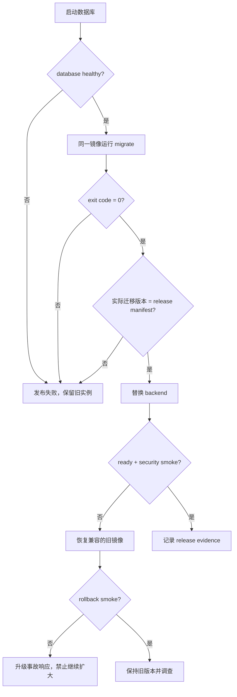

# M14 容器、独立迁移与 staging 发布参考实现

## 1. 目标与边界

M14 完成 M6 E1-11 的仓库内参考闭环：同一后端镜像完成数据库迁移和服务启动，运行账号无 DDL 权限，发布失败关闭，并实际演练旧镜像回滚与当前镜像恢复。

它不是生产部署平台。当前证据不代表镜像仓库签名/SBOM、Kubernetes 多副本滚动、正式 Secret Manager、PITR、跨故障域灾备、容量和审批链已经完成。

## 2. 单一不可变产物

根目录 `Dockerfile` 在固定 digest 的 Temurin 21 JDK 中构建，在固定 digest 的 JRE 中运行。镜像包含一个 Spring Boot fat jar，通过入口参数选择：

| 模式 | 入口 | 权限与职责 |
|---|---|---|
| `migrate` | `DatabaseMigrationMain` | 只装配 Flyway/JDBC，使用迁移账号执行版本化 DDL |
| `server` | Spring Boot 主应用 | 禁用自动 Flyway，使用无 DDL 运行账号提供 API/Worker |

镜像使用 UID/GID `10001:10001`，不包含环境密码。正式环境必须使用 registry digest；`SERVICEOS_ALLOW_MUTABLE_IMAGE=true` 仅供本地和 CI 构建后演练。

## 3. 数据库权限边界

staging 初始化三个角色：

| 角色 | 用途 | 权限 |
|---|---|---|
| `serviceos_bootstrap` | 本地隔离环境初始化/验收 | 仅参考环境管理账号，不注入应用 |
| `serviceos_migrator` | 一次性迁移任务 | schema CREATE 和迁移对象所有权 |
| `serviceos_runtime` | 长期业务进程 | 已迁移表 DML、sequence 使用；禁止 DDL/角色管理 |

默认权限由 migrator 授予 runtime，因此新迁移创建的表自动获得 DML 权限。`smoke.sh` 必须同时证明 runtime 能查询业务表、不能 `CREATE TABLE`。

## 4. 失败关闭发布状态机



`deploy.sh` 使用迁移容器退出码作为发布门禁，并在启动后端前查询 `flyway_schema_history`。本地负向演练把期望版本改为 `999`，确认脚本失败且当前 backend 容器 ID 不变。

## 5. 容器安全基线

backend 与 migrate 均启用：

- 非 root 用户；
- `read_only: true`；
- 仅 `/tmp` 使用带大小上限的 tmpfs；
- `cap_drop: [ALL]`；
- `no-new-privileges:true`；
- 外部注入数据库、OIDC 和文件签名配置；
- 后端端口只绑定本机回环地址用于参考环境；
- `/actuator/prometheus` 默认匿名 401；
- 35 秒优雅停机窗口。

数据库镜像和 JDK/JRE 镜像均固定 OCI index digest。正式镜像构建仍需补充 SBOM、签名、漏洞政策和 registry provenance。

## 6. 回滚策略

ServiceOS 采用应用回滚而非自动数据库 down migration：

1. 数据库变更采用 expand/contract，旧应用在兼容窗口内可读取新 schema；
2. `build-rollback-candidate.sh` 从指定 Git commit 构建旧 jar，再以相同安全 runtime 包装；
3. `rollback.sh` 仅替换 backend，等待 readiness 并检查实际 image ID；
4. 候选失败时 trap 自动恢复发布前镜像；
5. `restore-current.sh` 和完整 smoke 证明可以从演练回滚返回当前版本。

真实生产回滚还必须核对消息 Schema、配置 Bundle、feature gate、外部副作用和数据库兼容性；本脚本不能代替 Go/No-go 审批。

## 7. 可重复验收

完整演练命令：

```bash
serviceos-deploy/staging/verify-rehearsal.sh
```

该命令依次执行：镜像构建、空库迁移、部署、smoke、上一提交镜像构建、回滚、恢复、再次 smoke、迁移版本不匹配负向门禁，并在退出时删除隔离的 Compose volume。

分步调试：

```bash
serviceos-deploy/staging/generate-local-env.sh /tmp/serviceos-staging.env serviceos-backend:m14-local
serviceos-deploy/staging/build-image.sh serviceos-backend:m14-local
serviceos-deploy/staging/deploy.sh /tmp/serviceos-staging.env
serviceos-deploy/staging/smoke.sh /tmp/serviceos-staging.env
serviceos-deploy/staging/cleanup.sh /tmp/serviceos-staging.env
```

## 8. 已证明与未证明

已证明：同一 image ID 用于迁移/后端、V001～V011 空库迁移、迁移失败关闭、期望版本门禁、runtime 无 DDL、非 root/只读/cap drop、健康探针、匿名指标拒绝、无镜像内置 secret、上一提交应用回滚和当前版本恢复。

仍未证明：正式 registry digest 跨环境提升、远端 CI 绿色结果、SBOM/签名/漏洞阻断、真实 orchestrator 多副本滚动与摘流、Worker claim 停机恢复、生产 PITR/对象恢复、staging 峰值与长稳、正式 Secret Manager 和生产审批。

## 9. 关联决策与验收

- [ADR-016：单一镜像、独立迁移与失败关闭发布](../decisions/ADR-016-single-image-explicit-migration-fail-closed-deployment.md)
- [M6 工程就绪验收矩阵](../testing/05-m6-engineering-readiness-acceptance.md)
- [M14 验收矩阵](../testing/12-m14-container-staging-deployment-acceptance.md)
- [安全、非功能、部署与运维实施蓝图](21-security-nfr-deployment-blueprint.md)
