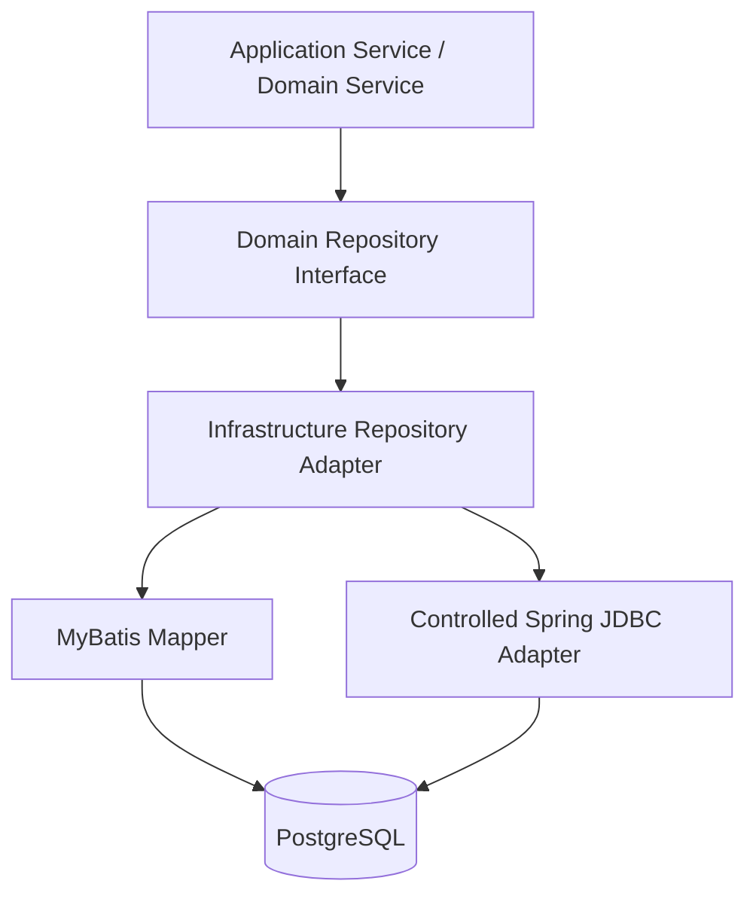

> **已被 ADR-091 取代（2026-07-20）**：数据访问层已一次性统一为 jOOQ，MyBatis/JdbcClient
> 旧实现已删除。本规范的"MyBatis 默认与 JDBC 受控例外"选型条款失效；与技术选型无关的
> 约束（Repository 语义、并发条件、多租户 Scope、事务边界、PostgreSQL 测试要求）由
> ADR-091 §3.4 继承并继续有效。本文件保留为历史参考。

# 持久化工程规范：MyBatis 默认与 JDBC 受控例外

## 1. 决策摘要

ServiceOS 后续持久化实现采用以下技术基线：

> 普通业务持久化和查询侧默认使用 MyBatis；Spring JDBC 仅作为可靠性、调度和高并发状态迁移内核的受控补充。

本规范解决两个目标之间的平衡：

1. 保留显式 SQL、PostgreSQL 能力和并发语义的可控性；
2. 降低普通 CRUD、动态查询、分页、映射和批量操作的样板代码。

本规范不要求立即重写已经稳定的 Spring JDBC 实现，而是约束新增代码和后续渐进迁移。

## 2. 为什么不继续全量使用 Spring JDBC

Spring JDBC 适合需要精确控制 SQL 和受影响行数的底层场景，但在完整业务平台中全量使用会产生大量重复工作：

- 手工参数绑定；
- 手工 RowMapper；
- 动态 SQL 拼接；
- 分页与排序模板；
- 查询对象与结果对象映射；
- 批量操作样板代码；
- 大量后台列表查询的重复基础设施。

ServiceOS 后续会持续增加项目、配置、工单、任务、审计、组织权限和运营工作台查询，因此需要将 MyBatis 设为默认持久化框架。

## 3. 为什么选择 MyBatis，而不是 JPA

ServiceOS 的核心数据访问具有以下特点：

- PostgreSQL 方言能力使用较多；
- 存在条件更新、乐观并发和状态机迁移；
- 存在 `FOR UPDATE SKIP LOCKED`；
- 存在 Inbox、Outbox、Claim、Lease 和受控 Retry；
- 事务和 SQL 行为必须可直接审查；
- 查询模型与领域聚合并不总是一致。

MyBatis 保留 SQL-first 模型，同时改善映射、动态查询和工程组织；相比 JPA，它不会引入脏检查、自动 flush、隐式级联和持久化上下文语义，因此更符合当前架构。

## 4. 适用矩阵

| 场景 | 默认技术 | 说明 |
|---|---|---|
| 项目、配置、权限等普通持久化 | MyBatis | 显式 Mapper + Repository Adapter |
| 工单、任务、审计列表查询 | MyBatis XML | 动态条件、分页、排序、数据范围 |
| 统计、聚合、报表查询 | MyBatis XML | 使用 DTO/Record 返回查询模型 |
| Inbox / Outbox | 保留或选择 Spring JDBC | 需要精确控制并发与批量 Claim |
| Task claim / lease / recovery | 保留或选择 Spring JDBC | 需要锁、租约、受影响行数验证 |
| Workflow 并发推进 | 逐例评估 | MyBatis 可清晰表达时优先 MyBatis |
| 简单主键查询 | MyBatis 注解或 XML | 以可读性为准 |
| 数据库迁移 | Flyway | 不属于 MyBatis 职责 |

## 5. 分层模型



领域层只依赖 Repository 接口。Mapper、XML、JdbcClient、数据库 Record 和 TypeHandler 都属于基础设施层。

推荐结构：

```text
com.serviceos.project
├── application/
├── domain/
│   ├── Project.java
│   └── ProjectRepository.java
└── infrastructure/
    └── persistence/
        ├── MyBatisProjectRepository.java
        ├── ProjectMapper.java
        ├── ProjectRecord.java
        └── ProjectMapper.xml
```

## 6. MyBatis 编码规范

### 6.1 SQL 放置

- 简单且稳定的单表 SQL可以使用注解；
- 动态查询、多表查询、批量操作、复杂映射和较长 SQL 使用 XML；
- 禁止在 Java 字符串中塞入难以阅读的大段复杂 SQL；
- 禁止使用 `select *`；
- SQL 别名应与 ResultMap 或 Record 字段保持稳定对应。

### 6.2 Mapper 边界

Mapper 只负责 SQL 执行，不负责：

- 业务状态判断；
- 权限决策；
- 领域事件发布；
- 审计策略；
- 事务编排。

Mapper 不得被 Controller、Application Service 或 Domain Service 直接注入。

### 6.3 数据对象

持久化 Record、查询 DTO 与领域聚合分离：

```text
数据库行 -> Persistence Record -> Repository Adapter -> Domain Aggregate
数据库查询 -> Query DTO / View Record -> Application Response
```

对于只读列表，不要求为了形式主义重建完整领域聚合。

### 6.4 类型映射

必须统一处理：

- UUID；
- 枚举；
- Instant、OffsetDateTime；
- 领域值对象；
- PostgreSQL JSONB；
- 数组或其他 PostgreSQL 特有类型。

优先建立可复用 TypeHandler；不得在多个 Mapper 中复制同一种转换逻辑。

## 7. Repository 语义规范

Repository 接口表达领域意图：

```java
public interface TaskRepository {
    boolean claim(TaskId taskId, UserId claimantId, long expectedVersion, Instant claimedAt);
    Optional<Task> findById(TaskId taskId);
}
```

不表达通用表操作：

```java
updateById(entity);
saveOrUpdate(entity);
selectByMap(filters);
```

涉及状态迁移的 SQL 必须：

1. 带当前状态或版本条件；
2. 校验受影响行数；
3. 对冲突、重复请求和失效租约有明确结果；
4. 在 PostgreSQL Testcontainers 中验证真实并发行为。

## 8. MyBatis-Plus 决策

ServiceOS 默认不在核心领域中采用 MyBatis-Plus 的通用 CRUD 编程模型。

原因：

- 容易使业务层直接依赖表结构；
- 容易绕过领域状态机；
- 通用 `updateById` 难以强制并发条件；
- `IService` / `ServiceImpl` 会模糊领域服务和持久化服务边界；
- Wrapper 查询容易散落在业务层。

如辅助模块确实需要 MyBatis-Plus，必须通过 ADR 说明边界，并禁止将 BaseMapper 暴露到业务层。

## 9. JDBC 例外准入

新增 Spring JDBC 实现必须同时满足：

1. 存在需要直接控制的明确数据库语义；
2. MyBatis 实现会显著降低 SQL 可读性、执行语义或测试可验证性；
3. Repository Adapter 对领域层屏蔽 JDBC；
4. 有 PostgreSQL 集成测试；
5. 在代码注释或 PR 说明中记录选择理由。

可接受理由包括：

- 批量 Claim 与 `SKIP LOCKED`；
- 单语句状态迁移和 `RETURNING`；
- 依赖精确更新计数的幂等写入；
- 极底层可靠性循环中的批处理优化。

不可接受理由包括：

- 开发者更熟悉 JDBC；
- 复制旧模块实现；
- 不愿建立 ResultMap 或 TypeHandler；
- 仅为了减少一个 Mapper 文件。

## 10. 事务约束

- 事务由应用层用例或明确的事务编排组件控制；
- Repository 和 Mapper 不得私自使用 `REQUIRES_NEW`；
- 聚合、审计、幂等响应和 Outbox 保持同一事务；
- 外部 HTTP、对象存储或 Broker 调用不得在持有数据库行锁时执行；
- 读取后更新的状态迁移优先转换为条件更新，避免不必要的长锁。

## 11. 多租户与数据权限

所有租户业务表的访问都必须具备明确的数据范围：

- tenant_id；
- 必要时 project_id；
- 授权解析后的可见范围。

禁止依赖调用方“记得加条件”。列表查询必须通过统一 Query Scope 参数或基础设施机制传入，并使用集成测试验证跨租户数据不可见。

## 12. 测试要求

### 普通持久化

至少验证：

- Record 与领域对象映射；
- 插入和查询；
- 唯一约束冲突；
- 枚举、时间和 JSONB 映射。

### 查询侧

至少验证：

- 动态条件组合；
- 分页和稳定排序；
- tenant/project scope；
- 空条件和边界数据。

### 并发内核

必须使用真实 PostgreSQL Testcontainers 验证：

- 并发 Claim 只有一个成功；
- Lease 到期恢复；
- `SKIP LOCKED` 不重复领取；
- 版本冲突；
- 事务回滚时业务、审计和 Outbox 一致回滚。

## 13. 渐进迁移顺序

不进行一次性全量重写，建议顺序：

1. 建立 MyBatis Starter、Mapper 扫描、XML、TypeHandler 和测试规范；
2. 新增功能全部按本规范执行；
3. 优先迁移 project、configuration、authorization 等普通持久化；
4. 迁移工单、任务、审计和运营工作台查询侧；
5. 对 reliability、task scheduler、workflow progression 逐例评估；
6. 稳定 JDBC 内核无明确收益时保持不动。

## 14. Agent 验收清单

Agent 提交持久化变更前必须确认：

- [ ] 普通业务代码默认使用 MyBatis；
- [ ] 领域层没有依赖 Mapper 或 JDBC；
- [ ] Repository 方法表达业务语义；
- [ ] 复杂 SQL 使用 XML；
- [ ] 没有 `select *`；
- [ ] tenant/project scope 已落实；
- [ ] 状态迁移包含并发条件；
- [ ] JDBC 例外已说明具体原因；
- [ ] PostgreSQL 集成测试覆盖关键语义；
- [ ] Flyway 迁移和数据库权限边界未被破坏。

## 15. 生效方式

根目录 `AGENTS.md` 将本规范声明为仓库级 Agent 强约束。后续实现如与本规范冲突，应被代码评审或 Agent 自检阻断；确需偏离时，必须先提交新的 ADR。
