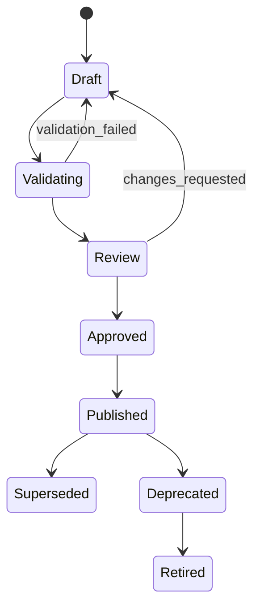

# 配置资产元模型

## 1. 目标

统一描述 Workflow、Form、Evidence、Rule、SLA、Dispatch、Pricing、Integration、Assignee Policy、
Notification 和 Calendar 等业务配置资产，使其可验证、可依赖、可审批、可发布、可锁定、可回滚和可审计。

## 2. 核心对象

- `ConfigurationAsset`：跨版本稳定的逻辑资产；
- `ConfigurationVersion`：不可变版本；
- `ConfigurationBundle`：一次业务上线使用的完整版本集合；
- `ConfigurationDependency`：版本间精确依赖；
- `Publication`：验证、审批、发布与投放记录；
- `ValidationResult`：结构、语义、样本和兼容校验结果；
- `ConfigurationMigration`：运行中实例显式迁移记录。

## 3. 通用标识

```text
assetId
assetType
assetKey
versionId
semanticVersion
tenantId
scopes
validity
schemaVersion
definition
dependencies
metadata
```

资产类型至少包括：

```text
WORKFLOW
FORM
EVIDENCE
RULE
SLA
DISPATCH
PRICING
INTEGRATION
ASSIGNEE_POLICY
NOTIFICATION
CALENDAR
```

## 4. 生命周期



Published 版本不可原地修改；修正必须创建新版本。

## 5. 依赖规则

- 依赖必须指向精确 `versionId`，禁止 `latest`；
- 发布前完成依赖闭包解析；
- 禁止循环依赖；
- 同一 Bundle 中，同一逻辑资产只能出现一个版本；
- 依赖租户、项目和作用域必须兼容；
- 缺失、失效或未批准的依赖阻止发布；
- Bundle 中资产内容应记录校验和，防止发布后漂移。

## 6. Configuration Bundle

工单创建时解析唯一 Bundle，并写入：

```text
configurationBundleId
configurationBundleVersion
configurationResolvedAt
configurationResolutionReason
```

执行期的流程、表单、资料、负责人、SLA、派单、通知和计价全部从锁定 Bundle 解析，不读取所谓“当前最新配置”。

Bundle 选择维度可包含：

- tenant；
- project；
- brand；
- business type；
- region；
- vehicle/charger product；
- risk level；
- validity window。

若出现零命中或多命中，禁止创建有效工单，转配置异常处理。

## 7. 发布校验

至少执行：

- JSON Schema 校验；
- 引用完整性和依赖闭包；
- 表达式静态类型检查；
- 工作流可达性、死路和歧义路由检查；
- 表单/资料条件循环检查；
- SLA 日历存在性；
- 派单硬过滤、评分和容量规则检查；
- 价格规则覆盖、冲突、精度和舍入检查；
- 权限和敏感字段检查；
- 真实样本回放；
- 与上一版本差异报告；
- 破坏性变更分类。

## 8. 运行中迁移

默认不迁移。需要迁移时必须：

- 显式发起并审批；
- 展示旧、新 Bundle 差异；
- 校验当前执行位置；
- 提供字段、任务、资料和计价迁移计划；
- 生成必要补偿任务；
- 失败可回退；
- 记录迁移前后版本和完整审计事件。

## 9. 最小持久化对象

```text
configuration_asset
configuration_version
configuration_dependency
configuration_bundle
configuration_bundle_item
configuration_publication
configuration_validation_result
configuration_migration
```

物理表结构在试点物理数据模型中确定。

## 10. 当前实现追踪

- M33 已实现 FORM 1.0.0 的结构、身份和不可变 Bundle 发布门禁；
- M36 已实现 EVIDENCE 1.0.0 的结构、身份、`evidenceKey` 唯一性、数量区间和多模板 Bundle 门禁；
- M37 已基于 Task 冻结 Bundle 与 Stage 实现不含条件表达式的 EvidenceSlot 运行时解析；
- 表达式静态类型、样本回放、依赖闭包与完整审批生命周期仍未实现；
- Proposed 状态和 ADR-018 未获批部分不因上述局部实现自动转为 Accepted。
