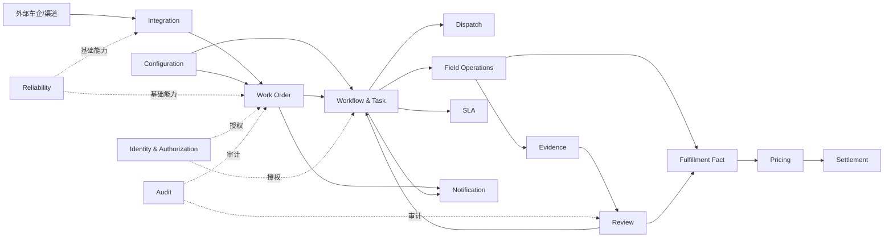

# ServiceOS 限界上下文地图

## 1. 目的

本文件规定 ServiceOS 的限界上下文、事实源所有权和上下游关系。目标是阻止模块之间通过数据库表、内部类或同步事务任意耦合。

## 2. 上下文总览



## 3. 限界上下文目录

### 3.1 Project & Service Catalog

拥有：

- Client；
- Brand；
- Project；
- ServiceProduct；
- 项目与服务产品的有效绑定。

不拥有工单实例、配置运行版本或履约数据。

向下游提供稳定 ID、编码和有效期查询。

### 3.2 Configuration

拥有：

- 配置资产；
- 配置版本；
- ConfigurationBundle；
- 发布、校验、依赖解析和废止状态。

不拥有运行中流程、表单提交、审核结果或工单状态。

向 Work Order 和 Workflow 提供精确、不可变的已发布版本引用。

### 3.3 Integration

拥有：

- 外部协议版本；
- 入站/出站报文事实；
- 签名、防重放、Schema 校验；
- 字段映射版本；
- 外部错误归一化；
- 外部投递状态。

不拥有 WorkOrder、Task 或 ReviewCase 的业务状态。

Integration 通过反腐层将外部报文转换为应用命令，或将领域事件转换为外部协议报文。

### 3.4 Work Order

拥有：

- WorkOrder；
- 外部订单业务键；
- 工单级生命周期；
- 配置包锁定；
- 工单级取消、暂停、恢复、履约完成和关闭约束；
- 工单级客户、车辆、设备和地址快照或稳定引用。

不拥有任务、证据、审核、派单决策和结算明细。

Work Order 是核心上下文之一，但不是所有履约数据的超级聚合。

### 3.5 Workflow & Task

拥有：

- WorkflowInstance；
- StageInstance；
- Task；
- 任务依赖、激活、阻塞、完成、取消、重试和人工接管；
- 任务责任人与统一待办状态。

不拥有 EvidenceRevision、ReviewDecision 或 DispatchDecision 的事实内容。

该上下文只引用相关业务聚合 ID，并根据完成结果推进任务图。

### 3.6 Dispatch

拥有：

- DispatchRequest；
- DispatchAttempt；
- CandidateEvaluation；
- DispatchDecision；
- ServiceAssignment；
- 容量预占和释放事实。

不拥有网点主数据和 Task 状态。成功分配后通过事件或应用接口通知 Workflow & Task。

### 3.7 Appointment & Field Operations

拥有：

- Appointment；
- Visit；
- FieldOperation；
- 现场开始、到达、完成、空跑和无法施工等事实。

不拥有文件二进制、审核决定或计价结果。

### 3.8 Evidence

拥有：

- EvidenceSlot；
- EvidenceItem；
- EvidenceRevision；
- EvidenceSetSnapshot；
- 采集约束结果；
- OCR/GPS/水印等派生技术结果的引用。

文件内容由 Secure File 上下文拥有；Evidence 只保存业务关联与不可变文件引用。

### 3.9 Review

拥有：

- ReviewCase；
- ReviewDecision；
- RejectReason；
- CorrectionCase；
- 审核对象快照引用；
- 人工、系统和车企来源的决定历史。

自动 Validation 是 Review 的输入能力，不替代 ReviewCase 的业务事实源地位。

### 3.10 SLA

拥有：

- SlaInstance；
- BusinessCalendar；
- 暂停、恢复、预警、超时和升级历史。

SLA 不直接改变 Task 或 WorkOrder 状态，只发布时钟事实和升级请求。

### 3.11 Fulfillment Fact & Pricing

拥有：

- FulfillmentFact；
- FactSetSnapshot；
- PricingContextSnapshot；
- CalculationRun；
- ChargeItem。

事实提取与金额计算必须分离。对上和对下计算共享事实快照，但使用独立计价方案与运行。

### 3.12 Settlement

拥有：

- SettlementStatement；
- StatementLine；
- ReconciliationResult；
- Dispute；
- Adjustment；
- 结算状态和财务确认。

Settlement 不重新解释现场资料，也不直接修改履约事实；争议通过显式调整和事实资格变更流程处理。

### 3.13 Identity, Authorization & Audit

拥有：

- Identity：主体与组织身份；
- Authorization：RoleGrant、能力和数据范围；
- Audit：不可抵赖的操作审计记录。

业务上下文只通过公开 API 请求授权判定和记录审计，不直接读取授权内部表。

### 3.14 Reliability

拥有：

- Idempotency Record；
- Inbox；
- Outbox；
- Lease；
- 通用异步执行和失败恢复事实。

Reliability 是基础上下文，不承载业务判断。业务事件语义由事件发布方拥有。

### 3.15 Notification & Operational Exception

拥有：

- NotificationRequest；
- DeliveryAttempt；
- OperationalException；
- 人工接管队列和处理结果。

通知失败不得回滚已经提交的业务事务；通过 Outbox 和重试恢复。

## 4. 上下游关系

| 上游 | 下游 | 关系 | 约束 |
|---|---|---|---|
| Project & Service Catalog | Configuration | Published Language | 只使用稳定项目、品牌和服务产品标识 |
| Configuration | Work Order | Customer/Supplier | 工单锁定精确 Bundle 版本 |
| Integration | Work Order | Anti-Corruption Layer | 外部 DTO 必须映射为内部命令 |
| Work Order | Workflow & Task | Domain Event | 工单激活后创建流程实例；禁止共享事务对象图 |
| Workflow & Task | Dispatch | Command/Event | 任务发起派单，派单结果回传稳定 ID |
| Field Operations | Evidence | Command | 现场作业创建资料槽位或提交证据 |
| Evidence | Review | Snapshot Reference | 审核只引用不可变资料版本或集合快照 |
| Review | Workflow & Task | Domain Event | 审核决定推动相关任务完成或创建整改任务 |
| Field/Review | Fulfillment Fact | Domain Event | 只从可追溯事实提取标准事实 |
| Pricing | Settlement | Published Language | 结算引用不可变 ChargeItem |
| Reliability | 全部业务上下文 | Shared Kernel（受限） | 只共享技术 API，不共享业务模型 |

## 5. 跨上下文规则

1. 禁止跨上下文直接写表；
2. 禁止在一个数据库事务中修改多个业务聚合，除非 ADR 明确批准；
3. 同步调用只用于需要立即返回的校验或命令结果；
4. 跨上下文副作用优先使用 Outbox 事件；
5. 查询可以使用独立投影，但投影不是业务事实源；
6. 外部协议枚举不得成为核心领域枚举；
7. 上下文公开 API 必须位于明确的命名接口中；
8. 任何事实源迁移必须包含数据迁移、双写/切换和回滚方案。

## 6. 首期模块化单体映射

限界上下文不等于独立微服务。首期采用 Spring Modulith 模块化单体：

```text
com.serviceos.project
com.serviceos.configuration
com.serviceos.integration
com.serviceos.workorder
com.serviceos.workflow
com.serviceos.task
com.serviceos.dispatch
com.serviceos.fieldoperation
com.serviceos.evidence
com.serviceos.review
com.serviceos.sla
com.serviceos.pricing
com.serviceos.settlement
com.serviceos.identity
com.serviceos.authorization
com.serviceos.audit
com.serviceos.reliability
com.serviceos.notification
```

是否拆分部署必须基于团队边界、负载、数据隔离和独立演进证据，而不是按领域名机械拆分。
