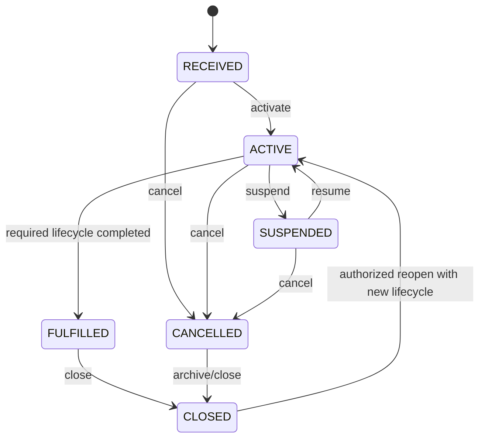
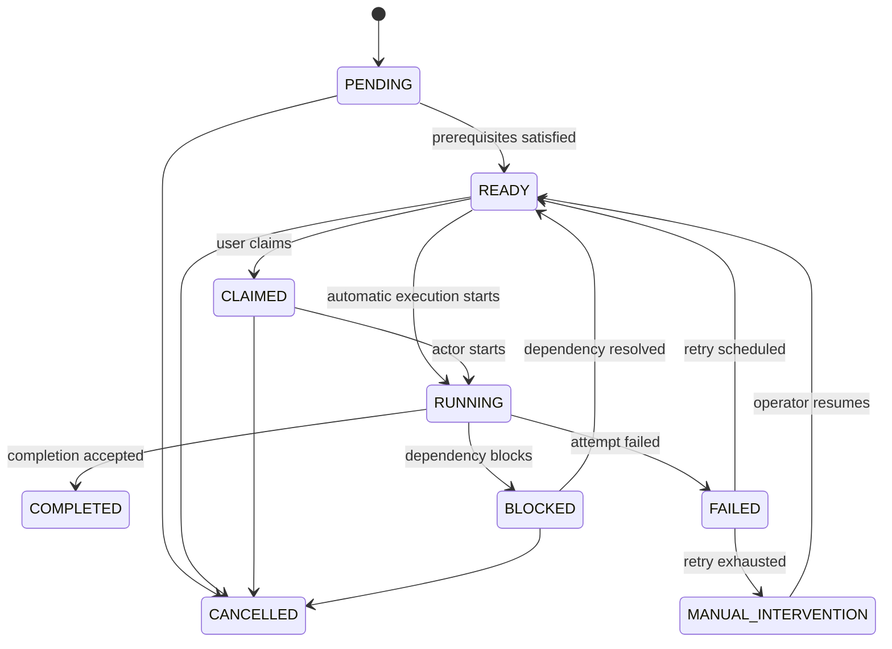
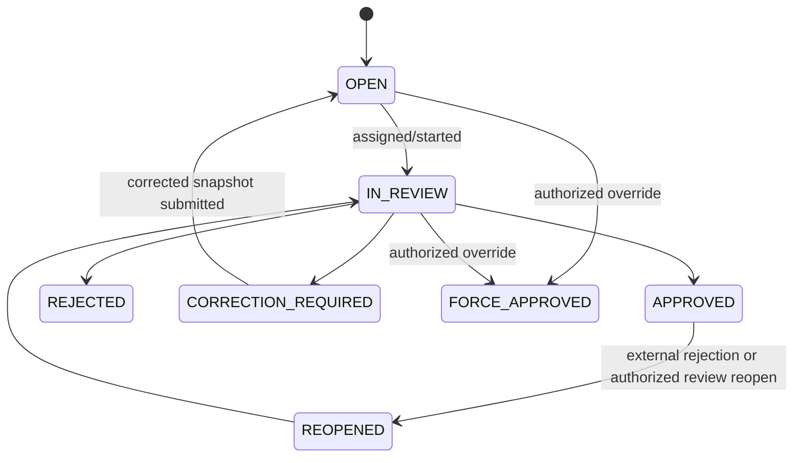
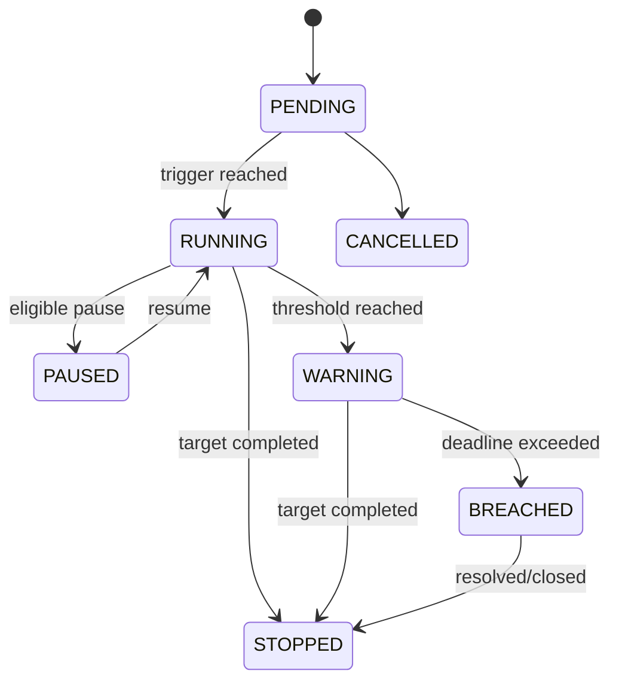

# 聚合状态机基线

本文冻结核心聚合的稳定生命周期。业务页面上的“待预约、审核中、待安装”等运营状态通常是任务与阶段投影，不应全部塞进 WorkOrder 生命周期。

## 1. WorkOrder 状态机



### 1.1 状态定义

| 状态 | 含义 |
|---|---|
| `RECEIVED` | 已接收并锁定配置，尚未正式进入履约 |
| `ACTIVE` | 至少一个履约生命周期正在进行 |
| `SUSPENDED` | 工单级暂停，任务和 SLA 按策略处理 |
| `FULFILLED` | 当前必要履约目标已达成，但仍可能等待回传、结算或关闭 |
| `CANCELLED` | 当前履约被取消，不等同于删除 |
| `CLOSED` | 最终关闭，普通命令不可再修改 |

### 1.2 禁止事项

- 不把 `SURVEYING`、`INSTALLING` 放入 WorkOrder 主状态；
- 不通过直接更新状态字段跳过命令约束；
- 重开时必须新建生命周期、阶段和任务，不复用历史任务；
- 强制关闭必须保留独立关闭类型、原因与授权依据。

## 2. StageInstance 状态机

```text
PENDING -> ACTIVE -> COMPLETED
   |          |          
   |          -> BLOCKED -> ACTIVE
   -> SKIPPED
ACTIVE -> CANCELLED
```

`SKIPPED` 必须由流程条件或有权人工决策产生，并记录原因；不能用跳过掩盖失败。

## 3. Task 状态机



### 3.1 不变量

- 只有 READY 任务可被领取或自动执行；
- 完成条件由任务定义版本和关联业务聚合共同判断；
- `FAILED` 表示一次或多次执行失败，不自动代表业务终止；
- 自动重试耗尽后必须进入 `MANUAL_INTERVENTION` 或明确终止；
- COMPLETED 与 CANCELLED 默认终态，整改必须创建新任务或显式重开实例。

## 4. EvidenceItem / Revision 状态机

### 4.1 EvidenceItem

```text
OPEN -> SUBMITTED -> UNDER_REVIEW -> ACCEPTED
  ^          |              |
  |          -> REJECTED ----
  |                         |
  +------ new revision -----+
ACCEPTED -> LOCKED
```

### 4.2 EvidenceRevision

```text
UPLOADING -> QUARANTINED -> AVAILABLE -> VALIDATED
                   |            |
                   -> REJECTED   -> REJECTED
VALIDATED -> SUPERSEDED
```

- 文件扫描通过只是 AVAILABLE，不代表业务资料通过；
- 补传新增 revision，旧 revision 变为 SUPERSEDED 或保留原审核结果；
- LOCKED 后普通人员不能原地替换文件。

## 5. ReviewCase 状态机



审核决定只追加，不覆盖历史。`FORCE_APPROVED` 必须独立记录，不能等价写成 APPROVED。

## 6. DispatchRequest 状态机

```text
CREATED -> EVALUATING -> DECIDED -> ASSIGNED
              |             |
              -> FAILED     -> RESERVATION_FAILED -> EVALUATING
FAILED -> MANUAL_INTERVENTION
ASSIGNED -> REVOKED
```

一次 DispatchRequest 可产生多次不可变 Decision；只有成功容量预占的决定进入 ASSIGNED。

## 7. Appointment 与 Visit 状态机

### 7.1 Appointment

```text
PROPOSED -> CONFIRMED -> RESCHEDULED -> CONFIRMED
CONFIRMED -> CANCELLED
CONFIRMED -> FULFILLED
```

改约不覆盖原预约，必须保留版本或历史记录。

### 7.2 Visit

```text
PLANNED -> EN_ROUTE -> ARRIVED -> IN_PROGRESS -> COMPLETED
                     |             |
                     -> NO_ACCESS  -> ABORTED
PLANNED/EN_ROUTE -> CANCELLED
```

二次及以上上门创建新的 Visit，不复用第一次上门记录。

## 8. SlaInstance 状态机



累计耗时、暂停时段、日历版本和每次升级必须保留，不只保存一个最终 deadline。

## 9. OutboundDelivery 状态机

```text
QUEUED -> CLAIMED -> SENDING -> SUCCEEDED
                         |       
                         -> PARTIAL_SUCCESS -> QUEUED / MANUAL_INTERVENTION
                         -> RETRYABLE_FAILED -> QUEUED
                         -> BUSINESS_REJECTED -> MANUAL_INTERVENTION
                         -> DEAD
```

业务拒绝不得无限重试；部分成功必须拆分已成功与待处理项。

## 10. CalculationRun 与 SettlementStatement

### 10.1 CalculationRun

```text
CREATED -> RUNNING -> SUCCEEDED
                   -> FAILED
SUCCEEDED -> SUPERSEDED
```

计算结果不可原地覆盖；重算创建新 Run。

### 10.2 SettlementStatement

```text
DRAFT -> GENERATED -> UNDER_RECONCILIATION -> CONFIRMED -> SETTLED
                       |                          |
                       -> DISPUTED -> ADJUSTED ---
CONFIRMED -> VOIDED (authorized correction only)
```

## 11. 状态变更实现约束

每次状态变更必须：

1. 通过明确命令；
2. 校验当前状态和业务不变量；
3. 记录操作者、时间、原因与版本；
4. 产生对应领域事件；
5. 与聚合写入和 Outbox 同事务提交；
6. 使用乐观锁或等价并发控制；
7. 对非法迁移返回稳定业务错误码。

禁止：

- Repository 暴露 `updateStatus` 作为业务入口；
- Controller 直接修改状态；
- 用数据库触发器隐藏业务迁移；
- 根据页面展示文案反推状态；
- 多个上下文共享同一状态字段并各自修改。

## 12. 测试矩阵

每个状态机必须包含：

- 所有允许迁移正例；
- 所有关键非法迁移；
- 并发重复命令；
- 幂等重放；
- 乐观锁冲突；
- 终态保护；
- 暂停/恢复与时间累计；
- 重开后历史不被覆盖。
