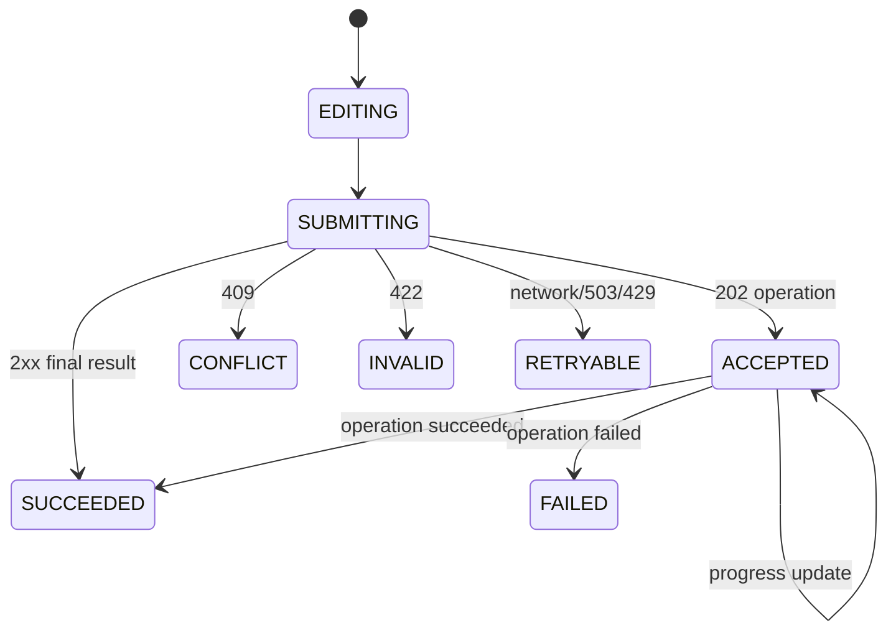
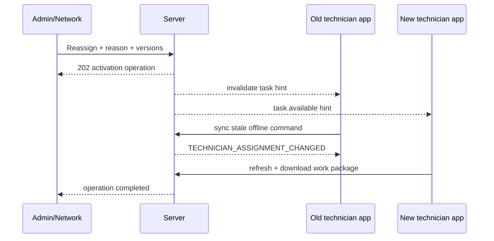

# 跨 Portal 协作、命令反馈与状态交互规格

## 1. 目标

同一工单会被总部、网点、师傅、自动任务和车企连接器协作处理。前端必须正确表达“事实已提交、异步处理中、投影尚未刷新、需要他人处理、失败可恢复”，避免多个 Portal 各自维护一套乐观状态。

## 2. 命令交互模型



### 2.1 提交要求

- 生成并持久化 Idempotency-Key；
- 更新命令携带 ETag/expectedVersion；
- 工单子域命令携带 authorityVersion；
- 提交期间阻止同一动作重复点击，但不锁住无关浏览；
- 请求超时不等于失败，先用幂等键/operation 查询结果；
- 页面关闭后 operation 仍可在通知/任务中心恢复。

### 2.2 最终成功

显示服务端资源 ID/version、业务结果和下一动作。若列表投影未追上，保留已成功提示并显示“同步中”，不能把旧行状态覆盖回来。

### 2.3 202 Accepted

显示可关闭的进度面板：operation 类型、开始时间、当前步骤（非业务事实）、目标资源、取消是否允许和失败恢复。轮询/推送均使用退避和页面可见性控制。

## 3. 错误交互

| 错误 | 用户信息 | 动作 |
|---|---|---|
| 401 | 会话失效 | 保存安全草稿，重新登录后恢复 |
| 403 | 无权执行/字段受限 | 不重试；显示申请权限/返回 |
| 404 | 对象不存在或已无范围 | 清除敏感缓存，返回来源队列 |
| 409 VERSION_CONFLICT | 对象已更新 | 展示差异、刷新、重新确认 |
| 409 ASSIGNMENT/AUTHORITY | 已改派/权威变化 | 禁止旧动作，隔离草稿，联系协调人 |
| 409 COMMAND_IN_PROGRESS | 同幂等命令处理中 | 打开既有 operation |
| 422 | 业务前置不满足 | 定位字段/资料/规则原因，保留输入 |
| 429 | 请求过多 | 显示 retryAfter，不自动高频重试 |
| 503 | 依赖暂不可用 | 区分本地命令是否已提交，提供安全重试 |
| UNKNOWN external | 外部结果未知 | 显示对账中，不提供盲目再次发送 |

所有错误显示 correlationId 的复制入口；普通用户不看到堆栈、SQL、连接器凭据或完整外部 payload。

## 4. Allowed Actions

页面渲染步骤：

1. 查询资源与 `allowed-actions`；
2. 按 actionCode 匹配已注册 UI renderer；
3. 使用 inputSchema 生成/校验输入；
4. 展示 obligations：原因、二次确认、审批、MFA、证据；
5. 提交对应命令 API；
6. 处理最终结果/operation/冲突；
7. 重新读取 allowed-actions。

未知 actionCode 不渲染通用“万能提交”表单；记录兼容性指标并提示客户端升级。前端可以隐藏无权动作改善体验，但服务端才是安全边界。

## 5. 跨端数据更新

更新渠道按优先级：

- 当前页面命令响应；
- Server-Sent Events/WebSocket 的轻量 invalidation（可选）；
- 浏览器可见性恢复时增量刷新；
- 队列/工作台定期刷新；
- 移动端 push 只提示重新同步，不携带权威业务正文。

推送消息只包含 resource type/id/version/cause。客户端收到后重新授权查询；不能直接把 push payload 写入业务 store。

## 6. 改派协作



- Admin/Network 在 saga 完成前看到“切换中”；
- 旧师傅本地资料不静默上传到新责任关系；
- 新师傅只有 TaskAssignment 激活后看到可执行动作；
- 用户通知按最终激活事件生成，不按按钮点击生成；
- saga 失败显示补偿/人工 Task，不伪装成功。

## 7. 审核与整改协作

```text
师傅提交 exact Form/Evidence versions
→ 客服领取 ReviewTask
→ 对每个 target 决定
→ 通过项保持
→ 驳回项创建 CorrectionCase + Task
→ 网点/师傅收到深链
→ 新 revision/submission
→ ResubmitCorrection
→ 新 ReviewCase/round
```

审核页面若检测到师傅已上传新 revision：旧草稿决定失效，必须刷新 targetVersion。师傅端只显示正式 ReviewDecision，不显示审核员未提交草稿。

## 8. 预约并发

客服、网点和师傅同时打开预约时，各自看到 revision/ETag。先提交者成功；后提交者收到 409，并展示：当前修订、自己的草稿、新旧时间/参与方差异。用户必须重新选择，不自动合并。

预约通知由 AppointmentConfirmed/Rescheduled 事件触发，避免三个 Portal 分别发送。

## 9. 集成失败协作

```text
Delivery attempt failed/unknown
→ Task retry policy
→ retries exhausted or needs decision
→ OperationalException + handling Task
→ Admin integration/exception page
→ Query external / Repair mapping / Replay
→ Verify acknowledgement/business state
→ resolve and close
```

业务用户页面默认显示错误分类和修复动作；技术原文按权限展开。网点/师傅只收到对其有行动要求的业务任务，不暴露车企技术错误。

## 10. 投影延迟

### 10.1 读取

页面显示 `asOf/freshnessStatus`。当资源详情权威版本高于列表 checkpoint，详情优先；列表行显示 pending indicator。

### 10.2 写后读

命令响应返回 `aggregateVersion/eventIds/projectionHint`。客户端可以：

- 立即更新该动作确认的最小字段；
- 标记其余区域等待投影；
- 查询权威资源/operation；
- 不自行推导下一个 Task、SLA 或派单结果。

## 11. 时间线

用户时间线合并领域事件、Task、预约、Visit、资料/审核、Delivery、试算和异常。每条包含：发生时间、接收时间（适用）、主体、事件、对象链接和结果。

- 不是原始日志 dump；
- 技术 attempt 默认折叠；
- 敏感字段按当前查看权限实时处理；
- 投影可以重建，审计仍是独立事实；
- 同 correlation 的事件可展开链路。

## 12. 草稿

| 草稿 | 存储 | 权威性 |
|---|---|---|
| 表单草稿 | 服务端 + 移动本地 | 非业务提交 |
| 审核决定草稿 | 审核人私有服务端草稿 | 非 ReviewDecision |
| 配置草稿 | Configuration DraftRevision | 可评审但未发布 |
| 动作表单临时输入 | 浏览器 session/受控本地 | 非命令 |

草稿必须显示保存位置、最后时间和是否跨设备。敏感草稿不得写通用 localStorage；退出/授权撤销后按策略清理。

## 13. 批量操作反馈

批量命令创建 BatchOperation：冻结筛选摘要/对象列表、逐项鉴权、dry-run、预计影响、批准和逐项结果。

UI 展示：总数、可执行、排除及原因、成功、冲突、失败和重试。部分成功不回滚已成功业务对象，也不显示一个笼统“全部失败”。

## 14. 通知与深链

通知文案明确：发生了什么、对象、行动要求、截止时间和来源。深链打开后重新鉴权；已处理/改派/过期时展示当前事实和可用下一步，不显示死按钮。

避免同一事件由总部、网点和师傅端各自触发重复通知；唯一 NotificationIntent 来自领域事件。

## 15. 高风险动作

高风险确认页必须显示：

- 对象和当前版本；
- 影响范围/下游副作用；
- 不可逆或后续调整方式；
- obligations；
- 必填标准原因和补充说明；
- 审批/MFA 状态；
- 幂等和 operation 结果。

禁止用只有“确定/取消”的通用弹窗执行强制关闭、强制通过、改派、重开、事实更正、配置发布和 rollout。

## 16. 前端缓存

- Query cache 按 Portal、tenant、subject、scopeVersion、resource/version 分区；
- 退出、角色/网点切换、改派和授权版本变化使敏感缓存失效；
- 命令缓存不跨账号；
- 浏览器离线缓存不包含不必要附件/价格；
- 客户端时间不决定 SLA、业务日期或事件顺序。

## 17. 完成定义

1. 每个写动作能区分 final success、accepted、unknown、conflict 和 failure；
2. 跨 Portal 不维护互相冲突的本地权威状态；
3. 改派、审核、预约和集成失败链路有端到端恢复交互；
4. 投影延迟不会把成功动作显示为失败；
5. 未知 actionCode 安全降级；
6. 高风险动作完整展示影响与 obligations；
7. 草稿、缓存和深链在授权变化后不泄露；
8. 所有业务完成以服务端资源/事件为证据，而不是前端点击埋点。
