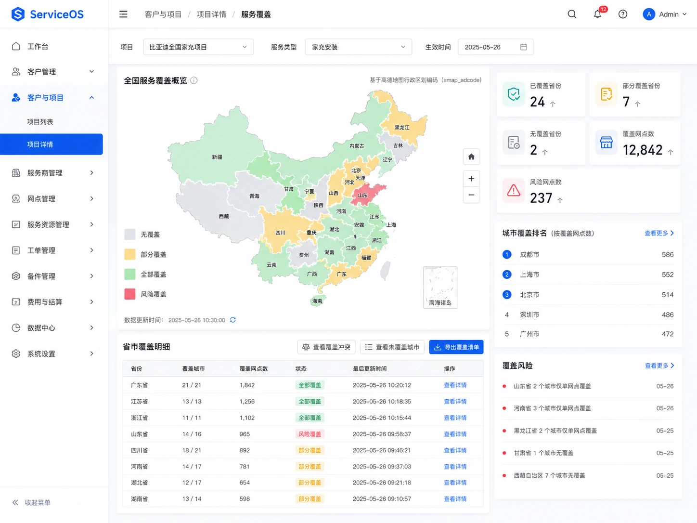
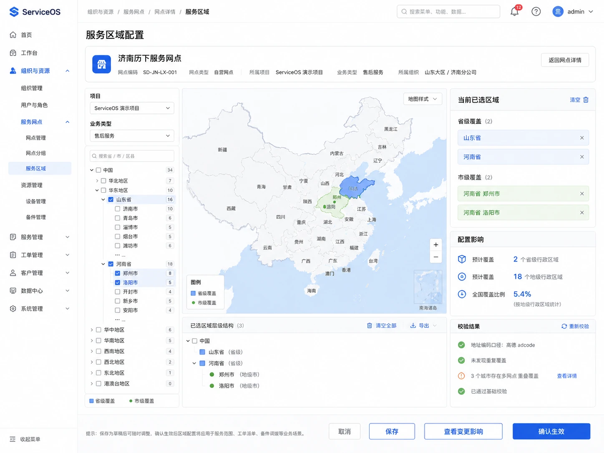
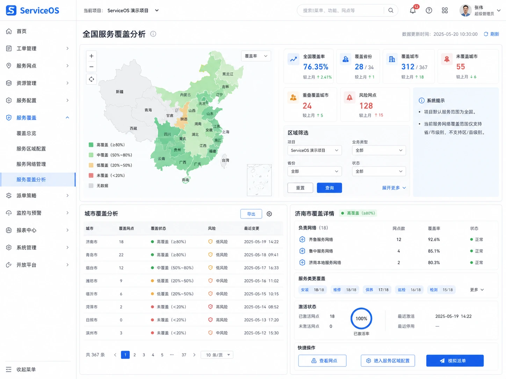
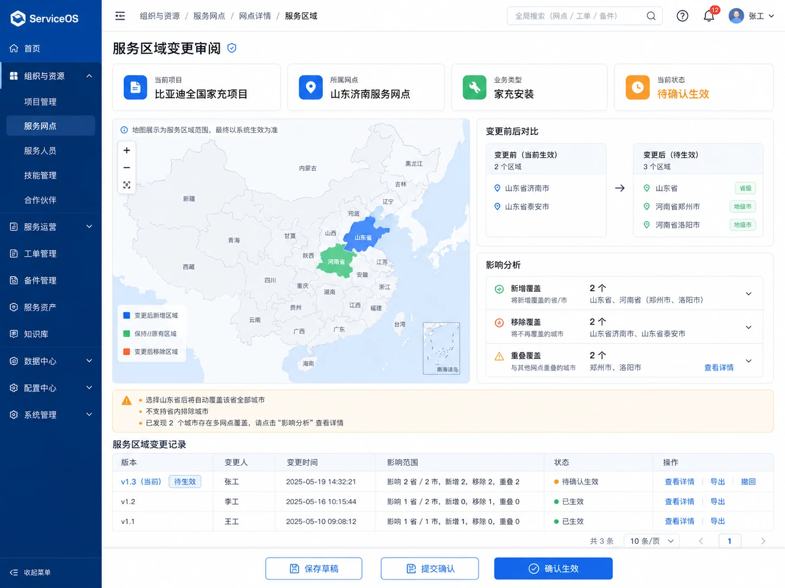

# 高德省市行政区域服务覆盖决策与批准视觉基线

## 1. 决策结论

产品负责人已批准 ServiceOS 第一阶段采用以下服务覆盖模型：

> **项目在服务覆盖维度默认全国，不配置项目服务区域；服务网点按项目和业务类型配置省级或地级行政区域；中国行政区域以高德地图行政区域数据为标准来源，以高德 `adcode` 作为车企交换、地图识别、区域配置和派单匹配的标准外部编码。**

本决策为 `Accepted`。后续领域模型、数据库、OpenAPI、Admin 页面、派单硬过滤、车企入站映射和测试不得重新引入另一套第一阶段口径。

### 1.1 第一阶段固定范围

- 项目默认全国可服务，不建设项目服务区域配置；
- 网点覆盖只开放省级和地级行政单元；
- 页面可称“省 / 市”，领域中使用 `PROVINCE / PREFECTURE_LEVEL`；
- 同一项目、业务类型和区域允许多个网点同时覆盖；
- 覆盖只判断地理承接资格，不直接决定最终派给哪个网点；
- 服务区域修改只影响修改后新产生的派单请求；
- 已激活的 `ServiceAssignment` 不因区域变化自动改派；
- 省级覆盖自动匹配该省下全部地级行政单元；
- 市级覆盖只匹配该地级行政单元；
- 选择省级后，不支持在该省内排除某些城市。

### 1.2 第一阶段明确不做

- 项目服务区域配置；
- 区县、乡镇或街道级覆盖；
- 主负责网点、备用网点和区域独占；
- 圆形半径、多边形、包含/排除区域；
- 经纬度距离、道路距离和实时路线优化；
- PostGIS；
- 地图绘制器；
- 服务区域配置包发布中心；
- 区域变更后自动重派历史工单。

## 2. 高德行政区域事实源

### 2.1 编码原则

ServiceOS 同时保留：

- `regionId`：平台内部稳定身份；
- `amapAdcode`：高德行政区域编码，作为标准外部业务编码；
- `amapCitycode`：高德城市编码，按来源原样保存；
- `sourceLevel`：高德原始层级；
- `businessLevel`：ServiceOS 归一后的 `PROVINCE / PREFECTURE_LEVEL / DISTRICT`；
- `catalogVersionId`：解析时使用的行政区目录版本。

`amapAdcode` 不直接作为不可变数据库主键。行政区划发生调整时，内部 `regionId`、历史快照和旧目录版本仍应保持可追溯。

### 2.2 同步治理

行政区目录通过受控同步任务维护，不在普通页面打开时实时拉取全国目录：

```text
高德目录同步
→ 写入 STAGING 批次
→ 校验编码唯一性、父子关系和层级
→ 生成新增/改名/迁移/停用差异
→ 高风险变化人工确认
→ 原子发布 PUBLISHED 目录版本
→ 刷新读取投影与地图缓存
```

同步失败时继续使用上一版已发布目录，不得清空或部分覆盖生产目录。

建议支持：

- 每月定期同步；
- 管理员手动触发；
- 发现车企未知 `adcode` 时发起受控补充同步；
- 大范围变化、父子层级变化和编码复用必须转人工确认。

### 2.3 车企区域映射

车企工单传入省、市编码时：

1. 保留车企原始编码和名称；
2. 优先按 `amapAdcode` 精确匹配；
3. 校验城市是否属于传入省份；
4. 记录匹配使用的目录版本；
5. 形成标准 `provinceRegionId / cityRegionId`；
6. 匹配成功后才进入自动派单。

无法精确匹配时，可查询车企专属显式映射；仍无法匹配或父子关系冲突时，禁止自动派单并创建人工补全任务。中文名称模糊匹配只能生成待确认建议，不能形成生产派单事实。

## 3. 建议逻辑数据模型

### 3.1 行政区目录版本

```text
GeoRegionCatalogVersion
- catalogVersionId
- provider = AMAP
- providerSnapshotAt
- status: STAGING / PUBLISHED / FAILED / RETIRED
- regionCount
- addedCount / updatedCount / deactivatedCount
- contentDigest
- syncStartedAt / syncCompletedAt
- publishedAt / publishedBy
- failureSummary
```

### 3.2 行政区域

```text
GeoAdministrativeRegion
- regionId
- catalogVersionId
- amapAdcode
- amapCitycode
- regionName
- sourceLevel
- businessLevel
- parentRegionId
- parentAmapAdcode
- regionPath
- centerLongitude / centerLatitude
- status
- validFrom / validTo
```

可以同步区县数据用于地址展示和未来扩展，但第一阶段网点覆盖配置只开放省、市两级。

### 3.3 车企外部编码映射

```text
ExternalRegionCodeMapping
- mappingId
- clientId / sourceSystem
- sourceRegionCode / sourceRegionName
- targetRegionId / targetAmapAdcode
- status
- effectiveFrom / effectiveTo
- reason
- confirmedBy / confirmedAt
```

### 3.4 网点区域覆盖

```text
NetworkRegionCoverage
- coverageId
- tenantId
- projectId
- networkId
- serviceType
- regionId
- amapAdcodeSnapshot
- regionNameSnapshot
- coverageLevel: PROVINCE / PREFECTURE_LEVEL
- effectiveFrom / effectiveTo
- status
- aggregateVersion
- changeReason
- createdBy / createdAt
- updatedBy / updatedAt
```

同一网点同时选择一个省和该省内城市时，保存前规范化为省级记录，避免重复覆盖。

## 4. 派单地理硬过滤

工单至少应具有标准化的 `provinceRegionId` 和可选 `cityRegionId`。地理候选匹配规则：

```text
命中省级覆盖
OR
命中市级覆盖
```

完整候选顺序：

1. 当前网点与项目关系有效；
2. 省级或市级覆盖命中；
3. 网点启用且未在对应范围停派；
4. 业务类型匹配；
5. 能力和资质满足；
6. 容量可用；
7. 未命中强制黑名单；
8. 合格候选进入评分或人工选择。

只有省编码、缺少市编码时，可以匹配省级覆盖，但不能匹配只覆盖城市的网点。省市编码都缺失或层级不一致时，不得自动派单。

## 5. 批准视觉参考

产品负责人已批准以下四张视觉方案。图片存放于：

`serviceos-architecture/assets/product/admin/service-coverage/`

这些图片是**强制视觉参考**，不是普通说明插图。实现必须保留其核心页面结构、信息优先级、地图与数据区域比例、交互工作流和操作位置。

### 5.1 项目服务覆盖总览



必须保留：

- 页面顶部项目、业务类型和生效时间上下文；
- 全国地图作为主视觉工作区；
- 覆盖、部分覆盖、无覆盖和风险覆盖的清晰图例；
- 右侧覆盖摘要、城市排名和风险列表；
- 下方省份覆盖明细表；
- 地图、省份表、城市列表和风险条目可相互下钻。

### 5.2 网点服务区域配置



这是配置页面的主要结构金线，必须采用：

```text
页面头与网点摘要
→ 左侧项目/业务类型/省市树
→ 中央高德行政区地图
→ 右侧已选区域/配置影响/校验结果
→ 底部取消、保存、查看变更影响、确认生效
```

必须支持区域树与地图基于同一 `amapAdcode` 双向联动。选择省后，其城市显示继承状态；需要排除城市时，用户必须取消省级覆盖并改为逐市选择。

### 5.3 全国服务覆盖分析



必须保留：

- 全国覆盖率、覆盖省份、覆盖城市、未覆盖城市、重叠覆盖和风险网点等摘要；
- 地图按覆盖密度或状态着色；
- 项目、业务类型、省份和状态筛选；
- 城市覆盖分析表；
- 所选城市的负责网点、服务类型和激活状态详情；
- 快捷进入网点、区域配置和派单模拟的入口。

覆盖率以项目默认全国和标准行政区目录为分母，必须由服务端返回统计口径、`asOf` 和目录版本，前端不得自行拼算。

### 5.4 服务区域变更审阅



必须保留：

- 项目、网点、业务类型和待生效状态摘要；
- 地图中新增、保留和移除区域的差异表达；
- 变更前与变更后的并列区域清单；
- 新增覆盖、移除覆盖、重叠覆盖和受影响新派单的影响分析；
- 明确提示“不会自动改变已激活责任”；
- 区域变更历史和版本信息；
- 保存、提交确认和确认生效操作区。

第一阶段不必实现独立审批流；“提交确认”可以是高风险确认步骤，但必须有 `If-Match`、差异预览、修改原因和审计记录。

## 6. 视觉参考的强制执行规则

### 6.1 不允许自由发挥的部分

未经产品负责人明确批准，不得改变：

- 四类页面的核心分区和主次关系；
- 配置页“三栏 + 底部动作”的工作区结构；
- 总览/分析页“地图为主、数据解释为辅”的比例；
- 变更审阅的差异、影响、历史和确认顺序；
- 企业蓝、浅色工作区、细边框、中高密度和克制装饰；
- 省市树、地图、已选区域和校验结果的联动关系；
- 风险、无覆盖、部分覆盖和正常覆盖的语义区分。

### 6.2 可以根据真实实现修正的部分

- 示例项目、网点、地区、日期和数字；
- 概念图中不准确或重复的中文；
- 与真实 API 不一致的示例字段；
- 可访问性、响应式和键盘操作所需调整；
- 全局 Admin 应用壳以 `12-classic-professional-visual-baseline.md` 为准。概念图中偶发的深色侧栏不是新的全局风格，正式实现继续使用已批准的浅色/白色导航。

### 6.3 PR 视觉证据

相关实现 PR 必须提供：

1. 对应参考图；
2. 真实页面 1440×1024 截图；
3. 真实页面 1280px 截图；
4. 参考图与实际页面并排对照；
5. 结构、间距、密度、组件和交互差异说明；
6. 每个差异属于“真实数据修正”“可访问性修正”还是“经产品负责人批准的设计变更”；
7. 正常、空、错误、无权限、只读、并发冲突和提交中状态证据。

缺少并排视觉证据时，只能标记为 `IMPLEMENTED_PENDING_VISUAL_REVIEW`，不得标记 `VISUAL_APPROVED` 或 `PRODUCT_ACCEPTED`。

## 7. Admin 信息架构

建议正式入口：

```text
客户与项目
└── 项目详情
    ├── 服务覆盖总览
    └── 全国服务覆盖分析

组织与资源
└── 服务网点
    └── 网点详情
        ├── 服务区域配置
        └── 区域变更记录
```

项目视角回答“全国哪里有服务、哪里缺口或风险”；网点视角回答“该网点在当前项目和业务中负责哪些省市”。

## 8. 页面状态

四张页面均必须具备：

- 首次加载和地图局部加载；
- 行政区目录同步中；
- 目录版本过期；
- 空覆盖；
- 无匹配网点；
- 无权限；
- 只读；
- 服务端错误；
- 高德地图加载失败但列表仍可用；
- 并发版本冲突；
- 保存中、影响分析中和确认生效中；
- 提交失败且明确说明是否已保存；
- 数据投影滞后和 `asOf` 提示。

地图不可用时，省市树和列表必须仍能完成查看或配置；地图是直观交互层，不是唯一业务入口。

## 9. 安全与授权

- 区域目录读取不授予项目和网点业务权限；
- 覆盖查询必须按 Tenant、Project 和授权范围过滤；
- 覆盖写入必须要求服务端 Capability、Scope、网点/项目关系、版本和当前状态校验；
- 客户端不得通过提交任意 `networkId / projectId / adcode` 扩大数据范围；
- 服务端必须重新解析并验证 `amapAdcode`、层级和父子关系；
- 区域变更差异和影响由服务端读模型返回；
- 修改原因、操作者、旧值、新值、目录版本和 correlationId 进入审计。

## 10. 验收标准

本能力只有同时满足以下条件才能标记产品完成：

1. 高德行政区目录完成版本化同步和失败关闭；
2. 车企省市编码精确匹配和父子校验完成；
3. 网点按项目、业务类型配置省市覆盖；
4. 省级和市级派单硬过滤使用真实覆盖数据；
5. 覆盖变更不静默影响已有责任；
6. 四张批准页面使用真实 API 和服务端统计；
7. 地图与区域树通过同一 `amapAdcode` 联动；
8. 无地图时仍可通过树和列表完成工作；
9. 正常、空、错误、无权限、只读、冲突和提交状态齐全；
10. 实际页面与本文件四张参考图完成并排审查；
11. 产品负责人明确批准实际页面；
12. 批准后建立正式视觉回归金标。
