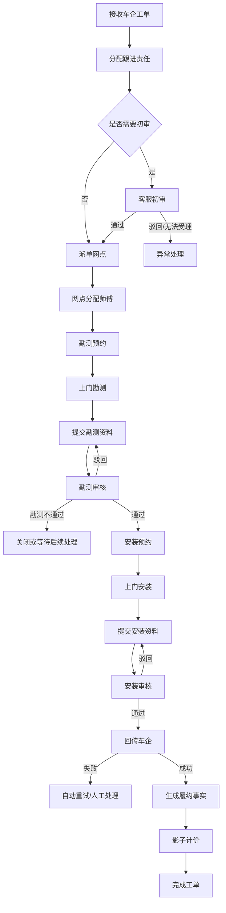

# 比亚迪勘安试点可执行流程规格

## 1. 目的

本文件将首个比亚迪勘测后安装业务，从访谈流程转换为可配置、可验证、可执行的任务规格。当前仍为 Draft；其中标记 `TBD` 的业务参数必须由试点业务负责人确认后才能升级为 Accepted。

## 2. 试点边界

- 车企集团：比亚迪；
- 品牌：TBD，首选海洋或王朝；
- 业务类型：勘测后安装；
- 区域：TBD，一个网点结构完整的省或城市群；
- 结算：首期只生成影子试算，不作为财务权威；
- 车企回传：支持真实适配器或可回放模拟适配器；
- 异常范围：派单失败、用户取消、勘测不通过、资料驳回、回传失败、强制关闭。

## 3. 顶层流程



## 4. 任务目录

| 节点 | 任务类型 | 执行主体 | 自动/人工 | 关键输出 |
|---|---|---|---|---|
| 接收车企工单 | `INGEST_ORDER` | Integration | 自动 | 标准工单、原始报文引用、幂等结果 |
| 分配跟进责任 | `ASSIGN_COORDINATORS` | Assignment Engine | 自动 | 品牌负责人、客服经理、项目经理 |
| 客服初审 | `INITIAL_REVIEW` | 客服 | 可配置 | 通过、驳回、异常原因 |
| 派单网点 | `DISPATCH_NETWORK` | Dispatch Engine/项目经理 | 自动优先 | 网点、派单解释、容量预占 |
| 分配师傅 | `ASSIGN_TECHNICIAN` | 网点/系统 | 可配置 | 师傅、分配方式 |
| 勘测预约 | `SURVEY_APPOINTMENT` | 客服/网点/师傅 | 人工 | 预约时间、联系人、结果 |
| 上门勘测 | `FIELD_SURVEY` | 师傅 | 人工 | 勘测结构化数据、到场证据 |
| 提交勘测资料 | `SUBMIT_SURVEY_EVIDENCE` | 师傅；异常时网点补充 | 人工 | 资料版本集合 |
| 勘测审核 | `REVIEW_SURVEY` | 客服 | 人工/部分自动 | 审核决定、驳回项、勘测结论 |
| 安装预约 | `INSTALL_APPOINTMENT` | 客服/网点/师傅 | 人工 | 预约时间、改约记录 |
| 上门安装 | `FIELD_INSTALL` | 师傅 | 人工 | 施工事实、物料消耗、增项事实 |
| 提交安装资料 | `SUBMIT_INSTALL_EVIDENCE` | 师傅；异常时网点补充 | 人工 | 安装资料版本集合 |
| 安装审核 | `REVIEW_INSTALL` | 客服 | 人工/部分自动 | 审核决定、驳回项 |
| 回传车企 | `DELIVER_TO_OEM` | Integration | 自动 | 回传意图、尝试、车企回执 |
| 生成履约事实 | `CONFIRM_FULFILLMENT_FACTS` | Fact Engine | 自动 | 已确认事实版本 |
| 影子计价 | `SHADOW_CALCULATION` | Pricing Engine | 自动 | 对上/对下试算及解释 |
| 完成工单 | `COMPLETE_WORK_ORDER` | WorkOrder | 自动 | `WorkOrderFulfilled/Closed` |

## 5. 节点规格

### 5.1 接收车企工单

前置条件：

- 接口调用通过认证、验签和租户解析；
- 外部业务幂等键可构造；
- 项目、业务类型和配置 Bundle 唯一命中。

命令与事件：

```text
CreateWorkOrder
→ WorkOrderCreated
→ ConfigurationBundleLocked
```

失败策略：

- 重复请求返回首次处理结果；
- 配置未命中进入接入异常队列，不创建半成品有效工单；
- 原始报文只读保存并受敏感数据权限保护。

### 5.2 分配跟进责任

负责人策略按配置解析，至少支持：

- 品牌负责人；
- 客服经理；
- 项目经理（品牌 + 区域）；
- 未命中时转项目管理员人工处理。

输出必须保留规则版本、输入摘要、命中条目和解释。

### 5.3 客服初审

配置项：

```text
initialReview.enabled = true | false
```

当关闭时，由系统产生自动通过决定，流程仍保留审计事件；不能直接跳过而不留痕。

客服不得直接改写车企原始字段。需要修正时必须记录更正字段、原因、操作者和原始值。

### 5.4 派单网点

硬过滤顺序：

1. 指定网点且有效；
2. 黑名单排除；
3. 停派排除；
4. 品牌与服务区域匹配；
5. 业务类型能力匹配；
6. 必需资质匹配；
7. 在途容量未超限。

候选网点评分可包含：

- 剩余产能；
- 履约率；
- 网点评分；
- 月度签约派单比例偏差。

无候选网点或容量预占冲突时进入 `MANUAL_DISPATCH_REQUIRED`，项目经理应在配置 SLA 内处理，当前基线为 24 小时并提前预警。

### 5.5 师傅分配

模式由项目配置：

- `AUTO`：系统根据区域、业务能力、排班和在途量分配；
- `NETWORK_MANUAL`：网点负责人选择师傅；
- `AUTO_THEN_MANUAL`：自动失败后转网点人工。

首期不允许师傅拒单。重新分配必须记录原因和历史分配链路。

### 5.6 预约

允许客服、网点和师傅发起预约，但必须通过服务端动作权限校验。

预约记录独立于工单字段，至少保留：

- 预约类型；
- 提议时间和确认时间；
- 操作者与联系渠道；
- 改约次数和原因；
- 用户无法联系、用户延期等结果；
- 关联 SLA 暂停或恢复事件。

### 5.7 勘测与资料提交

勘测数据由节点表单版本定义。资料项由 Evidence Version 定义，支持：

- 固定必传；
- 条件必传；
- 现场拍照限制；
- GPS、水印、OCR、SN/VIN 一致性；
- 视频、签字和协议；
- 单项资料多版本补传。

网点代补资料时必须标记 `submittedOnBehalfOf` 和原因；不得覆盖师傅原始版本。

### 5.8 勘测审核

一张审核任务默认一名客服审核人。审核员不能修改师傅字段和代传资料。

每个资料项支持：

- `APPROVED`；
- `REJECTED`，选择项目专属标准原因并可补充说明；
- 多轮整改；
- 保留全部历史版本和决定。

审核结果路由：

```text
通过 → 安装预约
勘测不通过 → 终止安装分支，进入关闭/等待规则
资料驳回 → 重新提交勘测资料
```

### 5.9 安装与安装审核

安装任务采集结构化施工事实，包括敷设方式、线缆、断路器、立柱、保护箱、接地、实际完成时间、桩编码、物料消耗和增项。

安装审核沿用不可变资料和只追加审核决定。审核通过后普通人员不得修改；特殊强制通过必须具备高风险权限、填写原因并审计。

### 5.10 回传车企

使用 Delivery Intent + Delivery Attempt 模型：

```text
创建回传意图
→ 幂等发送
→ 保存请求/响应摘要
→ 成功确认或按退避策略重试
→ 超过阈值转客服人工处理
```

车企驳回先形成客服协调任务，不直接跳到师傅。客服确认后再发起对应整改任务。

### 5.11 履约事实和影子计价

只有审核通过且达到项目验收条件的数据才能生成已确认履约事实。影子计价不得形成正式应收应付，仅用于：

- 与旧系统或人工结算对比；
- 输出价格版本、命中规则和金额解释；
- 识别规则缺口和差异。

## 6. 工单与任务状态约束

- 客户端不得直接提交目标状态；
- 任务通过命令流转；
- WorkOrder 的生命周期与具体任务状态分离；
- 资料驳回只影响相关审核/整改任务，不回滚已完成的无关任务；
- 强制关闭必须生成取消/补偿计划；
- 恢复或重新开启必须指定恢复点和审批依据。

## 7. 必须验证的异常场景

1. 同一车企工单重复推送；
2. 地址无法匹配区域；
3. 所有网点停派或达到容量；
4. 两个派单请求同时抢占最后容量；
5. 师傅离线提交后重复同步；
6. OCR 识别 SN 与工单不一致；
7. 同一资料项连续三次驳回；
8. 审核通过后车企再次驳回；
9. 回传超时、网络异常和重复回执；
10. 应用重启、消息重复和人工接管；
11. 工单运行中发布新 Bundle；
12. 强制关闭后又申请恢复。

## 8. 发布 Gate

升级为 Accepted 前必须补齐：

- 确定品牌和试点区域；
- 填写实际 SLA；
- 完成节点字段、资料项和驳回原因清单；
- 提供至少 20 个正常和 20 个异常脱敏样本；
- 明确初审是否启用、师傅分配模式和勘测不通过处置；
- 通过 Workflow JSON Schema 校验；
- 用样本完成桌面回放；
- 产品、业务和技术负责人共同批准。
